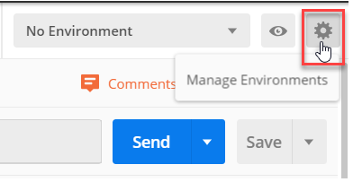
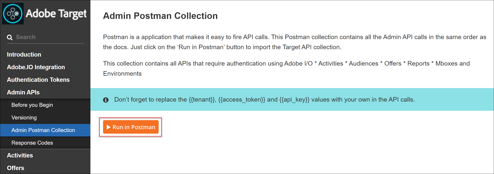

# Konfigurieren der Authentifizierung für Adobe Target-APIs

Die Adobe Target Admin-APIs, einschließlich [!DNL Recommendations] Admin-APIs werden durch Authentifizierung gesichert, um sicherzustellen, dass nur autorisierte Benutzer sie für den Zugriff auf Adobe Target verwenden. Verwenden Sie die [Adobe Developer-Konsole](https://console.adobe.io/) zur Verwaltung dieser Authentifizierung für alle Adobe Experience Cloud-Lösungen, einschließlich [!DNL Target].

In dieser Lektion werden die ersten Schritte erläutert, die zum Generieren von Authentifizierungstoken erforderlich sind, die für die erfolgreiche Interaktion mit Adobe Target-APIs erforderlich sind. In den folgenden Abschnitten werden Sie:

1. Erstellen Sie ein Projekt (zuvor als Integration bezeichnet) in der Adobe Developer-Konsole.
2. Exportieren Sie Projektdetails in Postman.
3. Generieren Sie ein Bearer-Zugriffstoken.
4. Testen Sie das Trägerzugriffs-Token.

## Voraussetzungen

| Ressource | Details |
| --- | --- |
| Postman | Um diese Schritte erfolgreich abzuschließen, rufen Sie die [Postman-App](https://www.postman.com/downloads/) für Ihr Betriebssystem. Postman Basic ist mit der Kontoerstellung kostenlos. Postman ist zwar nicht erforderlich, um Adobe Target-APIs im Allgemeinen zu verwenden, erleichtert aber API-Workflows. Adobe Target bietet mehrere Postman-Sammlungen, die die Ausführung seiner APIs erleichtern und erfahren, wie sie funktionieren. Der Rest dieses Tutorials setzt Grundkenntnisse in Postman voraus. Informationen zur Unterstützung finden Sie im Abschnitt [Postman-Dokumentation](https://learning.getpostman.com/). |
| Verweise | Die Vertrautheit mit den folgenden Ressourcen wird im Rest dieses Tutorials vorausgesetzt:<UL><li>[Adobe I/O Github](https://github.com/adobeio)</li><li>[Dokumentation zur Target-Adobe I/O](https://developers.adobetarget.com/api/#introduction)</li><li>[Dokumentation zur Recommendations API](https://developers.adobetarget.com/api/recommendations/)</li></ul> |

## Erstellen eines Adobe I/O-Projekts

In diesem Abschnitt greifen Sie auf die Adobe Developer Console zu und erstellen ein Projekt für [!DNL Adobe Target]. Weitere Informationen finden Sie unter [Dokumentation zu Projekten](https://www.adobe.io/apis/experienceplatform/console/docs.html#!AdobeDocs/adobeio-console/master/projects.md).

<!--1. Generate your private key and public certificate, per the [documentation on authentication](https://www.adobe.io/authentication/auth-methods.html#!AdobeDocs/adobeio-auth/master/JWT/JWTCertificate.md). //<!--as described in **Step 1** of [How to set up Adobe IO: Authentication - Step by Step](https://helpx.adobe.com/marketing-cloud-core/kb/adobe-io-authentication-step-by-step.html). After completing Step 1, return to this tutorial and resume with Step 2, below. // The outcome of this step should be the creation of a `private.key` file and a `certificate_pub.crt` file. Return to this tutorial once you have generated these two files.-->

1. Im [Adobe Admin Console](https://adminconsole.adobe.com/), stellen Sie sicher, dass Ihr Adobe-Benutzerkonto sowohl [Produkt-Admin](https://helpx.adobe.com/enterprise/using/admin-roles.html) und [Entwickler](https://helpx.adobe.com/enterprise/using/manage-developers.html) Zugriff auf Ebene [!DNL Target].

2. Im [Adobe Developer-Konsole](https://console.adobe.io/)wählen Sie die Experience Cloud-Organisation aus, für die Sie diese Integration erstellen möchten. (Beachten Sie, dass Sie wahrscheinlich nur Zugriff auf eine einzige Experience Cloud-Organisation haben.)

   

3. Klicken **[!UICONTROL Neues Projekt erstellen]**.

   

4. Klicken **[!UICONTROL API hinzufügen]** , um Ihrem Projekt eine REST-API für den Zugriff auf Adobe-Dienste und -Produkte hinzuzufügen.

   

5. Auswählen **[!DNL Adobe Target]** als Adobe-Dienst, mit dem Sie integrieren möchten. Klicken Sie auf **[!UICONTROL Nächste]** -Schaltfläche, die angezeigt wird.

   

6. Wählen Sie eine Option zum Verknüpfen öffentlicher und privater Schlüssel mit der Dienstkontointegration aus, die Sie für Target erstellen. Wählen Sie für dieses Tutorial **[!UICONTROL Option 1: Generieren eines Schlüsselpaars]** und klicken Sie auf **[!UICONTROL Generieren von keypair]**.
   

7. Beachten Sie die Ergebnisse! Notieren Sie sich, wie angegeben, die automatisch heruntergeladene Konfigurationsdatei (`config`), die Ihren privaten Schlüssel enthält. Klicken Sie auf **[!UICONTROL Weiter]**.
   
8. Überprüfen Sie in Ihrem Dateisystem den Speicherort von `config`: die komprimierte Konfigurationsdatei, die im vorherigen Schritt erstellt wurde. Auch dies `config` enthält Ihren privaten Schlüssel, den Sie später benötigen werden. Der genaue Speicherort in Ihrem Dateisystem kann sich von dem hier gezeigten unterscheiden.
   
9. Wählen Sie in der Adobe Developer Console die [Produktprofil(e)](https://helpx.adobe.com/enterprise/using/manage-products-and-profiles.html) entspricht den Eigenschaften, in denen Sie [!DNL Recommendations]. (Wenn Sie keine Eigenschaften verwenden, wählen Sie die Option Standardarbeitsbereich .) Klicken **[!UICONTROL Konfigurierte API speichern]**.
   

10. Klicken **[!UICONTROL Integration erstellen]**. Sie sollten eine temporäre Meldung erhalten, die angibt, dass Ihre API erfolgreich konfiguriert wurde.

11. Benennen Sie Ihr Projekt als letzten Schritt in einen aussagekräftigeren Namen als den ursprünglichen. `Project 1`. Navigieren Sie dazu mithilfe des Navigationspfads zum Projekt und klicken Sie auf **[!UICONTROL Projekt bearbeiten]** , um auf ** zuzugreifen[!UICONTROL Projekt bearbeiten] -Modal verwenden und das Projekt umbenennen.

>[!NOTE]
> 
>In diesem Tutorial nennen wir unser Projekt &quot;Target-Integration&quot;. Wenn Sie davon ausgehen, Ihr Projekt für mehr als nur Adobe Target zu verwenden, sollten Sie es entsprechend benennen. Sie können ihn beispielsweise &quot;Adobe-APIs&quot;oder &quot;Experience Cloud-APIs&quot;nennen, da er mit anderen Lösungen in der Adobe Experience Cloud verwendet werden kann.

## Exportieren von Projektdetails

Jetzt, da Sie über ein Adobe-Projekt verfügen, können Sie für den Zugriff auf [!DNL Target]müssen Sie sicherstellen, dass Sie Details zu diesem Projekt zusammen mit Ihren Adobe-API-Anfragen senden. Diese Details sind erforderlich, um mit mehreren Adobe-APIs, darunter mehreren [!DNL Target] APIs. Die Integrationsdetails umfassen beispielsweise Autorisierungs- und Authentifizierungsinformationen, die für die [!DNL Target] Admin-APIs. Um die APIs mit Postman zu verwenden, müssen Sie daher diese Details in Postman übertragen.

Es gibt viele Möglichkeiten, die Details Ihres Projekts in Postman anzugeben. In diesem Abschnitt nutzen wir jedoch einige vordefinierte Funktionen und Sammlungen. Zunächst (in diesem Abschnitt) exportieren Sie die Details Ihrer Integration in eine Postman-Umgebung. Als Nächstes generieren Sie ein Bearer-Zugriffstoken, um Ihnen Zugriff auf die erforderlichen Adobe-Ressourcen zu gewähren.

>[!NOTE]
>
>Für Videoanleitungen, die für alle Experience Cloud-Lösungen gelten, einschließlich [!DNL Target], siehe [Verwenden von Postman mit Experience Platform-APIs](https://experienceleague.adobe.com/docs/platform-learn/tutorials/platform-api-authentication.html?lang=en). Die folgenden Abschnitte sind für die [!DNL Target] APIs:
>
> 1. Exportieren von Adobe I/O-Integrationsdetails in Postman
> 2. Generieren eines Zugriffstokens mit Postman

>
> Diese Schritte werden im Folgenden beschrieben.

1. Noch im [Adobe Developer-Konsole](https://console.adobe.io/), navigieren Sie zu , um die **[!UICONTROL Dienstkonto (JWT)]** Anmeldedaten. Verwenden Sie entweder die linke Navigation oder die **[!UICONTROL Anmeldeinformationen]** -Abschnitt angezeigt.
   
In **[!UICONTROL Details zu Berechtigungen]**, beachten Sie, dass Sie Ihre **Öffentliche Schlüssel**, **Client-ID**und andere Informationen zu Ihrem Dienstkonto.
   
2. Klicken Sie auf , um zu Informationen zum **[!UICONTROL Adobe Target]** API. Verwenden Sie entweder die linke Navigation oder die **[!UICONTROL Verbundene Produkte und Dienste]** -Abschnitt angezeigt.
   
3. Klicken **[!UICONTROL Herunterladen für Postman]** > **[!UICONTROL Dienstkonto (JWT)]** , um eine JSON-Datei zu erstellen, die Ihre Authentifizierungsinformationen für eine Postman-Umgebung erfasst.
   
Notieren Sie die JSON-Datei in Ihrem Dateisystem.
   
4. Klicken Sie in Postman auf das Zahnradsymbol, um Ihre Umgebungen zu verwalten, und klicken Sie dann auf **Import** , um die JSON-Datei (Umgebung) zu importieren.
   
5. Wählen Sie Ihre Datei aus und klicken Sie auf **Öffnen**.
   
6. In der Postman **Verwalten von Umgebungen** modal klicken Sie auf den Namen der neu importierten Umgebung, um sie zu überprüfen. (Ihr Umgebungsname kann sich von dem hier gezeigten unterscheiden. Bearbeiten Sie den Namen nach Bedarf. Sie muss nicht unbedingt mit dem Namen des Adobe-Projekts übereinstimmen.)
   
7. Hinweis `CLIENT_SECRET` und `API_KEY` (zusammen mit anderen Variablen) deren Werte vorausgefüllt werden, die aus Ihrer Integration stammen, wie in der Adobe Developer-Konsole definiert. (Die Postman `CLIENT_SECRET` sollte mit der Variablen `CLIENT SECRET` Adobe-Anmeldedaten, wie in der Developer Console angezeigt, und `API_KEY` sollte Postman ebenfalls `CLIENT ID` in der Entwicklerkonsole.) Beachten Sie hingegen Folgendes: `PRIVATE_KEY`, `JWT_TOKEN`und `ACCESS_TOKEN` leer sind. Beginnen wir mit der Bereitstellung der `PRIVATE_KEY` -Wert.
   

   >[!NOTE]
   >
   >**Überraschung!**
   >
   >Pop quiz! Kannst du dich erinnern, wo dein privater Schlüssel ist?
   >Das ist richtig, es ist im `config` -Datei, die zuvor von der Adobe Developer Console heruntergeladen wurde!

8. Öffnen Sie in Ihrem Dateisystem Ihre `config` und öffnen Sie die `private` Schlüsseldatei.
   
9. Gesamten Inhalt der `private` Schlüsseldatei.
   
10. Fügen Sie in Postman Ihren privaten Schlüsselwert in die **ERSTER WERT** und **AKTUELLER WERT** -Felder.
   
11. Klicken **[!UICONTROL Aktualisieren]** und schließen Sie das Modal Umgebungen .

## Bearer-Zugriffstoken generieren

In diesem Abschnitt generieren Sie Ihr Trägerzugriffstoken, das zur Authentifizierung Ihrer Interaktion mit Adobe Target-APIs erforderlich ist. Um Ihr Bearer-Zugriffstoken zu generieren, müssen Sie Ihre Integrationsdetails (wie in den vorherigen Abschnitten beschrieben) an die [Adobe Identity Management Service (IMS)](https://www.adobe.io/authentication/auth-methods.html#!AdobeDocs/adobeio-auth/master/AuthenticationOverview/AuthenticationGuide.md). Es gibt verschiedene Möglichkeiten, dies zu tun. In diesem Tutorial haben wir jedoch eine maßgeschneiderte POST-Anfrage an die IMS-API erstellt. Mach nur Spaß. In diesem Tutorial nutzen wir eine Postman-Sammlung mit einem vordefinierten IMS-Aufruf, der den Prozess direkt und einfach macht. Nach dem Import der Kollektion können Sie sie bei Bedarf wiederverwenden, um neue Token nicht nur für Adobe Target, sondern auch für andere Adobe-APIs zu generieren.

1. Navigieren Sie zum [Beispielaufrufe der Adobe Identity Management Service-API](https://github.com/adobe/experience-platform-postman-samples/tree/master/apis/ims).
   
2. Klicken Sie auf **Postman-Erfassung zur Generierung von Adobe I/O Access Token**.
   
3. Rufen Sie die JSON-Rohdaten für diese Sammlung ab, indem Sie auf **Roh**, kopieren Sie dann die resultierende JSON in die Zwischenablage. (Alternativ können Sie die JSON-Rohdatei als JSON-Datei speichern.)
   
4. Importieren Sie die Sammlung in Postman, indem Sie die JSON-Rohdaten aus der Zwischenablage einfügen und senden. (Alternativ können Sie die von Ihnen gespeicherte JSON-Datei hochladen.) Klicken Sie auf **Weiter**.
   
5. Wählen Sie die **[!UICONTROL IMS: JWT-Generierung + Auth über Benutzer-Token]** Anforderung in der Postman-Sammlung &quot;Adobe I/O Access Token Generation&quot;, stellen Sie sicher, dass Ihre Umgebung ausgewählt ist, und klicken Sie auf **Senden** , um das Token zu generieren.

   

   >[!NOTE]
   >
   >Dieses Bearer-Zugriffstoken ist 24 Stunden lang gültig. Senden Sie die Anfrage erneut, sobald Sie ein neues Token generieren müssen.

6. Öffnen Sie erneut das Modal Umgebungen verwalten und wählen Sie Ihre Umgebung aus.
   
7. Beachten Sie die `ACCESS_TOKEN` und `JWT_TOKEN` -Werte werden nun ausgefüllt.
   

>[!NOTE]
>
>F: Muss ich die Postman-Sammlung &quot;Adobe I/O Access Token Generation&quot;verwenden, um das JSON Web Token (JWT) und das Trägerzugriffstoken zu generieren?
>
>A: Nein! Die Postman-Sammlung &quot;Adobe I/O Access Token Generation&quot;ist verfügbar, um das JWT- und Trägerzugriffstoken in Postman einfacher zu generieren. Alternativ können Sie Funktionen in der Adobe Developer-Konsole verwenden, um das Trägerzugriffs-Token manuell zu generieren.

## Testen des Trägerzugriffs-Tokens

In dieser Übung verwenden Sie Ihr neues Bearer-Zugriffstoken, indem Sie eine API-Anfrage senden, die eine Liste der Aktivitäten von Ihrer [!DNL Target] -Konto. Eine erfolgreiche Antwort weist darauf hin, dass Ihr Adobe-Projekt und die Authentifizierung erwartungsgemäß funktionieren, um die API zu verwenden.

1. Importieren Sie die [Postman-Sammlung für Adobe Target-Admin-APIs](https://developers.adobetarget.com/api/#admin-postman-collection). Befolgen Sie alle Anweisungen, bis die Sammlung in Postman importiert wurde.
   
1. Erweitern Sie die Sammlung und beachten Sie die **[!UICONTROL Aktivitäten auflisten]** -Anfrage.
   
1. Beachten Sie, dass Variablen wie `{{access_token}}` zunächst ungelöst sind. Sie können dies auf verschiedene Weise beheben. Beispielsweise können Sie eine neue Kollektionsvariable mit dem Namen `{{access_token}}`- In diesem Tutorial ändern Sie stattdessen die API-Anfrage, um die zuvor verwendete Postman-Umgebung zu nutzen. Dadurch kann die Umgebung auch weiterhin als einheitliche, konsistente Konsolidierung aller Variablen dienen, die in allen Adobe-APIs verwendet werden.
   
1. Ersetzender Typ `{{access_token}}` mit `{{ACCESS_TOKEN}}`.
   
1. Ersetzender Typ `{{api_key}}` mit `{{API_KEY}}`.
   
1. Ersetzender Typ `{{tenant}}` mit `{{TENANT_ID}}`. Hinweis `{{TENANT_ID}}` noch nicht erkannt.
   
1. Öffnen Sie das Modal Umgebungen verwalten und wählen Sie Ihre Umgebung aus.
   
1. Typ zum Hinzufügen eines neuen `{{TENANT_ID}}` Umgebungsvariable. Kopieren Sie den Wert Ihrer Mandanten-ID und fügen Sie ihn in die **ERSTER WERT** und **AKTUELLER WERT** Felder für Ihre neue `TENANT_ID` Umgebungsvariable.

   

   >[!NOTE]
   >
   >Die Mandantenkennung unterscheidet sich von Ihrer [!DNL Target] `clientcode`. Die Mandanten-ID ist in der URL vorhanden, wenn Sie sich bei [!DNL Target]. Um Ihre Mandantenkennung zu erhalten, melden Sie sich bei der [!DNL Adobe Experience Cloud], öffnen [!DNL Target]und klicken Sie auf [!DNL Target] Karte. Verwenden Sie den Wert der Mandanten-ID, wie in der URL-Subdomäne angegeben.
   >
   >Wenn beispielsweise Ihre URL bei der Anmeldung bei Adobe Target
   >
   >`<https://mycompany.experiencecloud.adobe.com/...>`
   >
   >lautet dann Ihre Mandantenkennung &quot;mycompany&quot;.

1. Senden Sie Ihre Anfrage, nachdem Sie sichergestellt haben, dass Sie die richtige Umgebung ausgewählt haben. Sie sollten eine Antwort mit Ihrer Aktivitätenliste erhalten.
   

Herzlichen Glückwunsch! Nachdem Sie die Authentifizierung Ihrer Adobe überprüft haben, können Sie damit mit Adobe Target-APIs (sowie anderen Adobe-APIs) interagieren. Sie können beispielsweise [Verwenden von Recommendations-APIs](https://developer.adobe.com/target/before-administer/recs-api/){target=&quot;_blank&quot;}, um Empfehlungen zu erstellen oder zu verwalten.
