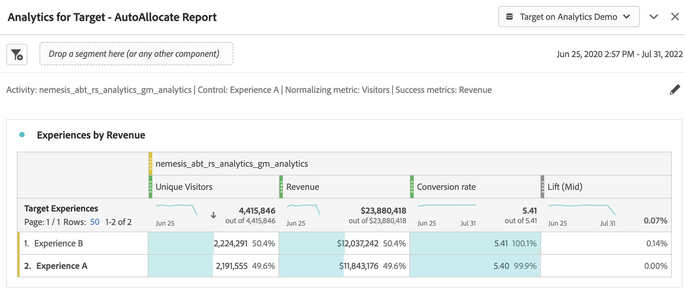

# Einrichten von A4T-Berichten in Analysis Workspace für [!DNL Auto-Allocate] activities

Ein [!DNL Auto-Allocate] -Aktivität einen Gewinner unter zwei oder mehr Erlebnissen identifiziert und dem Gewinner automatisch mehr Traffic zuordnet, während der Test weiter ausgeführt und das Lernen fortgesetzt wird. Die Integration von Analytics for Target (A4T) für [!DNL Auto-Allocate] können Sie Ihre Berichtsdaten in Adobe Analytics anzeigen und sogar für benutzerdefinierte Ereignisse oder Metriken optimieren, die in Adobe Analytics definiert sind.

Während Rich-Analysis-Funktionen in Adobe Analytics Analysis Workspace verfügbar sind, wurden einige Änderungen am Standard- **[!UICONTROL Analytics for Target]** -Bedienfeld zur korrekten Interpretation erforderlich [!DNL Auto-Allocate] aufgrund der Nuancen in [Optimierungskriterien](https://experienceleague.adobe.com/docs/target/using/integrate/a4t/a4t-at-aa.html?lang=en#supported).

Dieses Tutorial führt Sie durch die empfohlenen Änderungen zur Analyse [!DNL Auto-Allocate] Aktivitäten in Workspace. Die Schlüsselkonzepte sind:

* Besucher sollten immer als Normalisierungsmetrik in [!DNL Auto-Allocate] Aktivitäten.
* Wenn es sich bei der Metrik um eine Adobe Analytics-Metrik handelt, hängt der geeignete Zähler für die Konversionsrate vom Typ der bei der Aktivitätseinrichtung ausgewählten Optimierungskriterien ab.
   * Das Optimierungskriterium &quot;Unique Visitor-Konversionsrate maximieren&quot;verfügt über eine Konversionsrate, deren Zähler die Anzahl der Unique Visitors mit einem positiven Wert der Metrik darstellt.
   * Der Metrikwert &quot;Maximieren pro Besucher*&quot;hat eine Konversionsrate, deren Zähler der normale Metrikwert in Adobe Analytics ist. Dies wird standardmäßig im **[!UICONTROL Analytics for Target]** -Bedienfeld in Workspace.
* Wenn Ihre Optimierungsmetrik eine von Target definierte Konversionsmetrik ist, wird die standardmäßige **[!UICONTROL Analytics for Target]** -Bedienfeld in Workspace bearbeitet die Konfiguration Ihres Bedienfelds.
* Die in Workspace angezeigten Konfidenzzahlen spiegeln nicht die [Konservativere Statistiken, die von der automatisierten Zuordnung verwendet werden](https://experienceleague.adobe.com/docs/target/using/activities/auto-allocate/automated-traffic-allocation.html?lang=en#section_98388996F0584E15BF3A99C57EEB7629)und sollten daher entfernt werden.

## Erstellen Sie A4T für [!DNL Auto-Allocate] Bereich in Workspace

So erstellen Sie A4T für [!DNL Auto-Allocate] Bericht beginnt mit der **[!UICONTROL Analytics for Target]** in Workspace angezeigt, wie unten dargestellt. Wählen Sie dann die folgenden Optionen aus:

1. **[!UICONTROL Kontrollerlebnis]**: Sie können ein beliebiges Erlebnis auswählen
2. **[!UICONTROL Normalisierungsmetrik]**: Besucher auswählen - Bei automatisierter Zuordnung werden die Konversionsraten immer durch Unique Visitors normalisiert.
3. **[!UICONTROL Erfolgsmetriken]**: Wählen Sie dieselbe Metrik aus, die Sie bei der Erstellung der Aktivität verwendet haben - wenn es eine Target-definierte Konversionsmetrik war, wählen Sie **Aktivitätskonvertierung**. Wählen Sie andernfalls die von Ihnen verwendete Adobe Analytics-Metrik aus.

*Abbildung 1: Einrichten des Bedienfelds &quot;Analytics for Target&quot; für [!DNL Auto-Allocate] Aktivitäten.*

>[!NOTE]
>
> Sie können auch zu einem vordefinierten **[!UICONTROL Analytics for Target]** angezeigt, wenn Sie im Berichtsbildschirm in Adobe Target auf den Link klicken.

## Target-Konversionsmetriken oder Analytics-Metriken mit Optimierungskriterien &quot;Metrikwert pro Besucher maximieren&quot;

Das standardmäßige A4T-Bedienfeld verarbeitet [!DNL Auto-Allocate] Aktivitäten, bei denen es sich bei der Zielmetrik entweder um eine Target-Konversion oder um eine Analytics-Metrik mit dem Optimierungskriterium &quot;Metrikwert pro Besucher maximieren&quot;handelt.

Ein Beispiel dieses Bedienfelds wird für die Umsatzmetrik angezeigt, bei der &quot;Metrikwert pro Besucher maximieren&quot;zum Zeitpunkt der Aktivitätserstellung als Optimierungskriterium ausgewählt wurde. Wie bereits erwähnt, [!DNL Auto-Allocate] verwendet konservativere Konfidenzberechnungen im Vergleich zu den von **[!UICONTROL Analytics for Target]** Bereich. Es wird daher empfohlen, die Konfidenzmetrik sowie die zugehörigen Metriken für die untere und obere Steigerung zu entfernen.

*Abbildung 2: Der empfohlene Bericht für [!DNL Auto-Allocate] Aktivitäten mit einer Analytics-Metrik, die Metrikwerte pro Besucher maximiert. Für diese Metriktypen sowie für Target definierte Konversionsmetriken ist die standardmäßige **[!UICONTROL Analytics for Target]**-Bedienfeld in Workspace verwendet werden.*

## Analytics-Metriken mit Optimierungskriterien für die Unique Visitor-Konversionsrate maximieren

Wenn eine Adobe Analytics-Metrik mit einem Optimierungskriterium verwendet wird: *Maximieren der Unique Visitor-Konversionsrate*, die Standardeinstellung **[!UICONTROL Analytics for Target]** -Bedienfeld im Arbeitsbereich geändert werden.

Die Erfolgsmetrik ist jetzt eine Zählung der Unique Visitors, für die die Konversionsmetrik positiv war. Dies kann durch Erstellen eines Segments erreicht werden, das auf Treffer mit einem positiven Wert der Metrik filtert. Erstellen Sie dieses Segment wie folgt:

1. Wählen Sie die **Komponenten** > **Segment erstellen** in der Workspace-Symbolleiste.
1. Ziehen Sie die bei der Erstellung der Aktivität verwendete Metrik aus dem linken Bereich in den **Definition** des Segments.
1. Wählen Sie die Werte der Metrik aus, die **größer als** ein numerischer Wert von 0.
1. Aus dem **Einschließen** Dropdown-Liste auswählen **Besucher**
1. Geben Sie Ihrem Segment einen geeigneten Namen

Ein Beispiel für die Segmenterstellung finden Sie in der folgenden Abbildung, in der wir Besucher auswählen, für die der Umsatz positiv ist.

*Abbildung 3: Segmenterstellung für Adobe Analytics-Metriken mit Optimierungskriterien, die der maximalen Unique Visitor-Konversionsrate entsprechen. In diesem Beispiel ist die Metrik Umsatz und das Optimierungsziel besteht darin, die Anzahl der Besucher mit positivem Umsatz zu maximieren.*

Sobald das entsprechende Segment erstellt wurde, wird die Standardeinstellung  **[!UICONTROL Analytics for Target]** -Bedienfeld in Workspace geändert werden.

1. Sekunde hinzufügen **Unique Visitors** Metrik neben der Metrikspalte für vorhandene Besucher
2. Ziehen Sie das soeben erstellte Segment unter die erste Spalte, um ein Bedienfeld zu erstellen, das Abbildung 4 ähnelt. Beachten Sie den Unterschied - die Anzahl der Unique Visitors mit positivem Umsatz ist ein Bruchteil der Gesamtzahl der Unique Visitors, die jedem Erlebnis zugewiesen sind.
   
   *Abbildung 4: Filtern von Unique Visitors nach dem neu erstellten Segment*
3. Eine Konversionsrate kann [schnell berechnet](https://experienceleague.adobe.com/docs/analytics-learn/tutorials/components/calculated-metrics/quick-calculated-metrics-in-analysis-workspace.html?lang=en) durch Hervorhebung der ersten und zweiten Spalte, Rechtsklick, Auswahl **Metrik aus Auswahl erstellen** > **Dividieren**. Die standardmäßige Konversionsrate sollte entfernt und durch diese neue berechnete Metrik ersetzt werden, wie in der Abbildung unten dargestellt. Möglicherweise müssen Sie die neu erstellte berechnete Metrik bearbeiten, um als **Format** > **Prozent** bis zu zwei Dezimalstellen, wie dargestellt.
   

   *Abbildung 4: Das letzte Bedienfeld &quot;Automatische Zuordnung&quot;mit den Konversionsraten für eine binarisierte Metrik zur Umsatzkonvertierung*

## Schlussfolgerung 

Die obigen Schritte haben gezeigt, wie Sie die [!DNL Workspace] , um Berichtsdaten zur automatischen Zuordnung anzuzeigen. Zusammenfassung:

* Wenn die Metrik eine Target-definierte Konversionsmetrik oder eine Adobe Analytics-Metrik mit Optimierungskriterium ist *Metrikwert pro Besucher maximieren*, sollte das standardmäßige Workspace-Bedienfeld verwendet werden, das mit Besuchern als Normalisierungsmetrik konfiguriert wurde.
* Wenn es sich bei der Metrik um eine Adobe Analytics-Metrik mit dem Optimierungskriterium &quot;Unique Visitor-Konversionsrate maximieren&quot;handelt, müssen Sie eine Konversionsrate verwenden, die als der Besucheranteil definiert ist, für den die Metrik positiv ist. Dies geschieht durch Erstellung eines entsprechenden Segments, das die Unique Visitor-Metrik filtert.
