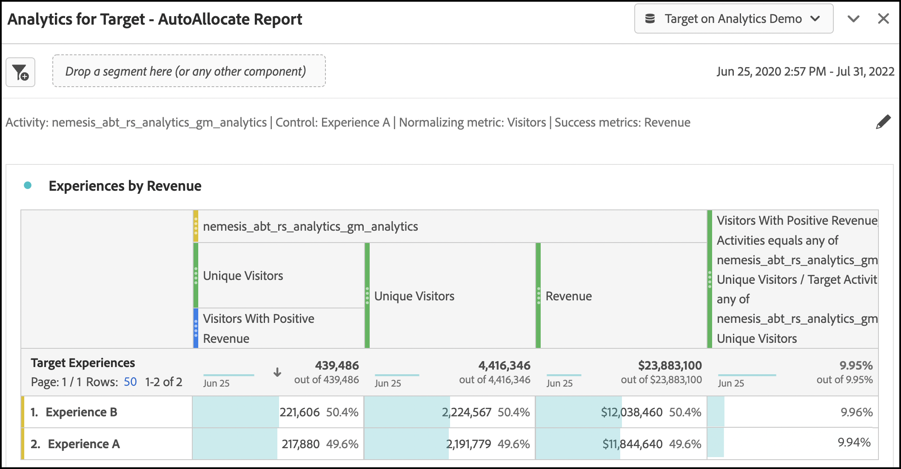

# Einrichten von A4T-Berichten in [!DNL Analysis Workspace] für [!DNL Auto-Allocate] activities

Ein [!DNL Auto-Allocate] -Aktivität einen Gewinner unter zwei oder mehr Erlebnissen identifiziert und dem Gewinner automatisch mehr Traffic zuordnet, während der Test weiter ausgeführt und das Lernen fortgesetzt wird. Die [!UICONTROL Analytics for Target] (A4T)-Integration für [!UICONTROL Automatische Zuordnung] können Sie Ihre Berichtsdaten in [!DNL Adobe Analytics]und Sie können sogar für benutzerdefinierte Ereignisse oder Metriken optimieren, die in [!DNL Analytics].

Obwohl Rich-Analytics-Funktionen in [!DNL Adobe Analytics] [!DNL Analysis Workspace], einige Änderungen an der Standardeinstellung **[!UICONTROL Analytics for Target]** -Bedienfeld zur korrekten Interpretation erforderlich [!DNL Auto-Allocate] aufgrund der Nuancen in [Optimierungskriterien](https://experienceleague.adobe.com/docs/target/using/integrate/a4t/a4t-at-aa.html?lang=en#supported).

Dieses Tutorial führt Sie durch die empfohlenen Änderungen zur Analyse [!DNL Auto-Allocate] Aktivitäten in [!DNL Analysis Workspace]. Die Schlüsselkonzepte sind:

* [!UICONTROL Besucher] sollte immer als Normalisierungsmetrik in [!DNL Auto-Allocate] Aktivitäten.
* Wenn die Metrik eine [!DNL Adobe Analytics] -Metrik, hängt der geeignete Zähler für die Konversionsrate vom Typ der Optimierungskriterien ab, die während der Aktivitätseinrichtung ausgewählt wurden.
   * Das Optimierungskriterium &quot;Unique Visitor-Konversionsrate maximieren&quot;verfügt über eine Konversionsrate, deren Zähler die Anzahl der Unique Visitors mit einem positiven Wert der Metrik darstellt.
   * Der &quot;Metrikwert pro Besucher maximieren* hat eine Konversionsrate, deren Zähler der normale Metrikwert in [!DNL Adobe Analytics]. Dies wird standardmäßig im **[!UICONTROL Analytics for Target]** Bedienfeld in [!DNL Analysis Workspace].
* Wenn Ihre Optimierungsmetrik eine [!DNL Target] definierte Konversionsmetrik, die standardmäßige **[!UICONTROL Analytics for Target]** Bedienfeld in [!DNL Analysis Workspace] verarbeitet die Konfiguration Ihres Bedienfelds.
* Die [!UICONTROL Konfidenz] in [!DNL Analysis Workspace] spiegeln nicht die [konservativere Statistiken, die von [!UICONTROL Automatische Zuordnung]](https://experienceleague.adobe.com/docs/target/using/activities/auto-allocate/automated-traffic-allocation.html?lang=en#section_98388996F0584E15BF3A99C57EEB7629)und sollten daher entfernt werden.

## Erstellen Sie A4T für [!DNL Auto-Allocate] Bedienfeld in [!DNL Analysis Workspace]

So erstellen Sie A4T für [!DNL Auto-Allocate] Bericht beginnt mit der **[!UICONTROL Analytics for Target]** Bedienfeld in [!DNL Analysis Workspace], wie unten dargestellt. Wählen Sie dann die folgenden Optionen aus:

1. **[!UICONTROL Kontrollerlebnis]**: Sie können ein beliebiges Erlebnis auswählen.
2. **[!UICONTROL Normalisierungsmetrik]**: Wählen Sie Besucher aus. [!DNL Auto-Allocate] Normalisiert Konversionsraten immer nach Unique Visitors.
3. **[!UICONTROL Erfolgsmetriken]**: Wählen Sie dieselbe Metrik aus, die Sie bei der Erstellung der Aktivität verwendet haben. Wenn dies eine [!DNL Target] definierte Konversionsmetrik auswählen **Aktivitätskonvertierung**. Andernfalls wählen Sie die [!DNL Adobe Analytics] -Metrik verwenden.

![[!UICONTROL Analytics for Target] Bedienfeldeinstellungen für [!DNL Auto-Allocate] Aktivitäten.](assets/AAFigure1.png)

*Abbildung 1: [!UICONTROL Analytics for Target] Bedienfeldeinstellungen für [!DNL Auto-Allocate] Aktivitäten.*

>[!NOTE]
>
> Sie können auch zu einem vordefinierten **[!UICONTROL Analytics for Target]** angezeigt, wenn Sie auf den Link im Berichtsbildschirm in [!DNL Adobe Target].

## [!DNL Target] [!UICONTROL Konversion] Metriken oder [!DNL Analytics] Metriken mit Optimierungskriterien &quot;Metrikwert pro Besucher maximieren&quot;

Das standardmäßige A4T-Bedienfeld verarbeitet [!DNL Auto-Allocate] Aktivitäten, bei denen die Zielmetrik entweder eine [!DNL Target] oder [!DNL Analytics] Metrik mit dem Optimierungskriterium &quot;Metrikwert pro Besucher maximieren&quot;.

Ein Beispiel für dieses Bedienfeld wird für die [!UICONTROL Umsatz] Metrik, wobei &quot;Metrikwert pro Besucher maximieren&quot;zum Zeitpunkt der Aktivitätserstellung als Optimierungskriterium ausgewählt wurde. Wie bereits erwähnt, [!DNL Auto-Allocate] verwendet konservativere Konfidenzberechnungen im Vergleich zu den in **[!UICONTROL Analytics for Target]** Bereich. Adobe empfiehlt, die Konfidenzmetrik sowie die zugehörigen Metriken für die untere und obere Steigerung zu entfernen.

![[!UICONTROL Analytics for Target - Bericht zur automatischen Zuordnung] panel](assets/AAFigure2.png)

*Abbildung 2: Der empfohlene Bericht für [!DNL Auto-Allocate] Aktivitäten mit [!DNL Analytics] Metrik &quot;Metrikwert pro Besucheroptimierung maximieren&quot;. Für diese Metriktypen sowie [!DNL Target] definierte Konversionsmetriken, die standardmäßige **[!UICONTROL Analytics for Target]**Bedienfeld in [!DNL Analysis Workspace] verwendet werden.*

## [!DNL Analytics] Metriken mit Optimierungskriterien zur &quot;Maximierung der Unique Visitor-Konversionsrate&quot;

Wenn ein [!DNL Adobe Analytics] wird mit einem Optimierungskriterium von *Maximieren der Unique Visitor-Konversionsrate*, die Standardeinstellung **[!UICONTROL Analytics for Target]** Bedienfeld in [!DNL Analysis Workspace] geändert werden.

Die Erfolgsmetrik ist jetzt eine Zählung der Unique Visitors, für die die Konversionsmetrik positiv war. Dies kann durch Erstellen eines Segments erreicht werden, das auf Treffer mit einem positiven Wert der Metrik filtert. Erstellen Sie dieses Segment wie folgt:

1. Wählen Sie die **[!UICONTROL Komponenten]** > **[!UICONTROL Segment erstellen]** in der [!DNL Analysis Workspace] Symbolleiste.
1. Ziehen Sie die bei der Erstellung der Aktivität verwendete Metrik aus dem linken Bereich in den **[!UICONTROL Definition]** des Segments.
1. Wählen Sie die Werte der Metrik aus, die **größer als** ein numerischer Wert von 0.
1. Aus dem **[!UICONTROL Einschließen]** Dropdown-Liste auswählen **[!UICONTROL Besucher]**.
1. Geben Sie Ihrem Segment einen geeigneten Namen.

Ein Beispiel für die Segmenterstellung finden Sie in der folgenden Abbildung, in der Sie [!UICONTROL Besucher mit positivem Umsatz].

![[!UICONTROL Besucher mit positivem Umsatz] Segment in [!DNL Analysis Workspace]](assets/AAFigure3.png)

*Abbildung 3: Segmenterstellung für [!DNL Adobe Analytics] Metriken mit Optimierungskriterien gleich &quot;[!UICONTROL Maximieren der Unique Visitor-Konversionsrate].&quot; In diesem Beispiel lautet die Metrik [!UICONTROL Umsatz]und das Optimierungsziel darin besteht, die Anzahl der Besucher mit positivem Umsatz zu maximieren.*

Nachdem das entsprechende Segment erstellt wurde, wird die Standardeinstellung  **[!UICONTROL Analytics for Target]** Bedienfeld in [!DNL Analysis Workspace] kann geändert werden.

1. Sekunde hinzufügen **Unique Visitors** Metrik neben dem vorhandenen [!UICONTROL Besucher] Metrikspalte.
2. Ziehen Sie das neu erstellte Segment unter die erste Spalte, um ein Bedienfeld zu erstellen, das Abbildung 4 ähnelt. Beachten Sie den Unterschied: die Anzahl der Unique Visitors mit positivem Umsatz einen Bruchteil der Gesamtzahl der Unique Visitors darstellt, die jedem Erlebnis zugewiesen sind.

   

   *Abbildung 4: Filter [!UICONTROL Unique Visitors] durch das neu erstellte Segment*

3. Eine Konversionsrate kann [schnell berechnet](https://experienceleague.adobe.com/docs/analytics-learn/tutorials/components/calculated-metrics/quick-calculated-metrics-in-analysis-workspace.html?lang=en) durch Hervorhebung der ersten und zweiten Spalte, Rechtsklick, Auswahl **[!UICONTROL Metrik aus Auswahl erstellen]** > **[!UICONTROL Dividieren]**.

   Die standardmäßige Konversionsrate sollte entfernt und durch diese neue berechnete Metrik ersetzt werden, wie in der Abbildung unten dargestellt. Möglicherweise müssen Sie die neu erstellte berechnete Metrik bearbeiten, um sie als **[!UICONTROL Format]** > **[!UICONTROL Prozent]** bis zu zwei Dezimalstellen, wie dargestellt.

   

   *Abbildung 5: Das endgültige [!UICONTROL Automatische Zuordnung] Bedienfeld, das die Konversionsraten für eine binarisierte Metrik zur Umsatzkonvertierung anzeigt*

## Zusammenfassung

Die Schritte in diesem Tutorial zeigten, wie Sie das [!DNL Analysis Workspace] zur Anzeige [!UICONTROL Automatische Zuordnung] Berichtsdaten.

Zusammenfassung:

* Wenn die Metrik eine [!DNL Target] definierte Konversionsmetrik oder [!DNL Adobe Analytics] Metrik mit dem Optimierungskriterium &quot;Metrikwert pro Besucher maximieren&quot;verwendet werden, sollte das standardmäßige Workspace-Bedienfeld verwendet werden, das mit Besuchern als Normalisierungsmetrik konfiguriert wurde.
* Wenn die Metrik eine [!DNL Adobe Analytics] Metrik mit dem Optimierungskriterium &quot;Unique Visitor-Konversionsrate maximieren&quot;verwenden, müssen Sie eine Konversionsrate verwenden, die als der Anteil der Besucher definiert ist, für die die Metrik positiv ist. Dies geschieht durch Erstellen eines entsprechenden Segments, das die [!UICONTROL Unique Visitor] Metrik.
