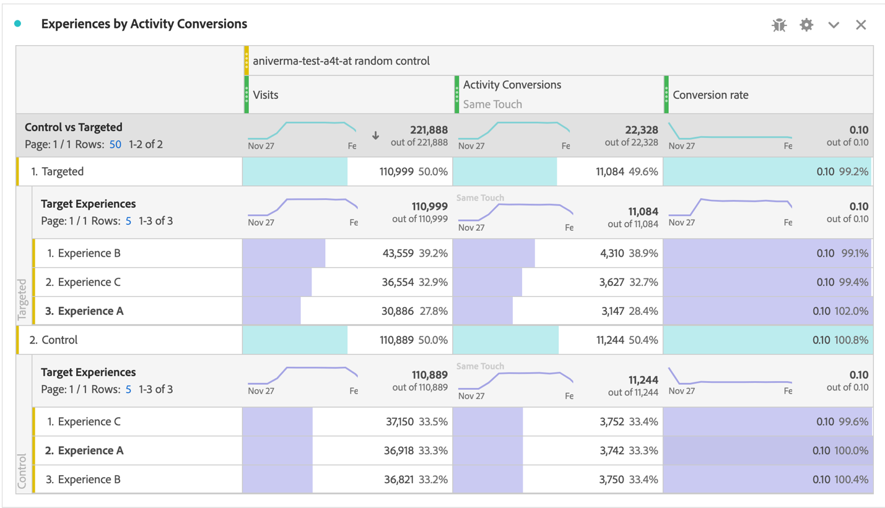

# Einrichten von A4T-Berichten in Analysis Workspace für [!DNL Auto-Target]-Aktivitäten

Die Analytics for Zielgruppe-(A4T-)Integration für [!DNL Auto-Target]-Aktivitäten verwendet die XML-Ensemble-Algorithmen (Ensemble Machine Learning) von Adobe Target, um das beste Erlebnis für jeden Besucher anhand von Profil, Verhalten und Kontext auszuwählen und dabei eine Adobe Analytics-Zielmetrik zu verwenden.

Während in Adobe Analytics Analysis Workspace Rich-Analyse-Funktionen verfügbar sind, sind einige Änderungen am Standardbedienfeld **[!UICONTROL Analytics für Zielgruppe]** erforderlich, um [!DNL Auto-Target]-Aktivitäten korrekt zu interpretieren. Dies ist auf Unterschiede zwischen den Aktivitäten für Experimentierungen (manuelle A/B- und automatisierte Zuordnung) und den Aktivitäten zur Personalisierung ([!DNL Auto-Target]) zurückzuführen.

Dieses Lernprogramm führt Sie durch die empfohlenen Änderungen zur Analyse von [!DNL Auto-Target]-Aktivitäten in Workspace, die auf den folgenden Hauptkonzepten basieren:

* Die Dimension **[!UICONTROL Control vs Targeted]** kann verwendet werden, um zwischen Kontrollerlebnissen und denen zu unterscheiden, die vom [!DNL Auto-Target]-Ensemble-ML-Algorithmus bereitgestellt werden.
* Besuche sollten als Normalisierungsmetrik verwendet werden, wenn Leistungsunterteilungen auf Erlebnisebene angezeigt werden. Darüber hinaus kann die Standardzählmethodik von [Adobe Analytics Besuche umfassen, bei denen der Benutzer keinen Aktivitäten-Inhalt](https://experienceleague.adobe.com/docs/target/using/integrate/a4t/a4t-faq/a4t-faq-viewing-reports.html?lang=en#metrics) tatsächlich sieht. Dieses Standardverhalten kann jedoch mithilfe eines entsprechenden Segments (Details unten) geändert werden.
* Die Verwendung von Scoping-Attributen für Besuche - auch als &quot;Besuchs-Lookback-Fenster&quot;im vorgeschriebenen Zuordnungsmodell bezeichnet - wird von den ML-Modellen von Adobe Target während der Schulungsphase verwendet. Bei der Unterteilung der Zielmetrik sollte dasselbe (nicht standardmäßige) Zuordnungsmodell verwendet werden.

## A4T für [!DNL Auto-Target]-Bedienfeld in Workspace erstellen

Um einen A4T-Bericht für [!DNL Auto-Target] zu erstellen, verwenden Sie entweder den Beginn mit dem Bereich **[!UICONTROL Analytics für Zielgruppe]** in Workspace, wie unten dargestellt, oder beginnen Sie mit einer Freiformtabelle. Wählen Sie dann die folgenden Optionen aus:

1. **[!UICONTROL Kontrollerlebnis]**: Sie können ein beliebiges Erlebnis auswählen. Diese Auswahl wird jedoch später außer Kraft gesetzt. Beachten Sie, dass das Kontrollerlebnis für [!DNL Auto-Target]-Aktivitäten eine Steuerungsstrategie ist, die entweder a) zufällig unter allen Erlebnissen dient oder b) ein einziges Erlebnis bereitstellt (diese Auswahl erfolgt zum Zeitpunkt der Erstellung der Aktivität in Adobe Target). Auch wenn Sie sich für Auswahl (b) entschieden haben - Ihre [!DNL Auto-Target]-Aktivität hat ein bestimmtes Erlebnis als Control bezeichnet - sollten Sie weiterhin den in diesem Lernprogramm beschriebenen Ansatz zur Analyse von A4T für [!DNL Auto-Target]-Aktivitäten verfolgen.
2. **[!UICONTROL Normalisierungsmetrik]**: Wählen Sie Besuche.
3. **[!UICONTROL Erfolgsmetriken]**: Obwohl Sie Metriken auswählen können, für die Berichte erstellt werden sollen, sollten Sie in der Regel Berichte zu derselben Metrik erstellen, die bei der Erstellung der Aktivität in Adobe Target zur Optimierung ausgewählt wurde.

*pngAbbildung 1: Einrichtung des Bereichs &quot;Analyse für Zielgruppe&quot;für  [!DNL Auto-Target] Aktivitäten.*

>[!NOTE]
>
>Um den Bereich &quot;Analyse für Zielgruppe&quot;für Aktivitäten mit automatischer Zielgruppe einzurichten, wählen Sie ein Kontrollerlebnis, wählen Sie &quot;Besuche&quot;als Normalisierungsmetrik und wählen Sie die gleiche Zielmetrik, die bei der Erstellung der Zielgruppe-Aktivität für die Optimierung ausgewählt wurde.

## Verwenden Sie die Dimension &quot;Kontrolle&quot;im Vergleich zu &quot;Zielgruppe&quot;, um das XML-Ensemble-Modell von Adobe Target mit Ihrer Kontrolle zu vergleichen

Das Standard-A4T-Bedienfeld ist für klassische (manuelle) A/B-Tests oder Aktivitäten mit automatisierter Zuordnung konzipiert, bei denen die Performance einzelner Erlebnisse mit der Kontrollerfahrung verglichen werden soll. Bei [!DNL Auto-Target]-Aktivitäten sollte der erste Auftragsvergleich jedoch zwischen der Control *strategy* und der Targeting *strategy* erfolgen (d. h. die Steigerung der Gesamtleistung des [!DNL Auto-Target] Ensemble ML-Modells im Vergleich zur Control-Strategie bestimmen).

Um diesen Vergleich durchzuführen, verwenden Sie die Dimension **[!UICONTROL Control vs Targeted (Analytics for Zielgruppe)]**. Ziehen Sie per Drag &amp; Drop, um die Dimension **[!UICONTROL Zielgruppe Erlebnisse]** im Standard-A4T-Bericht zu ersetzen.

Beachten Sie, dass diese Ersetzung die standardmäßigen Lift- und Konfidenzberechnungen im A4T-Bedienfeld ungültig macht. Um Verwirrung zu vermeiden, können Sie diese Metriken aus dem Standardbedienfeld entfernen und den folgenden Bericht beibehalten:

*pngAbbildung 2: Der empfohlene Basisbericht für  [!DNL Auto-Target] Aktivitäten. Dieser Bericht wurde so konfiguriert, dass zielgerichteter Traffic (der vom Ensemble-ML-Modell bereitgestellt wird) mit Ihrem Control-Traffic verglichen wird.*

>[!NOTE]
>
>Derzeit stehen für A4T-Berichte zur automatischen Zielgruppe keine Lift- und Konfidenzzahlen für Kontroll- oder Targeting-Dimensionen zur Verfügung. Bis Support hinzugefügt wird, können Steigerung und Konfidenz manuell berechnet werden, indem der [Vertrauensrechner](https://experienceleague.adobe.com/docs/target/assets/complete_confidence_calculator.xlsx?lang=en) heruntergeladen wird.

## Aufschlüsselungen von Metriken auf Erlebnisebene Hinzufügen

Um weitere Einblicke in die Leistung des Ensemble-ML-Modells zu erhalten, können Sie die Aufschlüsselungen auf Erlebnisebene der Dimension **[!UICONTROL Control vs. Targeted]** untersuchen. Ziehen Sie in Workspace die Dimension **[!UICONTROL Erlebnisse der Zielgruppe]** in Ihren Bericht und unterteilen Sie dann jede der Dimensionen &quot;Kontrolle&quot;und &quot;Zielgruppe&quot;einzeln.

*pngAbbildung 3: Aufschlüsseln der Zieldimension nach Zielgruppen-Erlebnissen*

Ein Beispiel für den resultierenden Bericht ist hier dargestellt.

*pngAbbildung 4: Ein  [!DNL Auto-Target] Standardbericht mit Aufschlüsselungen auf Erlebnisebene. Beachten Sie, dass Ihre Zielmetrik möglicherweise unterschiedlich sein kann und Ihre Kontrollstrategie ein einziges Erlebnis aufweisen kann.*

>[!TIP]
>
>Klicken Sie in Workspace auf das Zahnradsymbol, um die Prozentwerte in der Spalte &quot;Konversionsrat&quot;auszublenden, um den Fokus auf die Erlebnis-Konvertierungsraten zu behalten. Beachten Sie, dass die Konversionsraten dann als Dezimalstellen formatiert werden, jedoch als Prozentwerte entsprechend interpretiert werden.

## Warum &quot;Besuche&quot;die richtige Normalisierungsmetrik für [!DNL Auto-Target]-Aktivitäten ist

Wählen Sie bei der Analyse einer [!DNL Auto-Target]-Aktivität immer Besuche als Standard-Normalisierungsmetrik. [!DNL Auto-Target] personalization wählt ein Erlebnis für einen Besucher einmal pro Besuch aus (formell einmal pro Adobe Target-Sitzung), d. h. das Erlebnis, das einem Benutzer angezeigt wird, kann sich bei jedem einzelnen Besuch ändern. Wenn Sie als Normalisierungsmetrik &quot;Individuelle Besucher&quot;verwenden, führt die Tatsache, dass ein Benutzer am Ende mehrere Erlebnisse (über verschiedene Besuche hinweg) sehen kann, zu verwirrenden Konversionsraten.

Ein einfaches Beispiel zeigt diesen Punkt: Betrachten Sie ein Szenario, bei dem zwei Besucher eine Kampagne aufrufen, die nur zwei Erlebnisse enthält. Der erste Besucher besucht zweimal. Sie werden Erlebnis A beim ersten Besuch zugewiesen, Erlebnis B beim zweiten Besuch (da sich der Status des Profils bei diesem zweiten Besuch ändert). Nach dem zweiten Besuch konvertiert der Besucher eine Bestellung. Die Konversion wird dem zuletzt angezeigten Erlebnis (Erlebnis B) zugeordnet. Der zweite Besucher besucht ebenfalls zweimal, und Erlebnis B wird beide Male angezeigt, jedoch nie konvertiert.

Vergleichen wir Berichte auf Besuchers- und Besuchsebene:

| Erlebnis | Unique Visitors | Besuche | Konversionen | Besucher-Norm. Conv. Rate | Besuchen Sie die Norm. Conv. Rate |
| --- | --- | --- | --- | --- | --- |
| A | 1 | 3 | - | 0% | 0% |
| B | 2 | 3 | 3 | 50% | 33,3% |
| Gesamt | 2 | 4 | 3 | 50% | 25 % |
*Tabelle 1: Beispiel für den Vergleich von Besucher-normalisierten und besuchsnormalisierten Berichten für ein Szenario, bei dem Entscheidungen an einem Besuch festhalten (und nicht an einem Besucher, wie bei regulären A/B-Tests). In diesem Szenario sind Besucher-normalisierte Metriken verwirrend.*

Wie aus der Tabelle hervorgeht, besteht eine eindeutige Inkongruenz von Zahlen auf Besucher-Ebene. Obwohl es insgesamt zwei individuelle Besucher gibt, ist dies keine Summe individueller Besucher für jedes Erlebnis. Obwohl der Konversionsrate auf Besucherebene nicht unbedingt falsch ist, machen Konversionsraten auf Besucherebene beim Vergleich einzelner Erlebnisse wohl wesentlich sinnvoller aus. Formal ist die Analyse (&quot;Besuche&quot;) dieselbe wie die Entscheidungs-Stickiness-Einheit, was bedeutet, dass Aufschlüsselungen von Metriken auf Erlebnisebene hinzugefügt und verglichen werden können.

## Filtern nach Besuchen der Aktivität

Die Standardzählmethodik von Adobe Analytics für Besuche bei einer Zielgruppe-Aktivität kann Besuche umfassen, bei denen der Benutzer nicht mit der Aktivität der Zielgruppe interagiert hat. Dies liegt daran, dass die Zuweisung von Zielgruppen zur Aktivität im Analytics-Besucher-Kontext beibehalten wird. Infolgedessen kann die Anzahl der Besuche der Aktivität der Zielgruppe manchmal zu hoch sein, was zu einem Rückgang der Konversionsraten führt.

Wenn Sie lieber Berichte zu Besuchen erstellen möchten, bei denen der Benutzer tatsächlich mit der Auto-Zielgruppe-Aktivität interagiert hat (entweder durch Einstieg in die Aktivität, ein Display-/Besuchsdatum oder eine Konversion), haben Sie folgende Möglichkeiten:

1. Erstellen Sie ein bestimmtes Segment, das Treffer aus der betreffenden Zielgruppe-Aktivität enthält, und
1. Filtern Sie die Metrik &quot;Besuche&quot;mit diesem Segment.

**So erstellen Sie das Segment:**

1. Wählen Sie in der Symbolleiste &quot;Arbeitsbereich&quot;die Option **[!UICONTROL Komponenten > Segment]** erstellen.
2. Geben Sie einen **[!UICONTROL Titel]** für Ihr Segment ein. Im folgenden Beispiel heißt das Segment [!DNL "Hit with specific Auto-Target activity"].
3. Ziehen Sie die Dimension **[!UICONTROL Zielgruppe Aktivitäten]** in den Bereich **[!UICONTROL Definition]**.
4. Verwenden Sie den Operator **[!UICONTROL equals]**.
5. Suchen Sie nach Ihrer spezifischen Aktivität der Zielgruppe.
6. Wählen Sie das Zahnradsymbol aus und wählen Sie **[!UICONTROL Zuordnungsmodell > Instanz]**, wie in der folgenden Abbildung dargestellt.
7. Klicken Sie auf **[!UICONTROL Speichern]**.

*pngAbbildung 5: Verwenden Sie ein Segment wie das hier dargestellte, um die Metrik &quot;Besuche&quot;in Ihrem A4T- [!DNL Auto-Target] Bericht zu filtern.*

Nachdem das Segment erstellt wurde, verwenden Sie es, um die Besuchsmetrik zu filtern, sodass die Besuchsmetrik nur Besuche enthält, bei denen der Benutzer mit der Zielgruppe-Aktivität interagiert hat.

**So filtern Sie Besuche mit diesem Segment:**

1. Ziehen Sie das neu erstellte Segment aus der Komponenten-Symbolleiste und bewegen Sie den Mauszeiger über die Basis der Metrikbezeichnung **[!UICONTROL Besuche]**, bis eine blaue Meldung **[!UICONTROL Filtern nach]** angezeigt wird.
2. Lassen Sie das Segment frei. Der Filter wird auf diese Metrik angewendet.

Das endgültige Fenster wird wie folgt angezeigt.

*pngAbbildung 6: Berichte-Bedienfeld mit dem Segment &quot;Treffer mit spezifischer Aktivität der automatischen Zielgruppe&quot;auf die   Besuchsmetrik angewendet. Dadurch werden nur Besuche sichergestellt, bei denen ein Benutzer tatsächlich mit der betreffenden Zielgruppe-Aktivität interagiert hat.*

## Ausrichtung der Zuordnung zwischen der ML-Modellschulung und der Zielmetrikgenerierung

Die A4T-Integration ermöglicht, dass das ML-Modell von [!DNL Auto-Target] *trainiert* verwendet wird, indem dieselben Konversions-Ereignis-Daten verwendet werden, die Adobe Analytics verwendet, um *Performance-Berichte* zu generieren. Es gibt jedoch bestimmte Annahmen, die bei der Interpretation dieser Daten bei der Schulung der ML-Modelle zugrunde gelegt werden müssen, die sich von den während der Berichte-Phase in Adobe Analytics gemachten Standardannahmen unterscheiden.

Die ML-Modelle von Adobe Target verwenden ein besuchsspezifisches Zuordnungsmodell. Das heißt, sie gehen davon aus, dass eine Konversion im selben Besuch wie eine Inhaltsanzeige für die Aktivität erfolgen muss, damit die Konversion der Entscheidung des ML-Modells &quot;zugeordnet&quot;wird. Dies ist erforderlich, damit die Zielgruppe eine rechtzeitige Schulung ihrer Modelle gewährleistet; Die Zielgruppe kann nicht bis zu 30 Tage auf eine Konversion warten (das Standardzuordnungsfenster für Berichte in Adobe Analytics), bevor sie diese in die Schulungsdaten für ihre Modelle aufgenommen wird.

Daher kann der Unterschied zwischen der Zuordnung, die von den Modellen der Zielgruppe (während der Schulung) verwendet wird, und der Standardzuordnung, die bei der Abfrage von Daten verwendet wird (während der Berichterstellung), zu Diskrepanzen führen. Es kann sogar so aussehen, dass die ML-Modelle schlecht abschneiden, wenn es tatsächlich um die Zuordnung geht.

>[!TIP]
>
>Wenn die ML-Modelle für eine Metrik optimiert werden, die anders zugeordnet wird als die Metriken, die Sie in einem Bericht anzeigen, funktionieren die Modelle möglicherweise nicht wie erwartet! Um dies zu vermeiden, stellen Sie sicher, dass die Zielmetriken in Ihrem Bericht dieselbe Zuordnung verwenden, die von den ML-Modellen der Zielgruppe verwendet wird.

Gehen Sie wie folgt vor, um Zielmetriken mit der gleichen Zuordnungsmethodik, die von Adobe Target-ML-Modellen verwendet wird, zu Ansicht:

1. Bewegen Sie den Mauszeiger über das Zahnradsymbol der Zielmetrik:
   
1. Führen Sie im resultierenden Menü einen Bildlauf zu **[!UICONTROL Dateneinstellungen]** durch.
1. Wählen Sie **[!UICONTROL Nicht standardmäßiges Zuordnungsmodell]** verwenden (falls noch nicht ausgewählt):
   
1. Klicken Sie auf **[!UICONTROL Bearbeiten]**.
1. Wählen Sie **[!UICONTROL Modell]**: **[!UICONTROL Beitrag]** und **[!UICONTROL Lookback-Fenster]**: **[!UICONTROL Besuch]**.
   
1. Klicken Sie auf **[!UICONTROL Anwenden]**.

Diese Schritte stellen sicher, dass Ihr Bericht die Zielmetrik der Anzeige des Erlebnisses zuordnet, wenn das Ereignis der Zielmetrik *irgendwann* (&quot;Beitrag&quot;) im selben Besuch eintrat, an dem ein Erlebnis angezeigt wurde.

## Letzter Schritt: Erstellen Sie einen Konversionsrate, der die Magie oben erfasst

Mit den Änderungen an den Metriken &quot;Besuch&quot;und &quot;Ziel&quot;in den vorhergehenden Abschnitten sollten Sie am A4T-Standardformat für [!DNL Auto-Target]-Berichte-Bedienfeld vorgehen und Konversionsraten erstellen, die das richtige Verhältnis aufweisen - das einer Zielmetrik mit der richtigen Zuordnung zu einer entsprechend gefilterten Metrik &quot;Besuche&quot;.

Erstellen Sie dazu eine berechnete Metrik, indem Sie folgende Schritte durchführen:

1. Wählen Sie in der Symbolleiste Arbeitsbereich die Option **[!UICONTROL Komponenten > Metrik erstellen]**.
1. Geben Sie für Ihre Metrik einen **[!UICONTROL Titel]** ein. Beispiel: &quot;Besuchskorrigierter Konversionsrate für Aktivität XXX.&quot;
1. Wählen Sie **[!UICONTROL Format]** = Prozent und **[!UICONTROL Dezimalstellen]** = 2.
1. Ziehen Sie die relevante Zielmetrik für Ihre Aktivität (z. B. Aktivitäten-Konversionen) in die Definition und verwenden Sie das Zahnradsymbol für diese Zielmetrik, um das Zuordnungsmodell an (Beitrag|Besuch) anzupassen, wie oben beschrieben.
1. Wählen Sie **[!UICONTROL Hinzufügen > Container]** oben rechts im Abschnitt **[!UICONTROL Definition]**.
1. Wählen Sie den Operator für Division () zwischen den beiden Containern.
1. Ziehen Sie Ihr zuvor erstelltes Segment - &quot;Treffer mit spezifischer [!DNL Auto-Target]-Aktivität&quot;in diesem Lernprogramm - für diese spezifische [!DNL Auto-Target]-Aktivität.
1. Ziehen Sie die Metrik **[!UICONTROL Besuche]** in den SegmentContainer.
1. Klicken Sie auf **[!UICONTROL Speichern]**.

Die vollständige Definition der berechneten Metrik wird hier angezeigt.

*pngAbbildung 7: Die besuchs- und zuordnungsberichtigte Modellmetrikdefinition Konversionsrat. (Beachten Sie, dass diese Metrik von Ihrer Zielmetrik und Ihrer Aktivität abhängt. Mit anderen Worten, diese Metrikdefinition kann nicht für alle Aktivitäten wiederverwendet werden.)*

>[!IMPORTANT]
>
>Die Konversionsrat-Metrik aus dem A4T-Bedienfeld ist nicht mit dem Konversions-Ereignis oder der Normalisierungsmetrik in der Tabelle verknüpft. Wenn Sie die in diesem Lernprogramm vorgeschlagenen Änderungen vornehmen, passt sich das Konversionsrate nicht automatisch an die Änderungen an. Wenn Sie die Änderung an einer (oder beiden) Konversionsmetrik und der Normalisierungsmetrik vornehmen, müssen Sie sich daher als letzten Schritt daran erinnern, das Konversionsrate ebenfalls zu ändern, wie oben gezeigt.

## Zusammenfassung: Endgültiges Beispiel für einen Arbeitsbereich für [!DNL Auto-Target]-Berichte

Wenn Sie alle oben genannten Schritte in einem Bedienfeld zusammenfassen, zeigt die folgende Abbildung eine vollständige Ansicht des empfohlenen Berichts für [!DNL Auto-Target] A4T-Aktivitäten. Dieser Bericht ist identisch mit dem Bericht, den die Zielgruppe zur Optimierung Ihrer Zielmetrik für maschinelles Lernen verwendet hat. Er enthält alle in diesem Lernprogramm besprochenen Nuancen und Empfehlungen. Dieser Bericht steht auch den Zählmethodiken bei herkömmlichen Zielgruppe-Berichte-basierten [!DNL Auto-Target]-Aktivitäten am nächsten.

*pngAbbildung 8: Der endgültige A4T- [!DNL Auto-Target] Bericht in Adobe Analytics Workspace, der alle in den vorherigen Abschnitten dieses Dokuments beschriebenen Anpassungen an Metrikdefinitionen kombiniert.*
