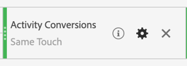

# Einrichten von A4T-Berichten in [!DNL Analysis Workspace] für [!DNL Auto-Target] Aktivitäten

>[!IMPORTANT]
>
>Bei [!UICONTROL automatischen Targeting]-Aktivitäten müssen Sie die Berichte in [!DNL Analytics Workspace] überprüfen und manuell ein A4T-Bedienfeld erstellen.

Die [!UICONTROL Analytics for Target] (A4T)-Integration für [!DNL Auto-Target] -Aktivitäten verwendet die ML-Algorithmen (maschinelles Lernen) des [!DNL Adobe Target]-Ensembles, um das beste Erlebnis für jeden Besucher basierend auf seinem Profil, Verhalten und Kontext auszuwählen, wobei gleichzeitig eine [!DNL Adobe Analytics] Zielmetrik verwendet wird.

Obwohl in [!DNL Adobe Analytics] [!DNL Analysis Workspace] umfangreiche Analysefunktionen verfügbar sind, sind aufgrund der Unterschiede zwischen Experimentieraktivitäten (manueller [!UICONTROL A/B-Test] und [!UICONTROL Automatische Zuordnung]) und Personalisierungsaktivitäten ([!UICONTROL [!UICONTROL Automatisches Targeting]]) einige Änderungen am Standardbedienfeld **[!UICONTROL Analytics for Target]** erforderlich, um [!DNL Auto-Target] Aktivitäten korrekt zu interpretieren.

In diesem Tutorial werden die empfohlenen Änderungen zur Analyse von [!UICONTROL automatischen Targeting]-Aktivitäten in [!DNL Analysis Workspace] erläutert, die auf den folgenden Schlüsselkonzepten basieren:

* Die Dimension **[!UICONTROL Kontrolle vs.]**) kann verwendet werden, um zwischen [!UICONTROL Kontrolle]-Erlebnissen und Erlebnissen zu unterscheiden, die vom ML-Algorithmus des [!UICONTROL Automatisches Targeting]-Ensembles bereitgestellt werden.
* Besuche sollten bei der Anzeige von Leistungsaufschlüsselungen auf Erlebnisebene als Normalisierungsmetrik verwendet werden. Darüber hinaus kann die standardmäßige Zählmethodik von [Adobe Analytics Besuche einschließen, bei denen der/die Benutzende keinen Aktivitätsinhalt sieht](https://experienceleague.adobe.com/docs/target/using/integrate/a4t/a4t-faq/a4t-faq-viewing-reports.html#metrics){target=_blank} aber dieses Standardverhalten kann durch die Verwendung eines Segments mit geeignetem Umfang geändert werden (Details unten).
* Die Attribution auf Besuchs-Lookback-Ebene, die im vorgeschriebenen Attributionsmodell auch als „Besuchs-Lookback-Fenster“ bezeichnet wird, wird von den [!DNL Adobe Target] ML-Modellen während ihrer Trainingsphasen verwendet. Bei der Aufschlüsselung der Zielmetrik sollte dasselbe (nicht standardmäßige) Attributionsmodell verwendet werden.

## Erstellen des Bedienfelds „A4T“ für [!UICONTROL Automatisches Targeting] in [!DNL Analysis Workspace]

Um einen A4T-Bericht für [!UICONTROL Automatisches Targeting] zu erstellen, beginnen Sie entweder mit dem Bedienfeld **[!UICONTROL Analytics for Target]** in [!DNL Analysis Workspace], wie unten dargestellt, oder beginnen Sie mit einer Freiformtabelle. Nehmen Sie dann die folgenden Auswahlen vor:

1. **[!UICONTROL Kontrollerlebnis]**: Sie können ein beliebiges Erlebnis auswählen. Diese Auswahl wird jedoch später überschrieben. Beachten Sie, dass das Kontrollerlebnis bei [!UICONTROL automatischen Targeting]-Aktivitäten wirklich eine Kontrollstrategie ist, die entweder a) in zufälliger Abfolge unter allen Erlebnissen bereitstellt oder b) ein einzelnes Erlebnis bereitstellt (diese Auswahl wird bei der Erstellung der Aktivität in [!DNL Adobe Target] getroffen). Selbst wenn Sie sich für Auswahl (b) entschieden haben, hat Ihre [!UICONTROL Automatisches Targeting]-Aktivität ein bestimmtes Erlebnis als Kontrolle ausgewiesen. Sie sollten dennoch den in diesem Tutorial beschriebenen Ansatz zur Analyse von A4T für [!UICONTROL Automatisches Targeting]-Aktivitäten befolgen.
2. **[!UICONTROL Normalisierungsmetrik]**: Wählen Sie [!UICONTROL Besuche].
3. **[!UICONTROL Erfolgsmetriken]**: Sie können zwar beliebige Metriken auswählen, für die Sie Berichte erstellen möchten, Sie sollten jedoch im Allgemeinen Berichte zu derselben Metrik anzeigen, die bei der Aktivitätserstellung in [!DNL Target] für die Optimierung ausgewählt wurde.

   Bedienfeld![[!UICONTROL Setup &#x200B;]Analytics for Target) für [!UICONTROL automatische Targeting]-Aktivitäten.](assets/Figure1.png)

   *Abbildung 1: Bedienfeld[!UICONTROL Einrichtung von Analytics for &#x200B;] für -Aktivitäten Automatisches Targeting)*

>[!TIP]
>
>Um Ihr Bedienfeld [!UICONTROL Analytics for Target] für [!UICONTROL Automatisches Targeting]-Aktivitäten einzurichten, wählen Sie ein beliebiges Kontrollerlebnis, [!UICONTROL Besuche] als Normalisierungsmetrik und dieselbe Zielmetrik aus, die bei der Erstellung [!DNL Target] Aktivität für die Optimierung ausgewählt wurde.

## Verwenden des [!UICONTROL Kontrollelements im Vergleich zuZielgruppendimension &#x200B;] Vergleich des [!DNL Target]-ML-Modells mit dem Steuerelement

Das standardmäßige A4T-Bedienfeld wurde für klassische (manuelle) [!UICONTROL A/B-Test]- oder [!UICONTROL Automatische Zuordnung]-Aktivitäten entwickelt, bei denen das Ziel darin besteht, die Leistung einzelner Erlebnisse mit der Kontrollerlebnis zu vergleichen. Bei [!UICONTROL automatischen Targeting]-Aktivitäten sollte jedoch der erste Reihenfolgenvergleich zwischen der Kontroll-(Strategie *und* zielgerichteten *Strategie)*. Mit anderen Worten, die Bestimmung der Steigerung der Gesamtleistung des [!UICONTROL Automatisches Targeting]-Ensemble ML-Modell über die Kontrollstrategie.

Verwenden Sie für diesen Vergleich die Dimension **[!UICONTROL Kontrolle vs. Zielgruppe (Analytics for Target]** . Drag-and-Drop, um die Dimension **[!UICONTROL Target-Erlebnisse]** im standardmäßigen A4T-Bericht zu ersetzen.

Beachten Sie, dass durch diese Ersetzung die standardmäßigen Berechnungen [!UICONTROL Steigerung und Konfidenz] im A4T-Bedienfeld ungültig werden. Um Verwirrung zu vermeiden, können Sie diese Metriken aus dem Standardbedienfeld entfernen und so den folgenden Bericht beibehalten:

Bedienfeld ![[!UICONTROL Erlebnisse nach Aktivitätskonversionen] in [!DNL Analysis Workspace]](assets/Figure2.png)

*Abbildung 2: Empfohlener Baseline-Bericht für [!DNL Auto-Target] Aktivitäten. Dieser Bericht wurde konfiguriert, um den Zieldatenverkehr (bereitgestellt vom ML-Modell des Ensembles) mit dem Kontrolldatenverkehr zu vergleichen.*

>[!NOTE]
>
>Derzeit sind [!UICONTROL Steigerung und Konfidenz] Zahlen für [!UICONTROL Kontroll- vs. Zielgruppendimensionen] für A4T-Berichte für [!UICONTROL Automatisches Targeting] nicht verfügbar. Bis Unterstützung hinzugefügt wird[!UICONTROL &#x200B; können „Steigerung und Konfidenz] manuell berechnet werden, indem der [Konfidenzrechner“ heruntergeladen &#x200B;](https://experienceleague.adobe.com/docs/target/assets/complete_confidence_calculator.xlsx).

## Aufschlüsselungen von Metriken auf Erlebnisebene hinzufügen

Um weitere Informationen zur Leistung des ML-Modells des Ensembles zu erhalten, können Sie Aufschlüsselungen auf Erlebnisebene der Dimension **[!UICONTROL Kontrolle vs.]**&quot; untersuchen. Ziehen Sie [!DNL Analysis Workspace] die Dimension **[!UICONTROL Target-Erlebnisse]** auf Ihren Bericht und schlüsseln Sie dann die einzelnen Kontroll- und Zieldimensionen getrennt auf.

Bedienfeld ![[!UICONTROL Erlebnisse nach Aktivitätskonversionen] in [!DNL Analysis Workspace]](assets/Figure3.png)

*Abbildung 3: Aufschlüsselung der Zieldimension nach Zielerlebnissen*

Ein Beispiel für den resultierenden Bericht finden Sie hier.

Bedienfeld ![[!UICONTROL Erlebnisse nach Aktivitätskonversionen] in [!DNL Analysis Workspace]](assets/Figure4.png)

*Abbildung 4: Ein standardmäßiger Bericht [!UICONTROL Automatisches Targeting] mit Aufschlüsselungen auf Erlebnisebene. Beachten Sie, dass Ihre Zielmetrik möglicherweise anders ist und Ihre Kontrollstrategie möglicherweise ein einziges Erlebnis hat.*

>[!TIP]
>
>Klicken Sie in [!DNL Analysis Workspace] auf das Zahnradsymbol, um die Prozentsätze in der Spalte [!UICONTROL Konversionsrate“ &#x200B;], damit der Fokus weiterhin auf den Erlebnis-Konversionsraten liegt. Die Konversionsraten werden dann als Dezimalzahlen formatiert, interpretieren sie jedoch entsprechend als Prozentzahlen.

## Warum &quot;[!UICONTROL Besuche] die richtige Normalisierungsmetrik für [!UICONTROL Automatisches Targeting]-Aktivitäten ist

Wählen Sie bei der Analyse [!UICONTROL &#x200B; Aktivität vom Typ „Automatisches &#x200B;]&quot; immer [!UICONTROL Besuche] als standardmäßige Normalisierungsmetrik aus. [!UICONTROL Automatisches Targeting] Bei der Personalisierung wird ein Erlebnis für einen Besucher einmal pro Besuch ausgewählt (formell einmal pro [!DNL Target]). Das bedeutet, dass sich das einem Besucher angezeigte Erlebnis bei jedem einzelnen Besuch ändern kann. Wenn Sie also [!UICONTROL Unique Visitors] als Normalisierungsmetrik verwenden, würde die Tatsache, dass ein einzelner Benutzer möglicherweise mehrere Erlebnisse sieht (über verschiedene Besuche hinweg), zu verwirrenden Konversionsraten führen.

Ein einfaches Beispiel veranschaulicht dies: Stellen Sie sich ein Szenario vor, in dem zwei Besucher eine Kampagne mit nur zwei Erlebnissen betreten. Der erste Besucher besucht zweimal. Sie werden Erlebnis A beim ersten Besuch zugewiesen, aber Erlebnis B beim zweiten Besuch (da sich ihr Profilstatus bei diesem zweiten Besuch ändert). Nach dem zweiten Besuch konvertiert der Besucher, indem er eine Bestellung aufgibt. Die Konversion wird dem zuletzt angezeigten Erlebnis (Erlebnis B) zugeordnet. Der zweite Besucher besucht ebenfalls zweimal und erhält beide Male Erlebnis B, konvertiert jedoch nie.

Vergleichen wir Berichte auf Besucher- und Besuchsebene:

| Erlebnis | Unique Visitors | Besuche | Konversionen | Besucherbereinigte Konversionsrate | Besuchsbereinigte Konversionsrate |
| --- | --- | --- | --- | --- | --- |
| A | 1 | 1 | - | 0% | 0% |
| B | 2 | 3 | 1 | 50% | 33.3% |
| Gesamt | 2 | 4 | 1 | 50% | 25 % |

*Tabelle 1: Beispiel für den Vergleich von besuchernormalisierten und besuchsnormalisierten Berichten für ein Szenario, in dem Entscheidungen an einem Besuch haften bleiben (und nicht wie bei regelmäßigen A/B-Tests für einen Besucher). Besuchernormalisierte Metriken sind in diesem Szenario verwirrend.*

Wie die Tabelle zeigt, gibt es eine eindeutige Inkongruenz bei den Zahlen auf Besucherebene. Obwohl es insgesamt zwei Unique Visitors gibt, ist dies nicht die Summe der Unique Visitors pro Erlebnis. Obwohl die Konversionsrate auf Besucherebene nicht unbedingt falsch ist, ist es wohl viel sinnvoller, wenn man individuelle Erlebnisse vergleicht. Formal ist die Einheit der Analyse („Besuche„) dieselbe wie die Einheit der Entscheidungssicherheit, was bedeutet, dass Aufschlüsselungen von Metriken auf Erlebnisebene hinzugefügt und verglichen werden können.

## Filtern nach tatsächlichen Besuchen der Aktivität

Die [!DNL Adobe Analytics] standardmäßige Zählmethodik für Besuche in einer [!DNL Target] Aktivität kann Besuche umfassen, bei denen der Benutzer nicht mit der [!DNL Target] Aktivität interagiert hat. Das liegt daran, wie [!DNL Target] Aktivitätszuweisungen im [!DNL Analytics] Besucherkontext beibehalten werden. Daher kann es vorkommen, dass die Anzahl der Besuche auf der [!DNL Target]-Aktivität überhöht ist, was zu niedrigeren Konversionsraten führt.

Wenn Sie lieber Berichte über Besuche erstellen möchten, bei denen der Benutzer tatsächlich mit der Aktivität vom Typ [!UICONTROL Automatisches Targeting] interagiert hat (entweder über den Eintritt in die Aktivität, ein Anzeige- oder Besuchsereignis oder eine Konversion), haben Sie folgende Möglichkeiten:

1. Erstellen Sie ein bestimmtes Segment, das Treffer aus der betreffenden [!DNL Target]-Aktivität enthält, und dann
1. Filtern Sie die [!UICONTROL Besuche] unter Verwendung dieses Segments.

**So erstellen Sie das Segment:**

1. Wählen Sie die **[!UICONTROL Komponenten > Segment erstellen]** in der [!DNL Analysis Workspace] Symbolleiste aus.
2. Geben Sie einen **[!UICONTROL Titel]** für Ihr Segment an. Im folgenden Beispiel trägt das Segment den Namen [!DNL "Hit with specific Auto-Target activity"].
3. Ziehen Sie die Dimension **[!UICONTROL Target-Aktivitäten]** in den Abschnitt **[!UICONTROL Definition]** des Segments.
4. Verwenden Sie den **[!UICONTROL gleich]**-Operator.
5. Suchen Sie nach Ihrer spezifischen [!DNL Target].
6. Klicken Sie auf das Zahnradsymbol und wählen Sie **[!UICONTROL Attributionsmodell > Instanz]** wie in der folgenden Abbildung dargestellt.
7. Klicken Sie auf **[!UICONTROL Speichern]**.

![Segment in [!DNL Analysis Workspace]](assets/Figure5.png)

*Abbildung 5: Verwenden Sie ein Segment wie das hier dargestellte, um die Metrik [!UICONTROL Besuche] in Ihrem A4T-Bericht für [!UICONTROL Automatisches Targeting] zu filtern*

Nachdem das Segment erstellt wurde, verwenden Sie es zum Filtern der Metrik [!UICONTROL Besuche] sodass die Metrik [!UICONTROL Besuche] nur Besuche enthält, bei denen der Benutzer mit der [!DNL Target] interagiert hat.

**So filtern Sie [!UICONTROL Besuche] mithilfe dieses Segments:**

1. Ziehen Sie das neu erstellte Segment aus der Komponenten-Symbolleiste und bewegen Sie den Mauszeiger über die Basis **[!UICONTROL Metrikbeschriftung]** Besuche“, bis eine blaue Eingabeaufforderung **[!UICONTROL Filtern nach]** angezeigt wird.
2. Segment freigeben. Der Filter wird auf diese Metrik angewendet.

Das letzte Bedienfeld wird wie folgt angezeigt:

Bedienfeld ![[!UICONTROL Erlebnisse nach Aktivitätskonversionen] in [!DNL Analysis Workspace]](assets/Figure6.png)

*Abbildung 6: Bedienfeld „Reporting“ mit dem Segment „Treffer mit spezifischer automatischer Targeting-Aktivität“, das auf die Metrik [!UICONTROL Besuche] angewendet wurde. Dieses Segment stellt sicher, dass nur Besuche im Bericht enthalten sind, bei denen ein Benutzer mit der betreffenden [!DNL Target]-Aktivität interagiert hat.*

## Stellen Sie sicher, dass Zielmetrik und Attribution an Ihrem Optimierungskriterium ausgerichtet sind

Durch die A4T-Integration kann das [!UICONTROL Automatisches Targeting]-ML-Modell *trainiert* verwendet werden, wobei dieselben Konversionsereignisdaten verwendet werden, die [!DNL Adobe Analytics] zum *von Leistungsberichten verwendet*. Es gibt jedoch bestimmte Annahmen, die bei der Interpretation dieser Daten beim Trainieren der ML-Modelle verwendet werden müssen, die sich von den Standardannahmen unterscheiden, die während der Reporting-Phase in [!DNL Adobe Analytics] gemacht wurden.

Insbesondere verwenden die [!DNL Adobe Target] ML-Modelle ein Attributionsmodell für Besuche. Das heißt, die ML-Modelle gehen davon aus, dass eine Konversion beim selben Besuch als Inhaltsanzeige für die Aktivität erfolgen muss, damit die Konversion der Entscheidung des ML-Modells „zugeordnet“ werden kann. Dies ist erforderlich, damit [!DNL Target] ein rechtzeitiges Training ihrer Modelle gewährleisten kann. [!DNL Target] können nicht bis zu 30 Tage auf eine Konversion (das standardmäßige Attributionsfenster für Berichte in [!DNL Adobe Analytics]) warten, bevor sie sie in die Trainingsdaten für ihre Modelle aufnehmen.

Daher kann der Unterschied zwischen der Zuordnung, die von den [!DNL Target] Modellen (während des Trainings) verwendet wird, und der Standardzuordnung, die bei der Datenabfrage (während der Berichterstellung) verwendet wird, zu Diskrepanzen führen. Es kann sogar den Anschein haben, dass die ML-Modelle schlecht abschneiden, obwohl das eigentliche Problem in der Attribution liegt.

>[!TIP]
>
>Wenn die ML-Modelle für eine Metrik optimieren, die anders zugeordnet ist als die Metriken, die Sie in einem Bericht anzeigen, funktionieren die Modelle möglicherweise nicht wie erwartet. Um dies zu vermeiden, stellen Sie sicher, dass die Zielmetriken in Ihrem Bericht dieselbe Metrikdefinition und Attribution verwenden, die von den [!DNL Target] ML-Modellen verwendet wird.

Die genaue Metrikdefinition und die Attributionseinstellungen hängen von dem [Optimierungskriterium](https://experienceleague.adobe.com/docs/target/using/integrate/a4t/a4t-at-aa.html#supported){target=_blank} ab, das Sie bei der Aktivitätserstellung angegeben haben.

### Targeting von definierten Konversionen oder [!DNL Analytics] Metriken mit *Maximieren des Metrikwerts pro Besuch*

Wenn es sich bei der Metrik um eine [!DNL Target] oder eine [!DNL Analytics] Metrik mit **Maximieren des Metrikwerts pro Besuch** handelt, ermöglicht die Definition der Zielmetrik, dass im selben Besuch mehrere Konversionsereignisse auftreten.

Gehen Sie wie folgt vor, um Zielmetriken anzuzeigen, die dieselbe Attributionsmethode wie die [!DNL Target] ML-Modelle verwenden:

1. Bewegen Sie den Mauszeiger über das Zahnradsymbol der Zielmetrik:

   

1. Scrollen Sie im angezeigten Menü zu **[!UICONTROL Dateneinstellungen]**.
1. Wählen **[!UICONTROL Nicht-standardmäßiges Attributionsmodell verwenden]** (falls noch nicht ausgewählt) aus.

   

1. Klicken Sie **[!UICONTROL Bearbeiten]**.
1. Wählen Sie **[!UICONTROL Modell]**: **[!UICONTROL Teilnahme]** und **[!UICONTROL Lookback-Fenster]**: **[!UICONTROL Visit]**.

   

1. Klicken Sie auf **[!UICONTROL Anwenden]**.

Mit diesen Schritten wird sichergestellt, dass Ihr Bericht die Zielmetrik der Anzeige des Erlebnisses zuordnet, wenn das Zielmetrikereignis *irgendwann* („Teilnahme„) bei demselben Besuch stattgefunden hat, bei dem ein Erlebnis gezeigt wurde.

### [!DNL Analytics] Metriken mit *Konversionsraten eindeutiger Besuche*

**Besuch mit positivem Metriksegment definieren**

Im Szenario, in dem Sie *Optimierungskriterium* Eindeutige Besuchs-Konversionsrate maximieren) ausgewählt haben, ist die richtige Definition der Konversionsrate der Anteil der Besuche, bei denen der Metrikwert positiv ist. Dies kann erreicht werden, indem ein Segment erstellt wird, das nach Besuchen mit einem positiven Wert der Metrik filtert, und dann die Besuchsmetrik gefiltert wird.

1. Wählen Sie wie zuvor die Option **[!UICONTROL Komponenten > Segment erstellen]** in der [!DNL Analysis Workspace] Symbolleiste aus.
2. Geben Sie einen **[!UICONTROL Titel]** für Ihr Segment an.

   Im folgenden Beispiel trägt das Segment den Namen [!DNL "Visits with an order"].

3. Ziehen Sie die in Ihrem Optimierungsziel verwendete Basismetrik in das Segment.

   Im folgenden Beispiel verwenden wir die Metrik **Bestellungen**, sodass die Konversionsrate den Anteil der Besuche misst, bei denen eine Bestellung aufgezeichnet wird.

4. Wählen Sie oben links im Segmentdefinitions-Container die Option **[!UICONTROL Einschließen]** **Besuch**.
5. Verwenden Sie den **[!UICONTROL ist größer als]**-Operator und setzen Sie den Wert auf 0.

   Wenn Sie den Wert auf 0 setzen, umfasst dieses Segment Besuche, bei denen die Bestellmetrik positiv ist.

6. Klicken Sie auf **[!UICONTROL Speichern]**.

*Abbildung 7: Filtern der Segmentdefinition nach Besuchen mit positiver Reihenfolge. Abhängig von der Optimierungsmetrik Ihrer Aktivität müssen Sie Bestellungen durch eine entsprechende Metrik ersetzen*

**Wenden Sie dies auf die Besuche in der Metrik Aktivitätsfilterung an**

Dieses Segment kann jetzt verwendet werden, um nach Besuchen mit einer positiven Anzahl von Bestellungen zu filtern und herauszufinden, wo ein Treffer bei der [!DNL Auto-Target]-Aktivität aufgetreten ist. Das Verfahren zum Filtern einer Metrik ähnelt dem vorherigen. Nach dem Anwenden des neuen Segments auf die bereits gefilterte Besuchsmetrik sollte das Berichtfenster wie in Abbildung 8 aussehen

*Abbildung 8: Das Bedienfeld „Bericht“ mit der richtigen Konversionsmetrik für Unique Visits: die Anzahl der Besuche, bei denen ein Treffer aus der Aktivität aufgezeichnet wurde und bei denen die Konversionsmetrik (Bestellungen in diesem Beispiel) nicht null war.*

## Letzter Schritt: Erstellen Sie eine Konversionsrate, die die obige Magie erfasst

Mit den Änderungen an den [!UICONTROL Besuchs] und Zielmetriken in den vorherigen Abschnitten sollten Sie Ihre standardmäßige A4T-Version für [!DNL Auto-Target] Reporting-Panel schließlich so ändern, dass Sie Konversionsraten erstellen, die dem richtigen Verhältnis entsprechen - dem der korrigierten Zielmetrik - und zu einer entsprechend gefilterten Metrik „Besuche“ führen.

Erstellen Sie dazu eine [!UICONTROL berechnete Metrik] indem Sie die folgenden Schritte ausführen:

1. Wählen Sie die **[!UICONTROL Komponenten > Metrik erstellen]** in der [!DNL Analysis Workspace] Symbolleiste aus.
1. Geben Sie einen **[!UICONTROL Titel]** für Ihre Metrik an. Beispiel: „Besuchskorrigierte Konversionsrate für Aktivität XXX“.
1. Wählen Sie **[!UICONTROL Format]** = Prozent und **[!UICONTROL Dezimalstellen]** = 2.
1. Ziehen Sie die entsprechende Zielmetrik für Ihre Aktivität (z. B. [!UICONTROL Aktivitätskonversionen]) in die Definition und passen Sie das Attributionsmodell wie zuvor beschrieben mit dem Zahnradsymbol für diese Zielmetrik an (Teilnahme|Besuch).
1. Wählen Sie **[!UICONTROL Hinzufügen > Container]** oben rechts im Abschnitt **[!UICONTROL Definition]** aus.
1. Wählen Sie den Operator Division (÷) zwischen den beiden Containern aus.
1. Ziehen Sie das zuvor erstellte Segment - mit dem Namen „Treffer mit spezifischer [!UICONTROL Automatisches Targeting]-Aktivität“ in diesem Tutorial für diese spezifische [!DNL Auto-Target].
1. Ziehen Sie die **[!UICONTROL Besuche]** in den Segment-Container.
1. Klicken Sie auf **[!UICONTROL Speichern]**.

>[!TIP]
>
> Sie können diese Metrik auch mit der Funktion [Schnellberechnete Metrik“ &#x200B;](https://experienceleague.adobe.com/docs/analytics-learn/tutorials/components/calculated-metrics/quick-calculated-metrics-in-analysis-workspace.html).

Die vollständige Definition der berechneten Metrik wird hier angezeigt.

*Abbildung 7: Metrikdefinition für die besuchskorrigierte und attributionskorrigierte Modellkonversionsrate. (Beachten Sie, dass diese Metrik von Ihrer Zielmetrik und Aktivität abhängt. Mit anderen Worten, diese Metrikdefinition ist nicht über Aktivitäten hinweg wiederverwendbar.)*

>[!IMPORTANT]
>
>Die [!UICONTROL Konversionsrate] Metrik aus dem A4T-Bedienfeld ist nicht mit dem Konversionsereignis oder der Normalisierungsmetrik in der Tabelle verknüpft. Wenn Sie die in diesem Tutorial vorgeschlagenen Änderungen vornehmen, passt [!UICONTROL Konversionsrate] nicht automatisch an die Änderungen an. Wenn Sie also die Änderung an der Attribution des Konversionsereignisses oder der Normalisierungsmetrik (oder an beiden) vornehmen, müssen Sie als letzten Schritt daran denken, auch die Konversionsrate [!UICONTROL Conversion] zu ändern, wie oben gezeigt.

## Zusammenfassung: Abschließendes Beispiel [!DNL Analysis Workspace] Bedienfeld für [!UICONTROL Automatisches Targeting]-Berichte

Die folgende Abbildung zeigt eine vollständige Ansicht des empfohlenen Berichts für A4T-Aktivitäten vom Typ [!UICONTROL Automatisches Targeting], indem alle oben genannten Schritte zu einem einzigen Bedienfeld zusammengefasst werden. Dieser Bericht ist derselbe, der von den [!DNL Target] ML-Modellen zur Optimierung Ihrer Zielmetrik verwendet wird. Der Bericht enthält alle Nuancen und Empfehlungen, die in diesem Tutorial besprochen wurden. Dieser Bericht ähnelt auch den Zählmethoden, die in herkömmlichen [!DNL Target]-gesteuerten Aktivitäten ([!UICONTROL &#x200B; Targeting) &#x200B;] werden.

Klicken, um Bild zu erweitern.

![Abschließender A4T-Bericht im [!DNL Analysis Workspace]](assets/Figure10.png "A4T-Bericht in Analysis Workspace"){width="600" zoomable="yes"}

*Abbildung 10: Der endgültige Bericht zu A4T [!UICONTROL Automatisches Targeting] in [!DNL Adobe Analytics] [!DNL Workspace], der alle Anpassungen an Metrikdefinitionen kombiniert, die in den vorherigen Abschnitten dieses Tutorials beschrieben wurden.*
