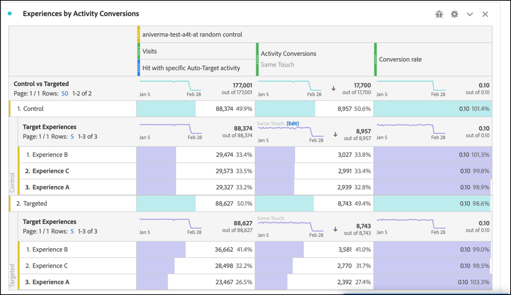

# Einrichten von A4T-Berichten in Analysis Workspace für [!DNL Auto-Target] -Aktivitäten

Bei der Integration von Analytics for Target (A4T) für [!DNL Auto-Target] -Aktivitäten werden die ML-Algorithmen (Ensemble Machine Learning) von Adobe Target verwendet, um das beste Erlebnis für jeden Besucher basierend auf seinem Profil, Verhalten und Kontext auszuwählen. Dabei wird eine Adobe Analytics-Zielmetrik verwendet.

Während in Adobe Analytics Analysis Workspace Rich-Analytics-Funktionen verfügbar sind, sind einige Änderungen am Standardbedienfeld **[!UICONTROL Analytics for Target]** erforderlich, um [!DNL Auto-Target]-Aktivitäten korrekt zu interpretieren. Dies liegt an Unterschieden zwischen Experimentierungsaktivitäten (manuelle A/B- und automatisierte Zuordnung) und Personalisierungsaktivitäten ([!DNL Auto-Target]).

Dieses Tutorial führt Sie durch die empfohlenen Änderungen zur Analyse von [!DNL Auto-Target] -Aktivitäten in Workspace, die auf den folgenden Schlüsselkonzepten basieren:

* Die Dimension **[!UICONTROL Kontrolle vs. Zielgruppe]** kann verwendet werden, um zwischen Kontrollerlebnissen und denen zu unterscheiden, die vom [!DNL Auto-Target]-Ensemble-ML-Algorithmus bereitgestellt werden.
* Besuche sollten bei der Anzeige von Leistungsunterteilungen auf Erlebnisebene als Normalisierungsmetrik verwendet werden. Darüber hinaus kann die Standardzählmethodik von [Adobe Analytics Besuche umfassen, bei denen der Benutzer tatsächlich keinen Aktivitätsinhalt sieht](https://experienceleague.adobe.com/docs/target/using/integrate/a4t/a4t-faq/a4t-faq-viewing-reports.html?lang=en#metrics). Dieses Standardverhalten kann jedoch durch die Verwendung eines entsprechend abgedeckten Segments geändert werden (Details unten).
* Die Attribution im Besuchs-Lookback-Bereich - auch als &quot;Besuchs-Lookback-Fenster&quot;auf dem vorgeschriebenen Attributionsmodell bezeichnet - wird von den ML-Modellen von Adobe Target während ihrer Trainingsphasen verwendet und dasselbe (nicht standardmäßige) Attributionsmodell sollte bei der Unterteilung der Zielmetrik verwendet werden.

## Erstellen des A4T-Bedienfelds für [!DNL Auto-Target] in Workspace

Um einen A4T-Bericht für [!DNL Auto-Target] zu erstellen, beginnen Sie entweder mit dem Bedienfeld **[!UICONTROL Analytics for Target]** in Workspace, wie unten dargestellt, oder beginnen Sie mit einer Freiformtabelle. Wählen Sie dann die folgenden Optionen aus:

1. **[!UICONTROL Kontrollerlebnis]**: Sie können ein beliebiges Erlebnis auswählen. Sie werden diese Auswahl jedoch später überschreiben. Beachten Sie, dass bei [!DNL Auto-Target] -Aktivitäten das Kontrollerlebnis wirklich eine Kontrollstrategie ist, die entweder a) zufällig unter allen Erlebnissen bereitgestellt wird oder b) ein einziges Erlebnis bereitstellt (diese Auswahl erfolgt zum Zeitpunkt der Aktivitätserstellung in Adobe Target). Selbst wenn Sie sich für die Auswahl (b) entschieden haben - Ihre [!DNL Auto-Target] -Aktivität hat ein bestimmtes Erlebnis als Kontrolle ausgewiesen - sollten Sie weiterhin den in diesem Tutorial beschriebenen Ansatz zur Analyse von A4T für [!DNL Auto-Target] -Aktivitäten verfolgen.
2. **[!UICONTROL Normalisierungsmetrik]**: Wählen Sie Besuche aus.
3. **[!UICONTROL Erfolgsmetriken]**: Obwohl Sie beliebige Metriken auswählen können, für die ein Bericht erstellt werden soll, sollten Sie im Allgemeinen Berichte zu derselben Metrik anzeigen, die bei der Aktivitätserstellung in Adobe Target zur Optimierung ausgewählt wurde.

*pngAbbildung 1: Einrichten des Bedienfelds &quot;Analytics for Target&quot;für  [!DNL Auto-Target] Aktivitäten.*

>[!NOTE]
>
>Um Ihr Bedienfeld &quot;Analytics for Target&quot;für Aktivitäten mit automatischem Targeting einzurichten, wählen Sie ein Kontrollerlebnis aus, wählen Sie Besuche als Normalisierungsmetrik und wählen Sie dieselbe Zielmetrik aus, die bei der Erstellung von Target-Aktivitäten zur Optimierung ausgewählt wurde.

## Verwenden Sie die Dimension Kontrolle vs. Zielgruppe , um das Ensemble-ML-Modell von Adobe Target mit Ihrer Kontrolle zu vergleichen

Das standardmäßige A4T-Bedienfeld wurde für klassische (manuelle) A/B-Tests oder Aktivitäten mit automatisierter Zuordnung entwickelt, bei denen das Ziel darin besteht, die Leistung einzelner Erlebnisse mit dem Kontrollerlebnis zu vergleichen. Bei [!DNL Auto-Target] -Aktivitäten sollte der erste Sortiervergleich jedoch zwischen der Kontrollstrategie *strategy* und der Zielgruppenstrategie *strategy* (d. h. Bestimmung der Steigerung der Gesamtleistung des [!DNL Auto-Target] -Ensemble-ML-Modells im Vergleich zur Kontrollstrategie) erfolgen.

Verwenden Sie für diesen Vergleich die Dimension **[!UICONTROL Kontrolle vs. Zielgruppe (Analytics for Target)]** . Ziehen Sie die Dimension **[!UICONTROL Target-Erlebnisse]** in den Arbeitsbereich, um sie im standardmäßigen A4T-Bericht zu ersetzen.

Beachten Sie, dass diese Ersetzung die standardmäßigen Steigerungs- und Konfidenzberechnungen im A4T-Bedienfeld ungültig macht. Um Verwirrung zu vermeiden, können Sie diese Metriken aus dem Standardbereich entfernen und den folgenden Bericht beibehalten:

*pngAbbildung 2: Der empfohlene Ausgangsbericht für  [!DNL Auto-Target] Aktivitäten. Dieser Bericht wurde so konfiguriert, dass der (vom Ensemble ML-Modell bereitgestellte) Targeting-Traffic mit dem Kontroll-Traffic verglichen wird.*

>[!NOTE]
>
>Derzeit sind Steigerungs- und Konfidenzzahlen nicht für Kontroll- und Targeting-Dimensionen für A4T-Berichte für Automatisches Targeting verfügbar. Bis die Unterstützung hinzugefügt wurde, können Steigerung und Konfidenz manuell berechnet werden, indem der [Konfidenzrechner](https://experienceleague.adobe.com/docs/target/assets/complete_confidence_calculator.xlsx?lang=en) heruntergeladen wird.

## Aufschlüsselungen von Metriken auf Erlebnisebene hinzufügen

Um weitere Einblicke in die Leistung des Ensemble-ML-Modells zu erhalten, können Sie die Aufschlüsselungen auf Erlebnisebene der Dimension **[!UICONTROL Kontrolle vs. Zielgruppe]** untersuchen. Ziehen Sie in Workspace die Dimension **[!UICONTROL Target Erlebnisse]** in Ihren Bericht und unterteilen Sie dann jede der Dimensionen Kontrolle und Zielgruppe separat.

*pngAbbildung 3: Aufschlüsseln der Zielgruppendimension nach Target-Erlebnissen*

Ein Beispiel für den resultierenden Bericht finden Sie hier.

*pngAbbildung 4: Ein Standardbericht  [!DNL Auto-Target] mit Aufschlüsselungen auf Erlebnisebene. Beachten Sie, dass Ihre Zielmetrik möglicherweise anders ist und Ihre Kontrollstrategie über ein einziges Erlebnis verfügen kann.*

>[!TIP]
>
>Klicken Sie in Workspace auf das Zahnradsymbol, um die Prozentsätze in der Spalte Konversionsrate auszublenden, damit der Fokus weiterhin auf die Erlebniskonversionsraten liegt. Beachten Sie, dass die Konversionsraten dann als Dezimalzahlen formatiert werden, sie jedoch entsprechend als Prozentsätze interpretiert werden.

## Warum &quot;Besuche&quot;die richtige Normalisierungsmetrik für [!DNL Auto-Target] -Aktivitäten ist

Wählen Sie bei der Analyse einer [!DNL Auto-Target] -Aktivität immer Besuche als standardmäßige Normalisierungsmetrik aus. [!DNL Auto-Target] Personalisierung wählt ein Erlebnis für einen Besucher einmal pro Besuch aus (formell einmal pro Adobe Target-Sitzung). Dies bedeutet, dass sich das Erlebnis, das einem Benutzer angezeigt wird, bei jedem einzelnen Besuch ändern kann. Wenn Sie also Unique Visitors als Normalisierungsmetrik verwenden, würde die Tatsache, dass einem einzelnen Benutzer (über verschiedene Besuche hinweg) am Ende mehrere Erlebnisse angezeigt werden, zu verwirrenden Konversionsraten führen.

Ein einfaches Beispiel zeigt diesen Punkt: in einem Szenario, in dem zwei Besucher an einer Kampagne teilnehmen, die nur über zwei Erlebnisse verfügt. Der erste Besucher besucht zweimal. Sie werden Erlebnis A beim ersten Besuch, Erlebnis B beim zweiten Besuch zugewiesen (da sich ihr Profilstatus bei diesem zweiten Besuch ändert). Nach dem zweiten Besuch wandelt der Besucher durch eine Bestellung um. Die Konversion wird dem zuletzt angezeigten Erlebnis (Erlebnis B) zugeordnet. Der zweite Besucher besucht auch zweimal. Erlebnis B wird beide Male angezeigt, jedoch nie konvertiert.

Vergleichen wir Berichte auf Besucher- und Besuchsebene:

| Erlebnis | Unique Visitors | Besuche | Konversionen | Besuchernorm. Siehe Rate | Besuchsnorm. Siehe Rate |
| --- | --- | --- | --- | --- | --- |
| A | 1 | 1 | - | 0% | 0 % |
| B | 2 | 3 | 1 | 50% | 33,3 % |
| Gesamt | 2 | 4 | 1 | 50 % | 25 % |
*Tabelle 1: Beispiel für den Vergleich von besuchernormalisierten und besuchsnormalisierten Berichten für ein Szenario, in dem Entscheidungen an einen Besuch gebunden sind (und nicht an Besucher, wie bei regulären A/B-Tests). Besuchernormalisierte Metriken verwirren in diesem Szenario.*

Wie in der Tabelle gezeigt, besteht eine eindeutige Unstimmigkeit zwischen Zahlen auf Besucherebene. Obwohl es insgesamt zwei Unique Visitors gibt, handelt es sich hierbei nicht um eine Summe einzelner Unique Visitors für jedes Erlebnis. Auch wenn die Konversionsrate auf Besucherebene nicht unbedingt falsch ist, ergeben Konversionsraten auf Besuchsebene beim Vergleich einzelner Erlebnisse wohl deutlich mehr Sinn. Formell entspricht die Analyseeinheit (&quot;Besuche&quot;) der Entscheidungs-Treue, was bedeutet, dass Aufschlüsselungen von Metriken auf Erlebnisebene hinzugefügt und verglichen werden können.

## Filtern nach tatsächlichen Besuchen der Aktivität

Die Standardzählmethodik von Adobe Analytics für Besuche einer Target-Aktivität kann Besuche umfassen, bei denen der Benutzer nicht mit der Target-Aktivität interagiert hat. Dies liegt an der Persistenz der Target-Aktivitätszuweisungen im Analytics-Besucherkontext. Daher kann die Anzahl der Besuche bei der Target -Aktivität in manchen Fällen zu hoch sein, was zu einem Rückgang der Konversionsraten führt.

Wenn Sie Berichte zu Besuchen bevorzugen, bei denen der Benutzer tatsächlich mit der Aktivität vom Typ Automatisches Targeting interagiert hat (entweder durch Einstieg in die Aktivität, ein Anzeige-/Besuchsereignis oder eine Konversion), haben Sie folgende Möglichkeiten:

1. Erstellen Sie ein bestimmtes Segment, das Treffer aus der betreffenden Target-Aktivität enthält, und dann
1. Filtern Sie die Metrik Besuche mit diesem Segment.

**So erstellen Sie das Segment:**

1. Wählen Sie in der Workspace-Symbolleiste die Option **[!UICONTROL Komponenten > Segment erstellen]** aus.
2. Geben Sie einen **[!UICONTROL Titel]** für Ihr Segment ein. Im folgenden Beispiel trägt das Segment den Namen [!DNL "Hit with specific Auto-Target activity"].
3. Ziehen Sie die Dimension **[!UICONTROL Zielaktivitäten]** in den Abschnitt Segment **[!UICONTROL Definition]** .
4. Verwenden Sie den Operator **[!UICONTROL equals]** .
5. Suchen Sie nach Ihrer spezifischen Target-Aktivität.
6. Wählen Sie das Zahnradsymbol aus und wählen Sie **[!UICONTROL Attributionsmodell > Instanz]** aus, wie in der folgenden Abbildung dargestellt.
7. Klicken Sie auf **[!UICONTROL Speichern]**.

*pngAbbildung 5: Verwenden Sie ein Segment wie das hier gezeigte, um die Metrik Besuche in Ihrem A4T-Bericht nach  [!DNL Auto-Target] Berichten zu filtern.*

Nachdem das Segment erstellt wurde, verwenden Sie es zum Filtern der Metrik Besuche , sodass die Metrik Besuche nur Besuche umfasst, bei denen der Benutzer mit der Target-Aktivität interagiert hat.

**So filtern Sie Besuche mit diesem Segment:**

1. Ziehen Sie das neu erstellte Segment aus der Komponenten-Symbolleiste und bewegen Sie den Mauszeiger über die Basis der Metrikbezeichnung **[!UICONTROL Besuche]**, bis eine blaue **[!UICONTROL Aufforderung zum Filtern nach]** angezeigt wird.
2. Lassen Sie das Segment frei. Der Filter wird auf diese Metrik angewendet.

Das endgültige Bedienfeld wird wie folgt angezeigt.

*pngAbbildung 6: Berichtsbereich mit dem Segment &quot;Treffer mit spezifischer Aktivität vom Typ Automatisches Targeting&quot;auf die   Besuchsmetrik angewendet. Dadurch werden nur Besuche im Bericht berücksichtigt, bei denen ein Benutzer tatsächlich mit der betreffenden Target-Aktivität interagiert hat.*

## Ordnen Sie die Attribution zwischen ML-Modellschulung und der Zielmetrikgenerierung an.

Durch die A4T-Integration kann das ML-Modell von [!DNL Auto-Target] *trainiert* werden, indem dieselben Konversionsereignisdaten verwendet werden, die Adobe Analytics für *generiert Leistungsberichte*. Es gibt jedoch bestimmte Annahmen, die bei der Interpretation dieser Daten bei der Schulung der ML-Modelle zugrunde gelegt werden müssen, die sich von den in der Berichterstellungsphase in Adobe Analytics gemachten Standardannahmen unterscheiden.

Insbesondere verwenden die ML-Modelle von Adobe Target ein besuchsspezifisches Attributionsmodell. Das heißt, sie gehen davon aus, dass eine Konversion im selben Besuch wie eine Inhaltsanzeige für die Aktivität erfolgen muss, damit die Konversion der Entscheidung des ML-Modells &quot;zugeordnet&quot;wird. Dies ist erforderlich, damit Target eine rechtzeitige Schulung seiner Modelle gewährleistet. Target kann nicht bis zu 30 Tage auf eine Konversion warten (das standardmäßige Attributionsfenster für Berichte in Adobe Analytics), bevor es in die Trainings-Daten für seine Modelle aufgenommen wird.

Daher kann der Unterschied zwischen der von den Target-Modellen (während des Trainings) verwendeten Attribution und der bei der Abfrage von Daten verwendeten Standardzuordnung (während der Berichterstellung) zu Diskrepanzen führen. Es kann sogar vorkommen, dass die ML-Modelle nur schlecht funktionieren, wenn das Problem in der Tat mit der Attribution liegt.

>[!TIP]
>
>Wenn die ML-Modelle für eine Metrik optimiert werden, die anders zugeordnet ist als die Metriken, die Sie in einem Bericht anzeigen, können die Modelle nicht erwartungsgemäß funktionieren! Um dies zu vermeiden, stellen Sie sicher, dass die Zielmetriken in Ihrem Bericht dieselbe Attribution verwenden, die von den ML-Modellen von Target verwendet wird.

Gehen Sie wie folgt vor, um Zielmetriken anzuzeigen, die dieselbe Attributionsmethodik aufweisen, die von den ML-Modellen von Adobe Target verwendet wird:

1. Bewegen Sie den Mauszeiger über das Zahnradsymbol der Zielmetrik:
   
1. Scrollen Sie aus dem resultierenden Menü zu **[!UICONTROL Dateneinstellungen]**.
1. Wählen Sie **[!UICONTROL Nicht standardmäßiges Attributionsmodell]** verwenden (falls noch nicht ausgewählt):
   
1. Klicken Sie auf **[!UICONTROL Bearbeiten]**.
1. Wählen Sie **[!UICONTROL Modell]** aus: **[!UICONTROL Beitrag]** und **[!UICONTROL Lookback-Fenster]**: **[!UICONTROL Besuch]**.
   
1. Klicken Sie auf **[!UICONTROL Anwenden]**.

Diese Schritte stellen sicher, dass Ihr Bericht die Zielmetrik der Anzeige des Erlebnisses zuordnet, wenn das Zielmetrikereignis *irgendwann* (&quot;Beitrag&quot;) im selben Besuch stattgefunden hat, an dem ein Erlebnis angezeigt wurde.

## Endlicher Schritt: Erstellen Sie eine Konversionsrate, die die oben genannte Magie erfasst

Mit den Änderungen an den Metriken &quot;Besuch&quot;und &quot;Ziel&quot;in den vorherigen Abschnitten sollten Sie am standardmäßigen A4T für das Berichtsfeld [!DNL Auto-Target] eine Konversionsrate erstellen, die das richtige Verhältnis - das einer Zielmetrik mit der richtigen Attribution zu einer entsprechend gefilterten Metrik &quot;Besuche&quot;aufweist.

Erstellen Sie dazu eine berechnete Metrik mithilfe der folgenden Schritte:

1. Wählen Sie in der Workspace-Symbolleiste die Option **[!UICONTROL Komponenten > Metrik erstellen]** aus.
1. Geben Sie einen **[!UICONTROL Titel]** für Ihre Metrik ein. Beispiel: &quot;Besuchskorrigierte Konversionsrate für Aktivität XXX&quot;.
1. Wählen Sie **[!UICONTROL Format]** = Prozent und **[!UICONTROL Dezimalstellen]** = 2.
1. Ziehen Sie die relevante Zielmetrik für Ihre Aktivität (z. B. Aktivitätskonversionen) in die Definition und verwenden Sie das Zahnradsymbol für diese Zielmetrik, um das Attributionsmodell auf (Beitrag|Besuch) anzupassen, wie zuvor beschrieben.
1. Wählen Sie **[!UICONTROL Hinzufügen > Container]** oben rechts im Abschnitt **[!UICONTROL Definition]** aus.
1. Wählen Sie zwischen den beiden Behältern den Operator Division () aus.
1. Ziehen Sie Ihr zuvor erstelltes Segment namens &quot;Treffer mit spezifischer [!DNL Auto-Target] -Aktivität&quot;in dieses Tutorial für diese spezifische [!DNL Auto-Target] -Aktivität.
1. Ziehen Sie die Metrik **[!UICONTROL Besuche]** in den Segmentbehälter.
1. Klicken Sie auf **[!UICONTROL Speichern]**.

Die vollständige Definition der berechneten Metrik wird hier angezeigt.

*pngAbbildung 7: Die Metrikdefinition für die besuchs- und zuordnungskorrigierte Modellkonversionsrate. (Beachten Sie, dass diese Metrik von Ihrer Zielmetrik und -aktivität abhängt. Mit anderen Worten: Diese Metrikdefinition kann nicht über mehrere Aktivitäten hinweg wiederverwendet werden.)*

>[!IMPORTANT]
>
>Die Metrik Konversionsrate aus dem A4T-Bedienfeld ist nicht mit dem Konversionsereignis oder der Normalisierungsmetrik in der Tabelle verknüpft. Wenn Sie die in diesem Tutorial vorgeschlagenen Änderungen vornehmen, passt sich die Konversionsrate nicht automatisch an die Änderungen an. Wenn Sie daher die Änderung an einer (oder beiden) der Konversionsereigniszuordnung und der Normalisierungsmetrik vornehmen, müssen Sie sich als letzten Schritt merken, um auch die Konversionsrate zu ändern, wie oben gezeigt.

## Zusammenfassung: Abschließendes Beispiel für Workspace-Bedienfeld für [!DNL Auto-Target]-Berichte

Wenn Sie alle oben genannten Schritte in einem Bedienfeld zusammenfassen, zeigt die Abbildung unten eine vollständige Ansicht des empfohlenen Berichts für [!DNL Auto-Target] A4T-Aktivitäten. Dieser Bericht entspricht dem Bericht, den die Target-Modelle für maschinelles Lernen zur Optimierung Ihrer Zielmetrik verwenden. Er enthält alle in diesem Tutorial behandelten Nuancen und Empfehlungen. Dieser Bericht ähnelt auch den Zählmethodiken, die bei herkömmlichen Target-Reporting-gesteuerten [!DNL Auto-Target] -Aktivitäten verwendet werden.

*pngAbbildung 8: Der endgültige A4T- [!DNL Auto-Target] Bericht in Adobe Analytics Workspace, der alle in den vorherigen Abschnitten dieses Dokuments beschriebenen Anpassungen an Metrikdefinitionen kombiniert.*
