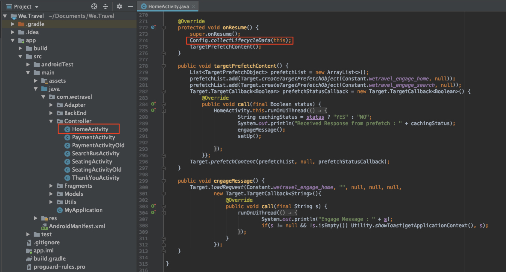

# Hinzufügen von Parametern zu den Anfragen

In dieser Lektion fügen wir den in der vorherigen Lektion hinzugefügten [!DNL Target]-Anforderungen Adobe-Lebenszyklusmetriken und benutzerdefinierte Parameter hinzu. Diese Metriken und Parameter werden später im Tutorial zum Erstellen personalisierter Zielgruppen verwendet.

## Lernziele

Am Ende dieser Lektion haben Sie folgende Möglichkeiten:

* Hinzufügen der Adobe-Lebenszyklusmetriken für Mobilgeräte
* Parameter zu einer Vorabrufanfrage hinzufügen
* Parameter zu einem Live-Speicherort hinzufügen
* Validieren der Parameter für beide Anfragen

## Hinzufügen der Lebenszyklusparameter

Aktivieren wir die [Adobe-Mobile-Lebenszyklusmetriken](https://experienceleague.adobe.com/docs/mobile-services/android/metrics.html?lang=en). Dadurch werden Standortanfragen Parameter hinzugefügt, die umfangreiche Informationen zum Gerät des Benutzers und zur Interaktion mit der App enthalten. In der nächsten Lektion erstellen wir Zielgruppen anhand der Daten, die die Lebenszyklusanfrage bereitstellt.

Um Lebenszyklusmetriken zu aktivieren, öffnen Sie den HomeActivity-Controller erneut und fügen Sie `Config.collectLifecycleData(this);` zur Funktion onResume() hinzu:



### Validieren der Lebenszyklusparameter für die Vorabruf-Anfrage

Führen Sie den Emulator aus und verwenden Sie LogCat, um die Lebenszyklusparameter zu validieren. Filtern Sie nach „prefetch“, um die Prefetch-Antwort zu finden und nach den neuen Parametern zu suchen:


Auch wenn wir nur `Config.collectLifecycleData()` zum HomeActivity Controller hinzugefügt haben, sollten Sie die Lebenszyklusmetriken, die mit der Target-Anfrage gesendet werden, auch auf Ihrem Dankesbildschirm sehen.

## Fügen Sie den Parameter „at_property“ zur Vorabruf-Anfrage hinzu.

Adobe Target-Eigenschaften werden in der [!DNL Target] definiert und dienen zum Festlegen von Grenzen für die Personalisierung von Apps und Websites. Der Parameter at_property identifiziert die spezifische Eigenschaft, in der Ihre Angebote und Aktivitäten aufgerufen und gepflegt werden. Wir fügen dem Vorabruf und den Live-Ortsanfragen eine Eigenschaft hinzu.

>[!NOTE]
>
>Abhängig von Ihrer Lizenz werden in der [!DNL Target] möglicherweise die Optionen Eigenschaften angezeigt. Wenn Sie diese Optionen nicht haben oder wenn Sie in Ihrer Firma keine Eigenschaften verwenden, fahren Sie mit dem nächsten Abschnitt dieser Lektion fort.

Sie können Ihren at_property-Wert in der [!DNL Target] unter [!UICONTROL Setup] > [!UICONTROL Properties] abrufen.  Bewegen Sie den Mauszeiger über die Eigenschaft, wählen Sie das Symbol für den Codeausschnitt aus und kopieren Sie den `at_property`:


Fügen Sie sie wie folgt als Parameter für jede Position in der Vorabruf-Anfrage hinzu:

Hier finden Sie den aktualisierten Code für die `targetPrefetchContent()`-Funktion (stellen Sie sicher, dass Sie den _[!UICONTROL your at_property value goes here]_&#x200B;Platzhaltertext aktualisieren!):

```java
public void targetPrefetchContent() {
        List<TargetPrefetchObject> prefetchList = new ArrayList<>();

        Map<String, Object> params1;
        params1 = new HashMap<String, Object>();
        params1.put("at_property", "your at_property value goes here");

        prefetchList.add(Target.createTargetPrefetchObject(Constant.wetravel_engage_home, params1));
        prefetchList.add(Target.createTargetPrefetchObject(Constant.wetravel_engage_search, params1));
        Target.TargetCallback<Boolean> prefetchStatusCallback = new Target.TargetCallback<Boolean>() {
            @Override
            public void call(final Boolean status) {
                HomeActivity.this.runOnUiThread(new Runnable() {
                    @Override
                    public void run() {
                        String cachingStatus = status ? "YES" : "NO";
                        System.out.println("Received Response from prefetch : " + cachingStatus);
                        engageMessage();
                        setUp();

                    }
                });
            }};
        Target.prefetchContent(prefetchList, null, prefetchStatusCallback);
    }
```

### Hinweis zu Parametern

Für zukünftige Projekte können Sie zusätzliche Parameter implementieren. Die `createTargetPrefetchObject()` Methode lässt drei Parametertypen zu: `locationParams`, `orderParams` und `productParams`. Siehe die Dokumentation für [weitere Details zum Hinzufügen dieser Parameter zur Prefetch-Anfrage](https://experienceleague.adobe.com/docs/mobile-services/android/target-android/c-mob-target-prefetch-android.html?lang=en).

Beachten Sie außerdem, dass den einzelnen Speicherorten in der Prefetch-Anfrage unterschiedliche Speicherortparameter hinzugefügt werden können. Sie können beispielsweise eine andere Zuordnung mit dem Namen param2 erstellen, einen neuen Parameter darin einfügen, dann param2 an einer Position und param1 an der anderen Position festlegen. Hier ein Beispiel:

```java
prefetchList.add(Target.createTargetPrefetchObject(location1_name, params1);
prefetchList.add(Target.createTargetPrefetchObject(location2_name, params2);
```

## Validieren des at_property-Parameters in der Prefetch-Anfrage

Führen Sie nun den Emulator aus und verwenden Sie Logcat , um zu überprüfen, ob die Eigenschaft at_property in der Vorabruf-Anfrage und -Antwort für beide Speicherorte angezeigt wird:


## Hinzufügen benutzerdefinierter Parameter zur Live-Standortanfrage

Die Live-Standortanfrage (wetravel_context_dest) wurde in der vorherigen Lektion hinzugefügt, damit wir eine entsprechende Promotion auf dem letzten Bestätigungsbildschirm des Buchungsprozesses anzeigen konnten. Wir möchten die Promotion basierend auf dem Ziel des Benutzers personalisieren. Dazu fügen wir dies als Parameter der Anfrage hinzu. Wir fügen auch einen Parameter für den Tropfenursprung und den Wert „at_property“ hinzu.

Fügen Sie die folgenden Parameter zur Funktion targetLoadRequest() im „Vielen Dank“-Aktivitäts-Controller hinzu:

Hier ist der aktualisierte Code für die Funktion targetLoadRequest() (stellen Sie sicher, dass Sie den Platzhaltertext „add your at_property value here!“ aktualisieren):

```java
public void targetLoadRequest(final ArrayList<Recommandation> recommandations) {
    Map<String, Object> locationParams = new HashMap<>();
    locationParams.put("at_property","add your at_property value here");
    locationParams.put("locationSrc", (""+Utility.getInSharedPreference(ThankYouActivity.this,Constant.departure,"")));
    locationParams.put("locationDest", (""+Utility.getInSharedPreference(ThankYouActivity.this,Constant.destination,"")));

    Target.loadRequest(Constant.wetravel_context_dest, "", null, null, locationParams, new Target.TargetCallback<String>() {
        @Override
        public void call(final String response) {
        try {
            runOnUiThread(new Runnable() {
                @Override
                public void run() {
                    AppDialogs.dialogLoaderHide();
                    filterRecommendationBasedOnOffer(recommandations, response);
                    recommandationbAdapter.notifyDataSetChanged();
                }
            });
        } catch (Exception e) {
            e.printStackTrace();
        }
        }
    });
    Target.clearPrefetchCache();
}
```

### Validieren der benutzerdefinierten Parameter in der Live-Standortanfrage

Führen Sie den Emulator aus und öffnen Sie die Protokolldatei. Filtern Sie nach einem der Parameter, um zu überprüfen, ob die Anfrage die erforderlichen Parameter enthält:


>[!NOTE]
>
>Auftragsbestätigungsanfragen und -parameter: Obwohl dies in diesem Demoprojekt nicht verwendet wird, werden Bestelldetails in der Regel in einer echten Implementierung erfasst, sodass [!DNL Target] Bestelldetails als Metriken/Dimensionen verwenden können. In der Dokumentation finden Sie Anweisungen zur Implementierung [ Bestellbestätigungsanfrage und der Parameter](https://experienceleague.adobe.com/docs/mobile-services/android/target-android/c-target-methods.html?lang=en).

>[!NOTE]
>
>Analytics for Target (A4T): Adobe Analytics kann als Berichtsquelle für [!DNL Target] konfiguriert werden. Dadurch können alle von der Target-SDK erfassten Metriken/Dimensionen in Adobe Analytics angezeigt werden. Weitere Informationen finden Sie in der [A4T](https://experienceleague.adobe.com/docs/target/using/integrate/a4t/a4t.html?lang=de)Übersicht .

Gut gemacht! Nun, da die Parameter eingerichtet sind, können wir diese Parameter verwenden, um Zielgruppen und Angebote in Adobe Target zu erstellen.

**[WEITER : „Erstellen von Audiences und Angeboten“ >](create-audiences-and-offers.md)**
