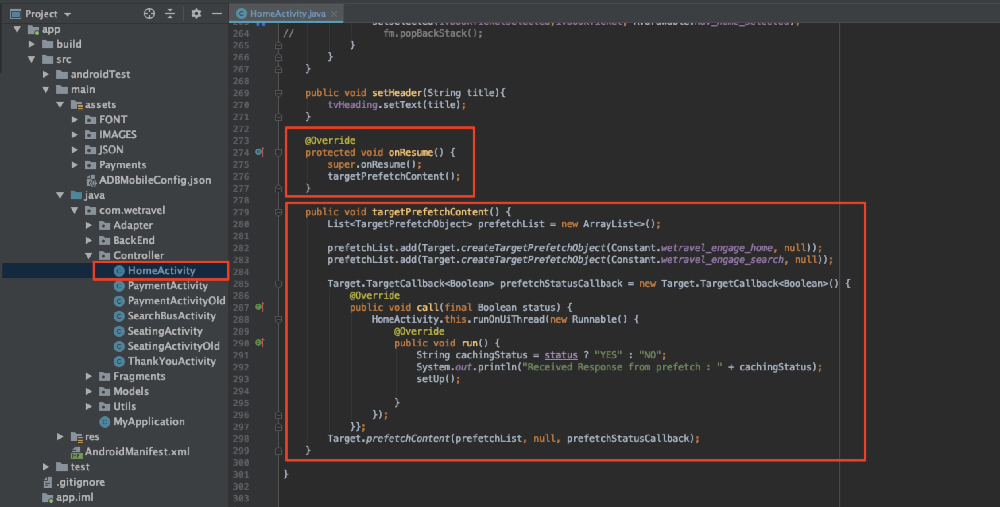

# Adobe Target-Anfragen hinzufügen

Adobe Mobile Services SDK (v4) bietet Adobe Target-Methoden und -Funktionen, mit denen Sie Ihre App mit unterschiedlichen Erlebnissen für verschiedene Benutzende personalisieren können. In der Regel werden eine oder mehrere Anfragen von der App an die Adobe Target gesendet, um den personalisierten Inhalt abzurufen und die Wirkung dieses Inhalts zu messen.

In dieser Lektion bereiten Sie die We.Travel-App auf die Personalisierung vor, indem Sie [!DNL Target] implementieren.

## Voraussetzungen 

Stellen Sie sicher, [die Beispiel-App herunterladen und aktualisieren](download-and-update-the-sample-app.md).

## Lernziele

Am Ende dieser Lektion haben Sie folgende Möglichkeiten:

* Zwischenspeichern mehrerer [!DNL Target]-Angebote (d. h. personalisierter Inhalte) mithilfe einer Batch-Vorabruf-Anfrage
* Laden vorab abgerufener [!DNL Target]
* Laden eines [!DNL Target] Speicherorts in Echtzeit (nicht vorab abgerufen)
* Löschen vorab abgerufener Speicherorte aus dem Cache
* Validieren vorab abgerufener und Echtzeitanfragen

## Terminologie  

Nachstehend finden Sie einige wichtige Target-Terminologie, die wir im weiteren Verlauf dieses Tutorials verwenden werden.

* **Anfrage:** eine Netzwerkanfrage an die Adobe Target-Server
* **Angebot** Ein Code-Ausschnitt oder anderer textbasierter Inhalt, der in der [!DNL Target]-Benutzeroberfläche (oder mit der API) definiert ist, die in der Antwort bereitgestellt wird. Normalerweise JSON, wenn [!DNL Target] in nativen Mobile Apps verwendet wird.
* **Location** Ein benutzerdefinierter Name für eine Anfrage, der in der [!DNL Target]-Benutzeroberfläche verwendet wird, um Angebote bestimmten Anfragen zuzuordnen
* **Batch-Anfrage** Eine einzelne Anfrage mit mehreren Speicherorten
* **Vorabruf-Anfrage** Eine einzelne Anfrage, die Angebote abruft und sie für die zukünftige Verwendung in der App im Speicher zwischenspeichert
* **Batch-Vorabrufanfrage:** eine einzelne Anfrage, die Angebote für mehrere Standorte vorab abruft
* **Zielgruppe:** eine Besuchergruppe, die in der [!DNL Target] definiert oder von anderen Adobe-Programmen für [!DNL Target] freigegeben ist (z. B. &quot;iPhone X Visitors“, „Visitors in the California“, „First App Open„)
* **Activity:** ein [!DNL Target] Konstrukt, das in der [!DNL Target]-Benutzeroberfläche (oder mit der API) definiert ist und Standorte, Angebote und Zielgruppen verknüpft, um ein personalisiertes Erlebnis zu erstellen

## Batch-Vorabrufanfrage hinzufügen

Die erste Anfrage, die wir in We.Travel implementieren werden, ist eine Batch-Vorabrufanfrage mit zwei [!DNL Target] auf dem Startbildschirm. In einer späteren Lektion konfigurieren wir Angebote für diese Orte, die Nachrichten anzeigen, um neue Benutzer durch den Buchungsprozess zu führen.

Eine Vorabruf-Anfrage ruft [!DNL Target] Inhalte so minimal wie möglich ab, indem die Adobe Target-Serverantwort (Angebot) zwischengespeichert wird. Eine Batch-Vorabruf-Anfrage ruft mehrere Angebote ab und speichert sie zwischen, die jeweils mit einem anderen Speicherort verknüpft sind. Alle im Voraus abgerufenen Speicherorte werden auf dem Gerät zwischengespeichert, damit sie später in der Benutzersitzung verwendet werden können. Durch den Vorabruf mehrerer Orte auf dem Startbildschirm können wir Angebote abrufen, die später verwendet werden sollen, wenn der Besucher durch die App navigiert. Weitere Informationen zu [-Methoden finden ](https://experienceleague.adobe.com/docs/mobile-services/android/target-android/c-mob-target-prefetch-android.html?lang=en) in der Dokumentation zum Vorabruf .

### Hinzufügen der Batch-Vorabruf-Anfrage

Aktualisieren wir nun den HomeActivity-Controller (den Quellcode des Startbildschirms), der sich unter App > Main > Java > com.travel > Controller befindet. Wir fügen die beiden rot dargestellten Code-Blöcke hinzu:

Wir beginnen mit dem HomeActivity-Controller (dem Quellcode des Startbildschirms), der sich unter App > Main > Java > com.travel > Controller befindet.

Wir fügen die beiden rot dargestellten Code-Blöcke hinzu:



Scrollen Sie nach unten zum Ende des Codes der Startseiten-Aktivität und fügen Sie den unten angegebenen Code nach der `setHeader()`-Funktion hinzu und *ersetzen* die aktuelle `onResume()`-Funktion:

```java
@Override
protected void onResume() {
    super.onResume();
    targetPrefetchContent();
}

public void targetPrefetchContent() {
    List<TargetPrefetchObject> prefetchList = new ArrayList<>();
    prefetchList.add(Target.createTargetPrefetchObject(Constant.wetravel_engage_home, null));
    prefetchList.add(Target.createTargetPrefetchObject(Constant.wetravel_engage_search, null));
    Target.TargetCallback<Boolean> prefetchStatusCallback = new Target.TargetCallback<Boolean>() {
        @Override
        public void call(final Boolean status) {
            HomeActivity.this.runOnUiThread(new Runnable() {
                @Override
                public void run() {
                    String cachingStatus = status ? "YES" : "NO";
                    System.out.println("Received Response from prefetch : " + cachingStatus);
                    setUp();

                }
            });
        }};
    Target.prefetchContent(prefetchList, null, prefetchStatusCallback);
}
```

Wahrscheinlich werden Sie von Ihrer IDE darauf hingewiesen, dass die [!DNL Target] Klassen nicht in die Datei importiert wurden. Stellen Sie sicher, dass Sie die [!DNL Target] Klassen oben im HomeActivity Controller importieren, wie unten in rot dargestellt:

```java
import com.adobe.mobile.Target;
import com.adobe.mobile.TargetPrefetchObject;
```


Sie werden wahrscheinlich auch Fehler für „Symbolvariable wetravel_engage_home nicht finden“ und „Symbolvariable wetravel_engage_search nicht finden“ sehen. Fügen Sie diese zur `Constant.java`-Datei hinzu (in app > src > main > java > com > wetravel > Utils):

```java
public static final String wetravel_engage_home = "wetravel_engage_home";
public static final String wetravel_engage_search = "wetravel_engage_search";
```


### Erläuterung zum Batch-Vorabruf-Anforderungs-Code

| Code | Beschreibung |
|--- |--- |
| `targetPrefetchContent()` | Eine benutzerdefinierte Funktion (nicht Teil der SDK), die [!DNL Target] verwendet, um zwei [!DNL Target] abzurufen und zwischenzuspeichern. |
| `prefetchContent()` | Die [!DNL Target] SDK-Methode, die die Vorabrufanfrage sendet |
| `Constant.wetravel_engage_home` | Vorab abgerufener [!DNL Target] Ortsname, der den Angebotsinhalt auf dem Startbildschirm anzeigt |
| `Constant.wetravel_engage_search` | Vorab abgerufener [!DNL Target] Ortsname, der den Angebotsinhalt auf dem Suchergebnisbildschirm anzeigt. Da dies ein zweiter Speicherort im Vorabruf ist, wird diese Vorabruf-Anfrage als „Vorabruf-Batch-Anfrage“ bezeichnet. |
| setUp() | Eine benutzerdefinierte Funktion, die den Startbildschirm der App rendert, nachdem die [!DNL Target] Angebote vorab abgerufen wurden |

### Über asynchrone und synchrone Versionen

Mit dem Code, den wir gerade implementiert haben, wird die Vorabruf-Anfrage als synchroner, blockierender Aufruf ausgeführt, unmittelbar bevor der Startbildschirm gerendert wird. Als wir den neuen Code in den HomeActivity Controller eingefügt haben, haben wir die Ausführung der `setUp()` Funktion von der `onResume()` Funktion bis nach der Target-Anfrage verschoben. Dies kann in Szenarien von Vorteil sein, in denen Sie Inhalte beim ersten Öffnen der App personalisieren möchten, da sichergestellt wird, dass personalisierte Inhalte von den Target-Servern zurückgegeben wurden (oder eine Zeitüberschreitung aufweisen), bevor der erste Bildschirm gerendert wird. Um das asynchrone Laden der Anfragen (im Hintergrund) zu ermöglichen, rufen Sie stattdessen `setUp()` in der Funktion `onCreate()` auf.

### Validieren der Batch-Vorabruf-Anfrage

Erstellen Sie die App neu und öffnen Sie den Android-Emulator. (Die folgenden Screenshots verwenden Pixel 2 in Android Q ab Version 9, API-Ebene 29.) Die Prefetch-Antwort sollte lauten: „Prefetch Response Received“:

Wenn der Startbildschirm gerendert wird, sollte die Vorabrufanfrage geladen werden. Filtern Sie mit Logcat nach [!DNL "Target"], um die Anfrage und die Antwort zu sehen:


Wenn keine erfolgreiche Antwort angezeigt wird, überprüfen Sie die Einstellungen in der `ADBMobileConfig.json` und die Code-Syntax in der HomeActivity-Datei.

Es werden jetzt zwei Speicherorte auf dem Gerät zwischengespeichert. Die Ortsnamen werden in Kürze verzögert in die [!DNL Target] geladen, wo sie in verschiedenen Dropdown-Menüs ausgewählt werden können, wenn Sie sie in einer Aktivität verwenden.

### Hinzufügen von Ladeanfragen für jeden zwischengespeicherten Speicherort

Nachdem die Speicherorte im Voraus abgerufen und ihre Antworten auf dem Gerät zwischengespeichert wurden, fügen wir die `Target.loadRequest()`-Methode hinzu, die den Angebotsinhalt aus dem Cache abruft, damit Sie ihn zur Aktualisierung Ihrer Anwendung verwenden können. Wir fügen eine neue benutzerdefinierte Methode mit dem Namen `engageMessage()` hinzu, die mit der Prefetch-Anfrage ausgeführt wird. `engageMessage()` ruft `Target.loadRequest()` an. `engageMessage()` wird vor dem `setUp()` ausgeführt, um sicherzustellen, dass die Ladeanfrage aufgerufen wird, bevor der Bildschirm eingerichtet wird.

Fügen Sie zunächst den `engageMessage()` Aufruf und die Methode für den Speicherort wetravel_engage_home in der StartseiteActivity hinzu:


Hier finden Sie den aktualisierten Code:

```java
    public void targetPrefetchContent() {
        List<TargetPrefetchObject> prefetchList = new ArrayList<>();
        Map<String, Object> params1;
        params1 = new HashMap<String, Object>();
        params1.put("at_property", "your at_property value goes here");
        prefetchList.add(Target.createTargetPrefetchObject(Constant.wetravel_engage_home, params1));
        prefetchList.add(Target.createTargetPrefetchObject(Constant.wetravel_engage_search, params1));
        Target.TargetCallback<Boolean> prefetchStatusCallback = new Target.TargetCallback<Boolean>() {
            @Override
            public void call(final Boolean status) {
                HomeActivity.this.runOnUiThread(new Runnable() {
                    @Override
                    public void run() {
                        String cachingStatus = status ? "YES" : "NO";
                        System.out.println("Received Response from prefetch : " + cachingStatus);
                        engageMessage();
                        setUp();
                    }
                });
            }};
        Target.prefetchContent(prefetchList, null, prefetchStatusCallback);
    }
    public void engageMessage() {
        Target.loadRequest(Constant.wetravel_engage_home, "", null, null, null,
            new Target.TargetCallback<String>(){
                @Override
                public void call(final String s) {
                    runOnUiThread(new Runnable() {
                        @Override
                        public void run() {
                            System.out.println("Engage Message : " + s);
                            if(s != null && !s.isEmpty()) Utility.showToast(getApplicationContext(), s);
                        }
                    });
                }
            });
    }
```

Fügen Sie nun den `engageMessage()`-Aufruf und die Methode für die Position wetravel_engage_search in der SearchBusActivity hinzu. Beachten Sie, dass der `engageMessage()`-Aufruf in der `onResume()`-Methode festgelegt wird, bevor der Aufruf an `setUpSearch()` erfolgt, sodass er ausgeführt wird, bevor der Bildschirm eingerichtet wird:


Hier finden Sie den aktualisierten Code:

```java
    @Override
    public void onResume() {
        super.onResume();
        engageMessage();
        setUpSearch();
    }
    public void engageMessage() {
        Target.loadRequest(Constant.wetravel_engage_search, "", null, null, null,
                new Target.TargetCallback<String>(){
                    @Override
                    public void call(final String s) {
                        runOnUiThread(new Runnable() {
                            @Override
                            public void run() {
                                System.out.println("Engage Message : " + s);
                                if(s != null && !s.isEmpty()) Utility.showToast(getApplicationContext(), s);
                            }
                        });
                    }
                });
    }
```

Da Sie der SearchBusActivity gerade Target-Methoden hinzugefügt haben, müssen Sie die [!DNL Target] Klassen importieren:

```java
import com.adobe.mobile.Target;
import com.adobe.mobile.TargetPrefetchObject;
```

## Echtzeit-Anfrage hinzufügen

Die nächste Anfrage, die wir der App hinzufügen, ist eine Echtzeit-Anfrage auf dem Dankesbildschirm. Mit „Echtzeit“ meinen wir, dass sowohl die Anfrage als auch die Antwort sofort angewendet werden (und für später nicht zwischengespeichert werden). In einer späteren Lektion werden wir mithilfe dieser Anfrage ein Erlebnis erstellen, das an das Reiseziel des Benutzers angepasst ist.

Fügen wir dem Dankesbildschirm also eine Echtzeit-Anfrage hinzu. In der Datei „Vielen Dank“ nehmen wir die rot angezeigten Änderungen vor:


Scrollen Sie zum Ende der Datei „Vielen Dank für Aktivität“. Kommentieren Sie die drei Zeilen in der `getRecommandations()` aus und fügen Sie den Aufruf der `targetLoadRequest()` hinzu:

```java
// AppDialogs.dialogLoaderHide();
// recommandations.addAll(recommandation.recommandations);
// recommandationbAdapter.notifyDataSetChanged();
```

Fügen Sie diese Codezeile zur `getRecommandations()` hinzu:

```java
targetLoadRequest(recommandation.recommandations);
```

Jetzt müssen wir die `targetLoadRequest()` definieren:


Fügen Sie diesen Codeblock nach der `filterRecommendationBasedOnOffer()` hinzu:

```java
public void targetLoadRequest(final ArrayList<Recommandation> recommandations) {
    Target.loadRequest(Constant.wetravel_context_dest, "", null, null, null, new Target.TargetCallback<String>() {
        @Override
        public void call(final String response) {
            try {
                runOnUiThread(new Runnable() {
                    @Override
                    public void run() {
                        AppDialogs.dialogLoaderHide();
                        filterRecommendationBasedOnOffer(recommandations, response);
                        recommandationbAdapter.notifyDataSetChanged();
                    }
                });
            } catch (Exception e) {
                e.printStackTrace();
            }
        }
    });
}
```

Da Sie der Dankeschön-Aktivität gerade Target-Methoden hinzugefügt haben, importieren Sie unbedingt die Target-Klassen:

```java
import com.adobe.mobile.Target;
import com.adobe.mobile.TargetPrefetchObject;
```

### targetLoadRequest()-Code-Erläuterung

| Code | Beschreibung |
|--- |--- |
| `targetLoadRequest()` | Eine benutzerdefinierte Funktion (nicht Teil der SDK), die ausgelöst wird, `Target.loadRequest()` der Speicherort wetravel_context_dest geladen und angezeigt wird |
| `Target.loadRequest()` | Die SDK-Methode, die die Anfrage an den Zielserver sendet |
| Constant.wetravel_context_dest | Der Ortsname, der der Anfrage zugewiesen wurde, die wir später beim Erstellen der Aktivität in der [!DNL Target] verwenden werden |
| `filterRecommendationBasedOnOffer()` | Eine benutzerdefinierte Funktion in der App, die das Angebot des Standorts aus der Target-Antwort übernimmt und entscheidet, wie sich die App je nach Inhalt des Angebots ändern soll |
| `recommandations.addAll()` | Eine benutzerdefinierte Funktion in der App, die standardmäßig ausgeführt wird, wenn der Dankesbildschirm geladen wird, aber jetzt ausgeführt wird, nachdem die Target-Antwort empfangen und von `filterRecommendationBasedOnOffer()` analysiert wurde |

Dies war ein komplexeres Update, das wir an der App vorgenommen haben, als wir die Anfrage auf dem Startbildschirm hinzugefügt haben. Nehmen wir uns also einen Moment Zeit, um zu überprüfen, was wir getan haben:

1. Wir unterbrachen das vorherige Verhalten der App, drei standardmäßige Promotions anzuzeigen, indem wir die Code-Zeilen auskommentierten
1. Stattdessen wurde die App angewiesen, eine neue Funktion auszuführen, die wir willkürlich targetLoadRequest nannten
1. Wir haben die Funktion `targetLoadRequest` definiert, um mit der Methode Target.loadRequest eine Anfrage an Target zu senden und die Funktion `filterRecommendationBasedOnOffer()` sofort auszuführen, wenn die [!DNL Target] Angebotsantwort empfangen wird
1. Die Funktion `filterRecommendationBasedOnOffer()` interpretiert die Antwort und entscheidet, welche Promotions auf den Bildschirm angewendet werden sollen

Dies ist ein sehr gängiges Nutzungsmuster bei der Verwendung von [!DNL Target] in Mobile Apps.  Beides ist sehr leistungsstark, da Sie fast jeden Aspekt Ihrer Mobile App personalisieren können. Es erfordert auch eine Koordinierung zwischen dem App-Code und den Angeboten, die wir später in der [!DNL Target] definieren werden. Aufgrund dieser Koordinierung können einige Anwendungsfälle der Personalisierung erfordern, dass Sie Ihre App im App Store aktualisieren, um die Aktivität zu starten.

### Echtzeit-Anfrage validieren

Öffnen Sie den Android-Emulator und führen Sie alle Schritte aus, um eine Reise zu buchen: Startseite > Bussuchergebnisse > Sitzplatzauswahl, Zahlungsoptionen (alle Zahlungsoptionen mit leeren Daten funktionieren).

Auf dem letzten Dankeschön-Bildschirm sehen Sie die Antwort von Logcat. Die Antwort sollte lauten: „Standardinhalt wurde für „travel_context_dest“ zurückgegeben:


## Löschen vorab abgerufener Speicherorte aus dem Cache

Es kann Situationen geben, in denen im Voraus abgerufene Speicherorte während einer Sitzung gelöscht werden müssen. Wenn beispielsweise eine Buchung erfolgt, ist es sinnvoll, die zwischengespeicherten Orte zu löschen, da der Benutzer jetzt „interagiert“ hat und den Buchungsprozess versteht. Wenn er während seiner Sitzung eine weitere Reise bucht, benötigt er die ursprünglichen Orte auf dem Startbildschirm und dem Suchergebnisbildschirm nicht, um seine Buchung zu leiten. Es wäre sinnvoller, die Standorte aus dem Cache zu löschen und neue Angebote für eine reduzierte zweite Buchung oder ein anderes relevantes Szenario vorab abzurufen. Dem Startbildschirm und dem Suchergebnisbildschirm kann Logik hinzugefügt werden, um neue Standorte im Voraus abzurufen, wenn eine Buchung während der Sitzung stattgefunden hat.

Für dieses Beispiel löschen wir nur vorab abgerufene Positionen für die Sitzung, wenn eine Buchung stattfindet. Dies geschieht durch Aufruf der `Target.clearPrefetchCache()`-Funktion. Stellen Sie die Funktion in der `targetLoadRequest()` wie unten dargestellt ein:

```java
Target.clearPrefetchCache()
```


Herzlichen Glückwunsch! Ihre App verfügt jetzt über das Framework für die Personalisierung. In der nächsten Lektion erweitern wir unsere Personalisierungsfunktionen, indem wir Parameter zu diesen Speicherorten hinzufügen.

**[NEXT : „Parameter hinzufügen“ >](add-parameters.md)**
