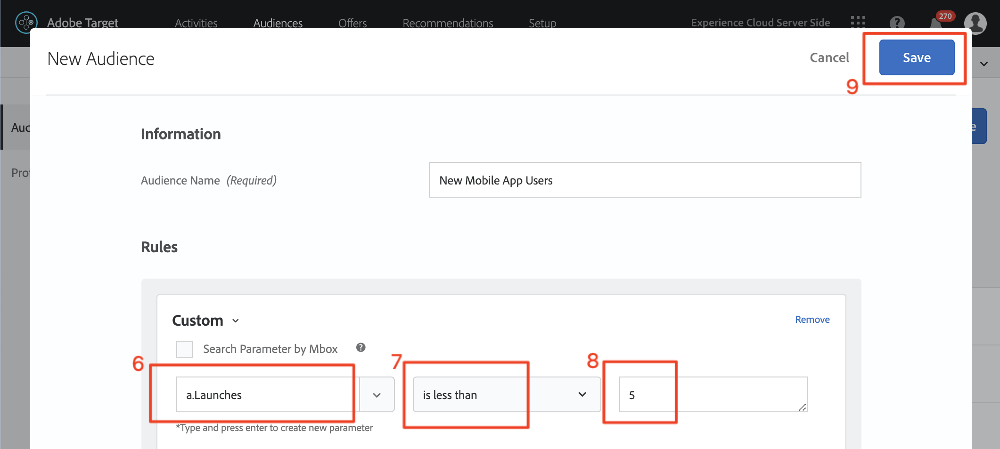

# Erstellen von Audiences und Angeboten in Adobe Target

In dieser Lektion gehen wir in die [!DNL Target] und erstellen Zielgruppen und Angebote für die drei Orte, die wir in der vorherigen Lektion implementiert haben.

## Lernziele

Am Ende dieser Lektion haben Sie folgende Möglichkeiten:

* Erstellen von Zielgruppen in Adobe Target
* Erstellen von Angeboten in Adobe Target

Genauer gesagt erstellen wir in dieser Lektion Zielgruppen und Angebote, die für die Personalisierung der zu Beginn des Tutorials definierten Anwendungsfälle benötigt werden. Wir möchten die Startbildschirme und die Suchbildschirme verwenden, um App-Benutzern bei der Buchung ihrer Reisen zu helfen, und wir möchten den Dankesbildschirm verwenden, um einige relevante Angebote basierend auf dem Ziel des Benutzers anzuzeigen. Hier ist eine Tabelle, die darstellt, was wir in dieser Lektion für jeden Standort erstellen werden:

| Standort | Zielgruppe | Angebot |
| --- | --- | --- |
| wetravel_engage_home | Neue Mobile-App-Benutzer | „Wählen Sie Ihren Ausgangs- und Zielort, um nach verfügbaren Buslinien zu suchen“ |
| wetravel_engage_search | Neue Mobile-App-Benutzer | „Verwenden von Filtern zur Eingrenzung der Suchergebnisse“ |
| wetravel_engage_home | Rückkehrende Mobile-App-Benutzer | „Willkommen zurück! Verwenden Sie den Promo-Code BACK30 während des Checkouts, um einen Rabatt von 10 % zu erhalten.“ |
| wetravel_engage_search | Rückkehrende Mobile-App-Benutzer | Standardinhalt |
| wetravel_context_dest | Zielort: San Diego | „DJ“ |
| wetravel_context_dest | Zielort: Los Angeles | „Universell“ |

## Workspace auswählen

Wenn Ihr Unternehmen Eigenschaften und Arbeitsbereiche verwendet, um die Grenzen für die Personalisierung von Apps und Websites festzulegen, und Sie in der letzten Lektion den Parameter at_property implementiert haben, sollten Sie zunächst sicherstellen, dass Sie sich in der richtigen Workspace befinden, bevor Sie mit dieser Lektion fortfahren. Wenn Sie keine Eigenschaften und Arbeitsbereiche verwenden, ignorieren Sie diesen Schritt einfach. Wählen Sie die in der vorherigen Lektion verwendete Workspace aus, um den at_property-Wert zu kopieren:

## Audiences erstellen

Erstellen wir nun die Zielgruppen, die wir zur Personalisierung der App verwenden werden.

### Erstellen einer Zielgruppe für neue Benutzer

Adobe Target-Zielgruppen werden verwendet, um bestimmte Besuchergruppen zu identifizieren. Angebote können dann auf diese spezifischen Gruppen zugeschnitten werden. Für die ersten beiden Standorte verwenden wir die Zielgruppe „Neue Benutzer“:

1. Klicken Sie in der oberen Navigationsleiste auf **[!UICONTROL Audiences]** .
1. Klicken Sie auf die Schaltfläche **[!UICONTROL Create Audience]** .
   

1. Geben Sie **[!UICONTROL New Mobile App Users]** als Zielgruppennamen ein.
1. Wählen Sie **[!UICONTROL Add Rule]** aus.
1. Wählen Sie eine **[!UICONTROL Custom]** aus.
   

1. Wählen Sie **[!UICONTROL a.Launches]** aus.
1. Wählen Sie **[!UICONTROL is less than]** aus.
1. Eingabe **5**.
1. Speichern Sie die neue Audience.
   

### Erstellen einer Zielgruppe für wiederkehrende Benutzende

Führen Sie dieselben Schritte wie oben beschrieben aus, um eine Zielgruppe für wiederkehrende Benutzende zu erstellen.

1. Benennen Sie die Zielgruppe _Wiederkehrende Mobile-App-Benutzer_.
1. Verwenden Sie **[!UICONTROL a.Launches is greater than or equal to 5]** als benutzerdefinierte Regel.
1. Speichern Sie die neue Audience.

   

>[!NOTE]
>
>Allen im [!DNL Target] Mobile SDK erfassten Lebenszyklusmetriken und Dimensionen wird ein „a“ vorangestellt (z. B. a.Launches). Sie sind in der Option „Benutzerdefiniert“ des Dropdown-Menüs verfügbar und können zum Erstellen von Zielgruppen verwendet werden.

### Erstellen Sie eine Zielgruppe für Benutzer, die eine Reise nach San Diego buchen

Als Nächstes erstellen wir einige Zielgruppen für einige der Ziele, die von der We.Travel-App angeboten werden. In der letzten Lektion haben wir das Ziel als Standortparameter in der Ortsanfrage „travel_context_dest“ übergeben. Dieser Parameter ist in der Option „Benutzerdefiniert“ des Dropdown-Menüs verfügbar.

>[!NOTE]
>
>Wenn ein Parameter, den Sie im Dropdown-Menü „Benutzerdefiniert“ erwarten, nicht in der [!DNL Target] angezeigt wird, überprüfen Sie erneut, ob er in der Anfrage tatsächlich übergeben wird. [!DNL Target] Wenn Sie sich vergewissert haben, dass in der Anfrage enthalten ist, aber das Laden nicht verzögert hat, können Sie einfach den Parameternamen eingeben und die Eingabetaste drücken, um Ihre Audience weiter zu definieren

1. Benennen Sie die Zielgruppe _Ziel: San Diego_.
1. Verwenden Sie eine benutzerdefinierte Regel mit dieser Definition: _locationDest enthält San Diego_.
1. Speichern Sie die neue Audience.

   

### Erstellen Sie eine Zielgruppe für Benutzer, die eine Reise nach Los Angeles buchen

1. Benennen Sie die _(Ziel: Los Angeles_
1. Verwenden Sie eine benutzerdefinierte Regel mit dieser Definition: _locationDest enthält Los Angeles_
1. Speichern Sie die neue Audience.

## Angebote erstellen

Erstellen wir nun Angebote, um diese Nachrichten anzuzeigen. Zur Erinnerung: Angebote sind Code-/Inhaltsfragmente, die in der [!DNL Target] Antwort bereitgestellt werden. Sie werden meist in der [!DNL Target] Benutzeroberfläche erstellt, können aber auch über die API oder mithilfe der Experience Fragments-Integration mit Adobe Experience Manager erstellt werden. In mobilen Apps sind JSON-Angebote üblich. In diesem Tutorial verwenden wir HTML-Angebote, mit denen Sie beliebige Nur-Text-Inhalte (einschließlich JSON) in der App bereitstellen können.

### Angebot für neue Benutzer erstellen

Erstellen wir zunächst Angebote für die Nachrichten an neue Benutzer:

1. Klicken Sie in der oberen Navigationsleiste auf **[!UICONTROL Offers]** .
1. Klicken Sie auf **[!UICONTROL Create]**.
1. Wählen Sie **[!UICONTROL HTML Offer]** aus.

   

1. Benennen Sie das Angebot _Startseite: Neue Benutzer einbinden_.
1. Geben Sie _Source und Ziel auswählen, um nach verfügbaren Bussen zu suchen_ als Code ein.
1. Speichern Sie das neue Angebot.

   

### Angebot für wiederkehrende Benutzer erstellen

Erstellen wir nun das eine Angebot für wiederkehrende Benutzende (das zweite Angebot ist der Standardinhalt, der als nichts angezeigt wird):

1. Benennen Sie das Angebot _Startseite: Wiederkehrende Benutzer_.
1. Enter _Welcome back! Verwenden Sie den Promo-Code BACK30 während des Checkouts, um einen Rabatt von 10 % zu erhalten._ als HTML-Code.
1. Speichern Sie das neue Angebot.

   

### Erstellen des San Diego-Angebots

Wenn „DJ“ zur Dankesaktivität zurückgegeben wird, zeigt die Logik in der Funktion filterRecommendationBasedOnOffer() ein Banner für „Rocknacht mit DJ SAM“ an:

1. Benennen Sie das Angebot _Promotion for San Diego_.
1. Geben Sie _DJ_ als HTML-Code ein.
1. Speichern Sie das neue Angebot.

### Angebot erstellen für Benutzer, die nach Los Angeles gehen

Wenn „Universal“ an die Dankeschön-Aktivität zurückgegeben wird, zeigt die Logik in der Funktion filterRecommendationBasedOnOffer() ein Banner für „Universal Studios“ an:

1. Nennen Sie das Angebot _Promotion for Los Angeles_.
1. Geben Sie _Universal_ als HTML-Code ein.
1. Speichern Sie das neue Angebot.

## Schlussfolgerung 

Jetzt haben wir unsere Audiences und Angebote. In der nächsten Lektion erstellen wir Aktivitäten, die Standorte, Zielgruppen und Angebote miteinander verknüpfen, um personalisierte Erlebnisse zu erstellen.

**[WEITER : „Layouts personalisieren“ >](personalize-layouts.md)**
