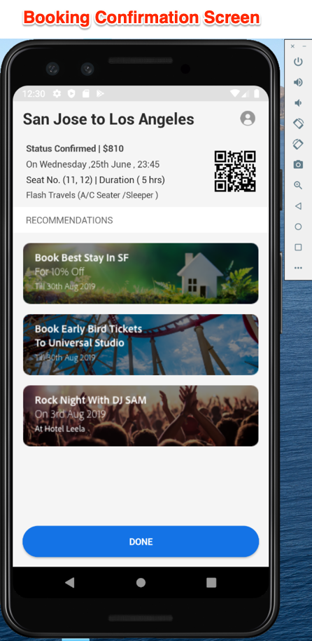

# Herunterladen und Aktualisieren der We.Travel-Beispielanwendung

Die Beispiel-App „We.Travel“ ist mit dem Adobe Mobile Services SDK v4 vorimplementiert. Sie müssen sie nur aktualisieren, damit sie auf Ihre eigenen Experience Cloud-Organisations- und Lösungskonten verweist.

## Lernziele

Am Ende dieser Lektion haben Sie folgende Möglichkeiten:

* Herunterladen und Öffnen der Beispielanwendung We.Travel in Android Studio
* Überprüfen und aktualisieren Sie die Mobile Services SDK-Einstellungen für [!DNL Target]

## Herunterladen der We.Travel-App

* Laden Sie die Datei [sample-app-android-SDKv4-Base-Version.zip) &#x200B;](assets/sample-app-android-SDKv4-Base-Version.zip)
* Dekomprimieren Sie die ZIP-Datei
* Öffnen Sie die App in Android Studio als vorhandenes Projekt (ignorieren Sie alle Fehler über „Ungültige VCS-Stammzuordnung„).
* Führen Sie die App in einem Emulator aus, um zu bestätigen, dass die App erstellt wird und Sie den Startbildschirm sehen können
* Durchsuchen Sie die App und vergewissern Sie sich, dass Sie den Buchungsprozess abschließen können (wählen Sie eine Zahlungsoption aus und klicken Sie einfach auf „Fortfahren“, um über den Rechnungsbildschirm zu springen!)

  

## Überprüfen und aktualisieren Sie die Mobile Services SDK-Einstellungen für [!DNL Target]

Die Adobe Mobile Services SDK wurde innerhalb der We.Travel-App vorinstalliert [laut Dokumentation](https://experienceleague.adobe.com/docs/mobile-services/android/getting-started-android/requirements.html?lang=de). Jetzt aktualisieren Sie die Installation, sodass sie auf Ihr eigenes [!DNL Target] verweist.

Erstellen Sie zunächst eine neue App in der Mobile Services-Benutzeroberfläche:

1. Melden Sie sich bei der [Adobe Mobile Services-Benutzeroberfläche an](https://mobilemarketing.adobe.com/).
1. Gehen Sie zur [!UICONTROL Manage Apps] und klicken Sie dann auf **[!UICONTROL Add]** , um eine neue App hinzuzufügen, die mit diesem Tutorial verwendet werden kann (**[!UICONTROL Manage Apps]** > **[!UICONTROL Add]**).
1. Wählen Sie eine Analytics Report Suite mit Nicht-Produktionsdaten aus, geben Sie der App einen Namen, wählen Sie den **[!UICONTROL Standard]** aus und klicken Sie auf **[!UICONTROL Save]**.
1. Fügen Sie nach dem Hinzufügen der App Ihren [!DNL Target]-Client-Code auf dem nächsten Bildschirm im Abschnitt [!UICONTROL SDK Target Options] hinzu (Sie finden Ihren Client-Code in der [!DNL Target] unter **[!UICONTROL Setup]** > **[!UICONTROL Implementation]** > **[!UICONTROL Edit Settings]** neben der Schaltfläche `at.js` herunterladen ).
1. Die [!UICONTROL Request Timeout] legt fest, wie lange die App auf die Antwort des [!DNL Target]-Servers wartet, bevor Zeitüberschreitungsanweisungen ausgeführt werden. Lassen Sie einfach die Standardeinstellung.
1. Aktivieren Sie die [!UICONTROL Visitor ID Service] und stellen Sie sicher, dass Ihr [!UICONTROL Organization] in der Dropdown-Liste ausgewählt ist.
1. Speichern Sie Ihre Änderungen, indem Sie oben rechts im Fenster auf **[!UICONTROL Save]** klicken (nicht auf die im [!UICONTROL Universal Links], [!UICONTROL App Links] Optionen oder [!UICONTROL Push Services] Abschnitt).
1. Scrollen Sie zum Abschnitt App-SDK-Downloads unten auf der Seite und laden Sie die Konfigurationsdatei herunter:

   

1. Ersetzen Sie die `ADBMobileConfig.json` Datei in Ihrem Android Studio-Projekt-Asset-Ordner (app > src > main > assets).

1. Öffnen Sie nun die `ADBMobileConfig.json`-Datei und stellen Sie sicher, dass sie die erwarteten Änderungen enthält, z. B. Ihren [!DNL Target]-Client-Code und Ihre Analytics-Details:
   

Wenn Ihre Einstellungen nicht angezeigt werden, vergewissern Sie sich, dass Sie in der [!UICONTROL Mobile Services]-Benutzeroberfläche auf die rechte **[!UICONTROL Save]**-Schaltfläche geklickt und die Datei an den richtigen Speicherort kopiert haben.

Herzlichen Glückwunsch! Sie haben die SDK mit Ihren [!DNL Target] Kontodetails aktualisiert! Wir führen eine zusätzliche Validierung der Konfiguration durch, nachdem wir in der nächsten Lektion [!DNL Target] Anfragen hinzugefügt haben.

**[NEXT : „Target-Anforderungen hinzufügen“ >](add-requests.md)**
