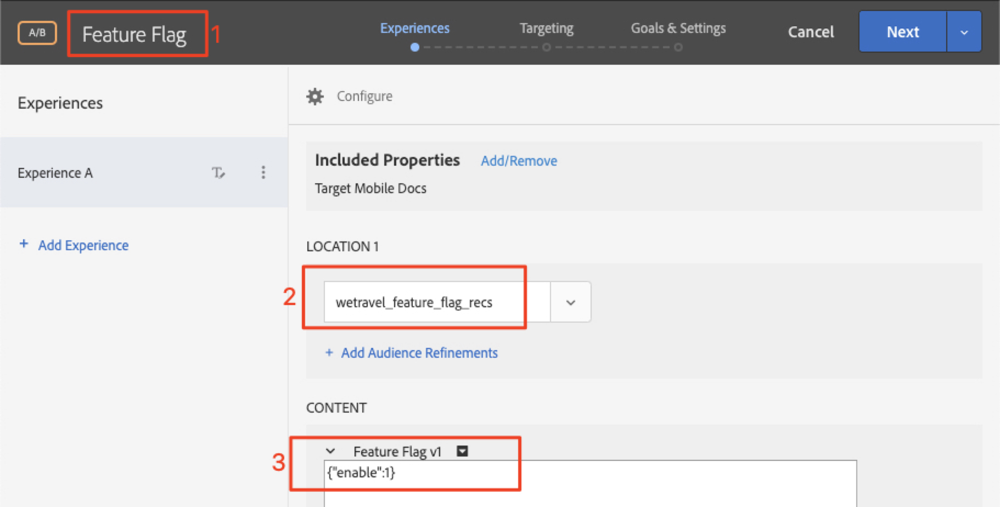
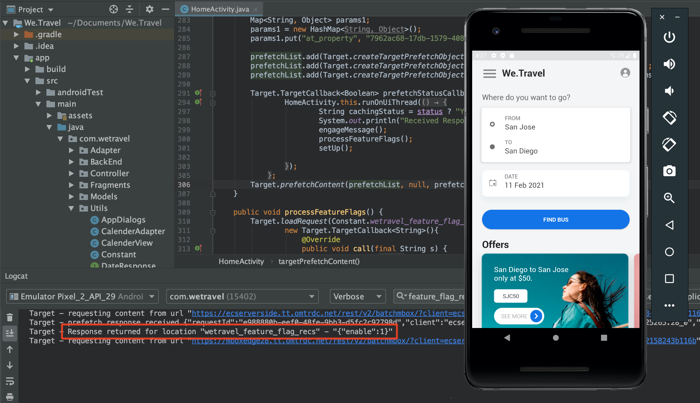

# Funktionskennzeichnung

Besitzer von mobilen Apps benötigen Flexibilität, um neue Funktionen in ihrer App einzuführen, ohne in mehrere App-Versionen investieren zu müssen. Sie möchten die Funktionen möglicherweise auch schrittweise auf einen Prozentsatz der Benutzerbasis ausbauen, um die Effektivität zu testen. Adobe Target kann zum Experimentieren mit UX-Funktionen wie Farbe, Kopieren, Schaltflächen, Text und Bildern verwendet werden und stellt diese Funktionen für bestimmte Audiencen bereit.

In dieser Lektion erstellen wir ein Angebot mit dem &quot;Feature-Flag&quot;, das als Trigger zur Aktivierung bestimmter App-Funktionen verwendet werden kann.

## Lernziele

Am Ende dieser Lektion können Sie:

* hinzufügen einer neuen Position für die Batch-Vorab-Anforderung
* Erstellen einer [!DNL Target]-Aktivität mit einem Angebot, das als Feature-Flag verwendet wird
* Laden und validieren Sie das Feature-Flag-Angebot in Ihrer App

## hinzufügen einer neuen Position zur Prefetch-Anforderung an die Home-Aktivität

In der Demo-App aus unseren vorherigen Lektionen fügen wir der Prefetch-Anforderung in der Home-Aktivität den neuen Speicherort &quot;wetravel_feature_flag_recs&quot;hinzu und laden ihn mit einer neuen Java-Methode auf den Bildschirm.

>[!NOTE]
>
>Einer der Vorteile der Verwendung einer Abfrage vor dem Abrufen besteht darin, dass das Hinzufügen einer neuen Anforderung keinen zusätzlichen Netzwerkaufwand verursacht oder zusätzliche Ladevorgänge verursacht, da die Anforderung in der Anforderung vor dem Abrufen verpackt wird

Vergewissern Sie sich zunächst, dass die Konstante wetravel_feature_flag_recs in der Datei Constant.java hinzugefügt wird:


Im Folgenden finden Sie den Code:

```java
public static final String wetravel_feature_flag_recs = "wetravel_feature_flag_recs";
```

Fügen Sie nun der Prefetch-Anforderung den Speicherort hinzu und laden Sie eine neue Funktion namens `processFeatureFlags()`:


Im Folgenden finden Sie den vollständigen aktualisierten Code:

```java
public void targetPrefetchContent() {
    List<TargetPrefetchObject> prefetchList = new ArrayList<>();

    Map<String, Object> params1;
    params1 = new HashMap<String, Object>();
    params1.put("at_property", "7962ac68-17db-1579-408f-9556feccb477");

    prefetchList.add(Target.createTargetPrefetchObject(Constant.wetravel_engage_home, params1));
    prefetchList.add(Target.createTargetPrefetchObject(Constant.wetravel_engage_search, params1));
    prefetchList.add(Target.createTargetPrefetchObject(Constant.wetravel_feature_flag_recs, params1));

    Target.TargetCallback<Boolean> prefetchStatusCallback = new Target.TargetCallback<Boolean>() {
        @Override
        public void call(final Boolean status) {
            HomeActivity.this.runOnUiThread(new Runnable() {
                @Override
                public void run() {
                    String cachingStatus = status ? "YES" : "NO";
                    System.out.println("Received Response from prefetch : " + cachingStatus);
                    engageMessage();
                    processFeatureFlags();
                    setUp();

                }
            });
        }};
    Target.prefetchContent(prefetchList, null, prefetchStatusCallback);
}

public void processFeatureFlags() {
    Target.loadRequest(Constant.wetravel_feature_flag_recs, "", null, null, null,
            new Target.TargetCallback<String>(){
                @Override
                public void call(final String s) {
                    runOnUiThread(new Runnable() {
                        @Override
                        public void run() {
                            System.out.println("Feature Flags : " + s);
                            if(s != null && !s.isEmpty()) {
                                //enable or disable features
                            }
                        }
                    });
                }
            });
}
```

### Anforderung der Funktionskennzeichnung überprüfen

Nachdem der Code hinzugefügt wurde, führen Sie den Emulator auf der Home-Aktivität aus und achten Sie auf die aktualisierte Antwort von Logcat:


## JSON-Angebot mit Funktionskennzeichnung erstellen

Wir erstellen jetzt ein einfaches JSON-Angebot, das als Flag oder Trigger für eine bestimmte Audience fungiert - die Audience, die die Funktion in ihrer App herausbringen würde. Erstellen Sie in der Oberfläche [!DNL Target] ein neues Angebot:


Benennen wir es &quot;Feature Flag v1&quot; mit dem Wert {&quot;enable&quot;:1}


## Erstellen einer Aktivität

Erstellen wir nun eine A/B-Test-Aktivität mit diesem Angebot. Ausführliche Anweisungen zum Erstellen einer Aktivität finden Sie in der vorherigen Lektion. Die Aktivität benötigt für dieses Beispiel nur eine Audience. In einem Live-Szenario können Sie spezifische benutzerspezifische Audiencen für bestimmte Funktionen erstellen und dann die Aktivität zur Verwendung dieser Audiencen festlegen. In diesem Beispiel weisen wir nur Traffic 50/50 zu (50 % auf Besucher, denen die Funktionsaktualisierungen angezeigt werden, und 50 % auf Besucher, denen ein Standarderlebnis angezeigt wird). Die Aktivität lautet wie folgt:

1. Benennen Sie die Aktivität &quot;Feature Flag&quot;
1. Wählen Sie den Speicherort &quot;wetravel_feature_flag_recs&quot;
1. Ändern Sie den Inhalt in das JSON-Angebot &quot;Feature Flag v1&quot;

   

1. Klicken Sie auf **[!UICONTROL Hinzufügen Erlebnis]**, um Erlebnis B hinzuzufügen.
1. Lassen Sie den Speicherort &quot;wetravel_feature_flag_recs&quot;
1. Lassen Sie **[!UICONTROL Standardinhalt]** für den Inhalt
1. Klicken Sie auf **[!UICONTROL Weiter]**, um zum Bildschirm [!UICONTROL Targeting] fortzufahren.

   

1. Überprüfen Sie im Bildschirm [!UICONTROL Targeting], ob die [!UICONTROL Traffic-Zuordnung]-Methode auf die Standardeinstellung (Manuell) eingestellt ist und dass für jedes Erlebnis die Standardzuordnung von 50 % gilt. Wählen Sie **[!UICONTROL Weiter]**, um zu **[!UICONTROL Ziele und Einstellungen]** fortzufahren.

   

1. Setzen Sie das **[!UICONTROL Primär Ziel]** auf **[!UICONTROL Konversion]**.
1. Legen Sie die Aktion auf **[!UICONTROL Anzeige einer Mbox]** fest. Wir verwenden den Speicherort &quot;wetravel_context_dest&quot; (da dieser Speicherort im Bestätigungsbildschirm angezeigt wird, können wir ihn verwenden, um zu sehen, ob die neue Funktion zu mehr Konversionen führt).
1. Klicken Sie auf **[!UICONTROL Speichern &amp; Schließen]**.

   

die Aktivität aktivieren.

## Aktivität der Funktionskennzeichnung überprüfen

Verwenden Sie jetzt den Emulator, um die Anforderung zu überwachen. Da das Targeting auf 50 % der Benutzer eingestellt ist, wird eine 50 %-ige Antwort mit dem Feature-Flag angezeigt, die den Wert `{enable:1}` enthält.



Wenn Sie den Wert `{enable:1}` nicht sehen, bedeutet das, dass Sie nicht auf das Erlebnis ausgerichtet sind. Als temporärer Test können Sie Folgendes ausführen, um das Angebot zu erzwingen:

1. Deaktivieren Sie die Aktivität.
1. Ändern Sie die Traffic-Zuordnung in der neuen Funktion auf 100 %.
1. Speichern und reaktivieren.
1. Wischen Sie die Daten auf Ihrem Emulator ab und starten Sie dann die App neu.
1. Das Angebot sollte nun den Wert `{enable:1}` zurückgeben.

In einem Live-Szenario kann die Antwort `{enable:1}` verwendet werden, um eine benutzerspezifischere Logik in Ihrer App zu aktivieren, um den spezifischen Funktionssatz anzuzeigen, der Ihre Zielgruppe-Audience anzeigen soll.

## Schlussfolgerung 

Gute Arbeit! Sie verfügen jetzt über die Fertigkeiten, die erforderlich sind, um Funktionen für bestimmte Audiencen der Benutzer einzuführen.
