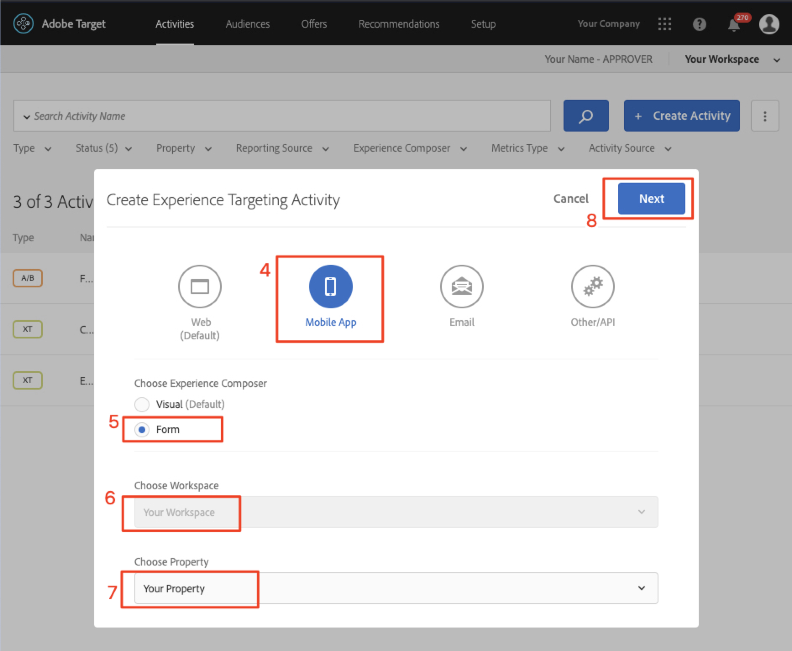

# Layouts personalisieren

Jetzt ist es an der Zeit, alles zusammenzubringen und die personalisierten Erlebnisse zu erstellen. Eine _Aktivität_ ist der [!DNL Target]-Mechanismus, der die Orte, Zielgruppen und Angebote miteinander verknüpft, sodass [!DNL Target] bei der Anforderung über die App mit den personalisierten Inhalten antwortet. Wir erstellen zwei Personalisierungsaktivitäten in [!DNL Target] und überprüfen, ob personalisierte Inhalte dem richtigen Benutzer zum richtigen Zeitpunkt und an der richtigen Stelle angezeigt werden.

## Lernziele

Am Ende dieser Lektion können Sie:

* Erstellen von Aktivitäten in Adobe Target
* Überprüfen der Aktivitäten in der Beispielanwendung

## Erstellen von Aktivitäten in Adobe Target

Erfahren Sie, wie Sie die Aktivitäten &quot;Benutzer einbinden&quot;und &quot;Kontextuelle Angebote&quot;erstellen.

### Erste Aktivität - &quot;Benutzer einbinden&quot;

Im Folgenden finden Sie eine Zusammenfassung der von uns erstellten Aktivität:

| Zielgruppe | Positionen | Angebote |
|---|---|---|
| Neue Mobile App-Benutzer | wetravel_engage_home, wetravel_engage_search | Startseite: Neue Benutzer einbinden, Suche: Neue Benutzer einbinden |
| Zurückgeben von App-Benutzern | wetravel_engage_home, wetravel_engage_search | Startseite: Wiederkehrende Benutzer, default_content |

Gehen Sie in der [!DNL Target]-Schnittstelle wie folgt vor:

1. Wählen Sie **[!UICONTROL Aktivitäten]** > **[!UICONTROL Aktivität erstellen]** > **[!UICONTROL Erlebnis-Targeting]**.

   

1. Klicken Sie auf **[!UICONTROL Mobile App]**.
1. Wählen Sie den **[!UICONTROL Form Composer]** aus.
1. Wählen Sie Ihren Arbeitsbereich aus (der Arbeitsbereich, den Sie in früheren Lektionen verwendet haben).
1. Wählen Sie Ihre Eigenschaft aus (dieselbe Eigenschaft wie in früheren Lektionen).
1. Klicken Sie auf **[!UICONTROL Weiter]**.

   

1. Ändern Sie den Aktivitätstitel in **[!UICONTROL Benutzer einbinden]**.
1. Wählen Sie die **[!UICONTROL Auslassungspunkte]** > **[!UICONTROL Zielgruppe ändern]** aus.
   
1. Stellen Sie die Zielgruppe auf **[!UICONTROL Neue Mobile App-Benutzer]** ein.
1. Klicken Sie auf **[!UICONTROL Fertig]**.
   

1. Ändern Sie den Speicherort in _wetravel_engage_home_.
1. Wählen Sie den Dropdown-Pfeil neben Standardinhalt und danach **[!UICONTROL HTML-Angebot ändern]** aus.

   

1. Wählen Sie die Startseite **[!UICONTROL aus: Neues Angebot für Benutzer]** einbinden.
1. Wählen Sie **[!UICONTROL Fertig]** aus.

   

1. Wählen Sie **[!UICONTROL Standort hinzufügen]** aus.
   

1. Wählen Sie den Standort _wetravel_engage_search_ aus.
1. Ändern Sie das HTML-Angebot.

   

1. Wählen Sie die **[!UICONTROL Suche aus: Neues Angebot für Benutzer]** einbinden.
1. Klicken Sie auf **[!UICONTROL Fertig]**.

   

Sie haben gerade eine Zielgruppe mit Standorten und Angeboten verbunden und damit das personalisierte Erlebnis für die neuen App-Benutzer geschaffen! Das Erlebnis sollte nun wie folgt aussehen:

Erstellen Sie nun ein Erlebnis für wiederkehrende Benutzer mobiler Apps:

1. Wählen Sie links **[!UICONTROL Erlebnis-Targeting hinzufügen]** aus.
1. Wählen Sie die Zielgruppe **[!UICONTROL Returning Mobile App Users]** aus.
1. Wählen Sie **[!UICONTROL Fertig]** aus.
   

Verwenden Sie nun denselben Prozess, den wir zuvor zur Konfiguration des neuen Erlebnisses verwendet haben. Die Konfiguration für das Erlebnis &quot;Returning Mobile App Users&quot;sollte wie folgt aussehen:

Fahren wir mit dem nächsten Bildschirm im Setup fort:

1. Klicken Sie auf **[!UICONTROL Weiter]** , um zum Bildschirm **[!UICONTROL Targeting]** zu gelangen.
1. Verwenden Sie die Standardeinstellungen für das Targeting. Wenn Sie Erlebnisse für Zielgruppen hatten, die sich überlappen (z. B. _New York-Benutzer_ und _Erstmalige Benutzer_) können die Prioritätsreihenfolge auf diesem Bildschirm festlegen.
1. Klicken Sie auf **[!UICONTROL Weiter]**, um zu **[!UICONTROL Ziele und Einstellungen]** zu wechseln.

   

Schließen wir nun die Aktivitätseinrichtung ab:

1. Setzen Sie das Primäre Ziel **[!UICONTROL a1/> auf**[!UICONTROL  Konversion ]**.]**
1. Legen Sie die Aktion auf **[!UICONTROL Mbox]** > _wetravel_context_dest_ fest (Da sich diese Position auf dem Bestätigungsbildschirm befindet, können wir damit Konversionen messen).

   

1. Behalten Sie alle anderen Einstellungen auf dem Bildschirm auf die Standardeinstellungen bei.
1. Klicken Sie auf **[!UICONTROL Speichern und schließen]**, um die Aktivität zu speichern.
1. Aktivieren Sie die **[!UICONTROL Aktivität]** auf dem nächsten Bildschirm.

Unsere erste Aktivität ist jetzt live und kann getestet werden!

### Zweite Aktivität - &quot;Kontextuelle Angebote&quot;

Im Folgenden finden Sie eine Zusammenfassung der zweiten Aktivität, die wir erstellen werden:

| Zielgruppe | Standort | Angebote |
| --- | --- | --- |
| Ziel: San Diego | wetravel_context_dest | Förderung von San Diego |
| Ziel: Los Angeles | wetravel_context_dest | Promotion für Los Angeles |

Wiederholen Sie den obigen Vorgang für die nächste Aktivität - &quot;Kontextuelle Angebote&quot;. Die endgültige Konfiguration für beide Erlebnisse ist unten dargestellt:

#### San Diego

#### Los Angeles

Im Schritt Ziele und Einstellungen ändern wir das Primäre Ziel in den Ort auf dem Buchungsbestätigungsbildschirm:

1. Legen Sie unter **[!UICONTROL Berichtseinstellungen]** das **[!UICONTROL Primäre Ziel]** auf **[!UICONTROL Konversion]** fest.
1. Legen Sie die Aktion auf **[!UICONTROL Mbox]** > _wetravel_context_dest_ fest (in dieser Aktivität ist diese Metrik im Wesentlichen bedeutungslos, da sie auch derselbe Ort ist, der das Erlebnis bereitstellt).
1. Klicken Sie auf **[!UICONTROL Speichern &amp; Schließen]**.

Aktivieren Sie die Aktivität auf dem nächsten Bildschirm.

Jetzt ist unsere zweite Aktivität live und kann getestet werden!

## Validieren des Startangebots

Führen Sie den Emulator aus und beobachten Sie, ob das erste Angebot unten auf dem Startbildschirm angezeigt wird. Wenn Sie ein wiederkehrender Benutzer mit fünf oder mehr App-Starts sind, wird das Angebot _welcome back_ angezeigt. Wenn Sie ein neuer Benutzer sind (weniger als 5 App-Starts), sollte die Meldung _neuer Benutzer_ angezeigt werden:

Wenn das neue Benutzerangebot nicht angezeigt wird, versuchen Sie, die Daten für Ihren Emulator zu löschen. Dadurch wird der App-Starter beim nächsten Start auf 1 zurückgesetzt. Dies geschieht unter **[!UICONTROL Tools]** > **[!UICONTROL AVD Manager]**. Möglicherweise müssen Sie auch Android Studio neu starten, wenn Logcat nicht ordnungsgemäß funktioniert:

Sie können die Antwort auch in Logcat überprüfen, indem Sie nach _wetravel_engage_home_ filtern:

## Überprüfen des Suchangebots

Wählen Sie **[!UICONTROL San Jose]** als **[!UICONTROL Abfahrt]** und **[!UICONTROL San Diego]** als **[!UICONTROL Ziel]** aus und klicken Sie auf **[!UICONTROL Bus]** suchen, um nach verfügbaren Bussen zu suchen.

Auf dem Ergebnisbildschirm sollte die Meldung _Filter_ angezeigt werden. Wenn Sie ein wiederkehrender Benutzer mit 5 oder mehr App-Starts sind, wird hier keine Nachricht angezeigt, da für diesen Ort (der leer ist) Standardinhalt festgelegt ist:

## Validieren der kontextuellen Angebote auf dem Dankesbildschirm

Fahren Sie nun mit dem Buchungsvorgang fort:

* Wählen Sie auf dem Ergebnisbildschirm einen Bus aus.
* Wählen Sie einen Platz auf dem Checkout-Bildschirm aus.
* Wählen Sie **[!UICONTROL Kreditkarte]** auf dem Zahlungsbildschirm aus (lassen Sie die Zahlungsinformationen leer - keine tatsächliche Buchung erfolgt).

Da San Diego als Ziel ausgewählt wurde, sollte das Angebotsbanner _DJ SAM_ auf dem Bestätigungsbildschirm angezeigt werden:

Wählen Sie nun **[!UICONTROL Fertig]** aus und versuchen Sie eine weitere Buchung mit Los Angeles als Ziel. Auf dem Bestätigungsbildschirm sollte das Banner _Universal Studios_ angezeigt werden:

## Schlussfolgerung 

Herzlichen Glückwunsch! Dadurch wird der Hauptteil des Adobe Target SDK 4.x für Android-Tutorials beendet. Sie verfügen jetzt über die Fähigkeiten, Personalisierung in Android-Apps zu implementieren! Sie können diese Dokumentation und Demo-App als Referenz für Ihre künftigen Projekte nutzen.

Weiter: Die Funktionskennzeichnung ist eine weitere Funktion, die mit Adobe Target in Android implementiert werden kann. Weitere Informationen zur Funktionskennzeichnung finden Sie in der nächsten Lektion.

**[NÄCHSTES : Funktionskennzeichnung >](feature-flagging.md)**
