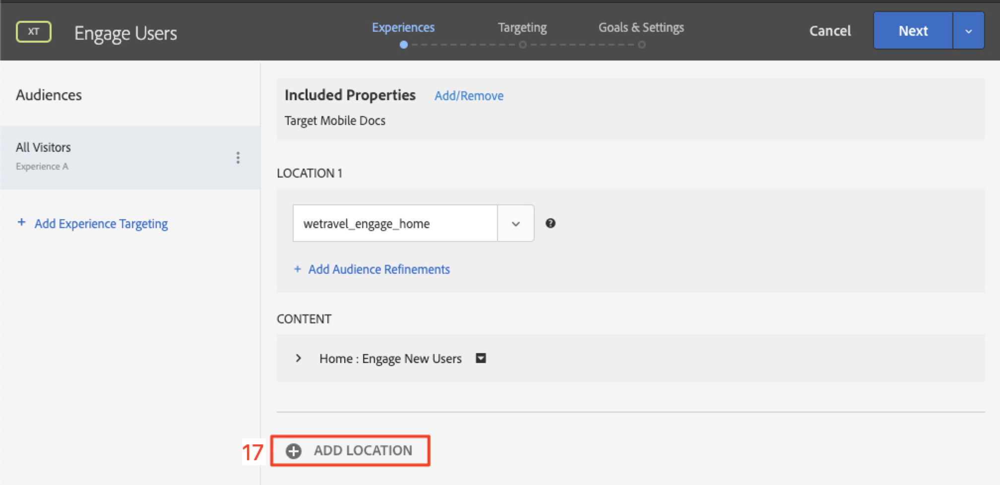
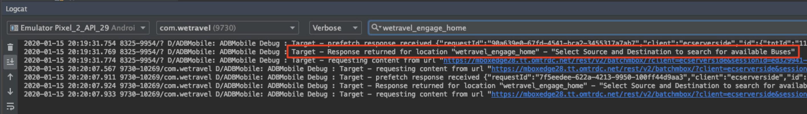

# Layouts personalisieren

Jetzt ist es an der Zeit, alles zusammenzubringen und die personalisierten Erlebnisse zu schaffen. Eine _Aktivität_ ist der [!DNL Target]-Mechanismus, der die Orte, Audiencen und Angebot miteinander verknüpft, sodass [!DNL Target] bei einer Anforderung aus der App mit dem personalisierten Inhalt reagiert. Wir werden zwei Aktivitäten zur Personalisierung in [!DNL Target] erstellen und überprüfen, ob personalisierte Inhalte zum richtigen Zeitpunkt und am richtigen Ort für den richtigen Benutzer angezeigt werden.

## Lernziele

Am Ende dieser Lektion können Sie:

* Erstellen von Aktivitäten in Adobe Target
* Aktivitäten in der Beispielanwendung überprüfen

## Erstellen von Aktivitäten in Adobe Target

Erfahren Sie, wie Sie Aktivitäten für Interages-Benutzer und kontextuelle Angebot erstellen.

### Erste Aktivität - &quot;Benutzer einbinden&quot;

Im Folgenden finden Sie eine Zusammenfassung der Aktivität, die wir erstellen werden:

| Zielgruppe | Orte | Angebote |
|---|---|---|
| Neue Mobile App-Benutzer | wetravel_engagement_home, wetravel_loue | Home: Neue Benutzer einbinden, Suchen: Neue Benutzer einbinden |
| Wiederkehrende Benutzer mobiler Apps | wetravel_engagement_home, wetravel_loue | Home: Zurückkehrende Benutzer, default_content |

Führen Sie in der [!DNL Target]-Schnittstelle Folgendes aus:

1. Wählen Sie **[!UICONTROL Aktivitäten]** > **[!UICONTROL Aktivität erstellen]** > **[!UICONTROL Erlebnis-Targeting]**.

   

1. Klicken Sie auf **[!UICONTROL Mobile App]**.
1. Wählen Sie den **[!UICONTROL Form Composer]**.
1. Wählen Sie Ihren Arbeitsbereich aus (der Arbeitsbereich, den Sie auch in früheren Lektionen verwendet haben).
1. Wählen Sie Ihre Eigenschaft (die gleiche Eigenschaft, die Sie in früheren Lektionen verwendet haben).
1. Klicken Sie auf **[!UICONTROL Weiter]**.

   

1. Ändern Sie den Titel der Aktivität in **[!UICONTROL Benutzer einbinden]**.
1. Wählen Sie **[!UICONTROL Auslassungspunkte]** > **[!UICONTROL Audience ändern]**.
   
1. Legen Sie die Audience auf **[!UICONTROL Neue Mobilanwendungsbenutzer]** fest.
1. Klicken Sie auf **[!UICONTROL Fertig]**.
   

1. Ändern Sie den Speicherort in _wetravel_engagement_home_.
1. Wählen Sie den Dropdownpfeil neben Standardinhalt und dann **[!UICONTROL HTML-Angebot ändern]**.

   

1. Wählen Sie **[!UICONTROL Home: Angebot &quot;Neue Benutzer]** einbinden&quot;.
1. Wählen Sie **[!UICONTROL Fertig]**.

   

1. Wählen Sie **[!UICONTROL Hinzufügen Position]**.
   

1. Wählen Sie den Speicherort _wetravel_engagement_search_ aus.
1. Ändern Sie das HTML-Angebot.

   

1. Wählen Sie **[!UICONTROL Suchen: Angebot &quot;Neue Benutzer]** einbinden&quot;.
1. Klicken Sie auf **[!UICONTROL Fertig]**.

   

Sie haben soeben eine Audience mit Orten und Angeboten verbunden und damit das personalisierte Erlebnis für die Benutzer der neuen mobilen App! Das Erlebnis sollte nun wie folgt aussehen:

Erstellen Sie jetzt ein Erlebnis für wiederkehrende Mobile App-Benutzer:

1. Wählen Sie links **[!UICONTROL Hinzufügen Erlebnis-Targeting]**.
1. Wählen Sie die Audience **[!UICONTROL Zurückkehrende Mobilanwendungsbenutzer]**.
1. Wählen Sie **[!UICONTROL Fertig]**.
   

Verwenden Sie jetzt denselben Prozess, den wir zuvor zur Konfiguration des neuen Erlebnisses verwendet haben. Die Konfiguration für das Erlebnis &quot;Zurückkehrende Benutzer mobiler Apps&quot;sollte wie folgt aussehen:

Fahren wir mit dem nächsten Bildschirm im Setup fort:

1. Klicken Sie auf **[!UICONTROL Weiter]**, um zum Bildschirm **[!UICONTROL Targeting]** fortzufahren.
1. Verwenden Sie die Standardeinstellungen für das Targeting. Wenn Sie Erlebnisse für Audiencen hatten, die sich überlagerten (z. _New Yorker Benutzer_ und _Erstmalige Benutzer_) können Sie die Reihenfolge der Priorität in diesem Bildschirm festlegen.
1. Klicken Sie auf **[!UICONTROL Weiter]**, um zu **[!UICONTROL Ziele und Einstellungen]** fortzufahren.

   

Führen Sie nun die Aktivität-Einrichtung durch:

1. Setzen Sie das **[!UICONTROL Primär Ziel]** auf **[!UICONTROL Konversion]**.
1. Legen Sie die Aktion auf **[!UICONTROL Angezeigte eine mbox]** > _wetravel_context_dest_ fest (Da sich diese Position im Bestätigungsbildschirm befindet, können wir sie verwenden, um Konversionen zu messen).

   

1. Alle anderen Einstellungen auf dem Bildschirm bleiben auf die Standardwerte eingestellt.
1. Klicken Sie auf **[!UICONTROL Speichern und Schließen]**, um die Aktivität zu speichern.
1. Aktivieren Sie die Aktivität **[!UICONTROL im nächsten Bildschirm.]**

Unsere erste Aktivität ist jetzt live und bereit zu testen!

### Zweite Aktivität - &quot;Kontextuelle Angebote&quot;

Im Folgenden finden Sie eine Zusammenfassung der zweiten Aktivität, die wir erstellen werden:

| Zielgruppe | Position | Angebote |
| --- | --- | --- |
| Ziel: San Diego | wetravel_context_dest | Verkaufsförderung für San Diego |
| Ziel: Los Angeles | wetravel_context_dest | Promotion für Los Angeles |

Wiederholen Sie diesen Vorgang für die nächste Aktivität - &quot;Kontextuelle Angebot&quot;. Die endgültige Konfiguration für beide Erlebnisse wird unten angezeigt:

#### San Diego

#### Los Angeles

Im Schritt Ziele und Einstellungen ändern wir das Primär Goal in den Speicherort im Bildschirm Buchungsbestätigung:

1. Legen Sie unter **[!UICONTROL Berichte Settings]** das **[!UICONTROL Primär Ziel]** auf **[!UICONTROL Konversion]** fest.
1. Legen Sie die Aktion auf **[!UICONTROL Anzeige einer mbox]** > _wetravel_context_dest_ fest (in dieser Aktivität ist diese Metrik im Wesentlichen bedeutungslos, da sie auch der gleiche Ort ist, der das Erlebnis liefert).
1. Klicken Sie auf **[!UICONTROL Speichern &amp; Schließen]**.

Aktivieren Sie die Aktivität im nächsten Bildschirm.

Jetzt ist unsere zweite Aktivität live und bereit zu testen!

## Validieren des Home-Angebots

Führen Sie den Emulator aus und achten Sie darauf, dass das erste Angebot unten auf dem Startbildschirm angezeigt wird. Wenn Sie ein wiederkehrender Benutzer mit 5 oder mehr App-Starts sind, wird das Angebot _welcome back_ angezeigt. Wenn Sie ein neuer Benutzer sind (weniger als 5 App-Starts), sollte die Meldung _neuer Benutzer_ angezeigt werden:

Wenn das neue Angebot nicht angezeigt wird, löschen Sie die Daten für Ihren Emulator. Dadurch wird die App beim nächsten Start auf 1 zurückgesetzt. Dies geschieht unter **[!UICONTROL Tools]** > **[!UICONTROL AVD Manager]**. Möglicherweise müssen Sie auch Android Studio neu starten, wenn Logcat nicht ordnungsgemäß funktioniert:

Sie können die Antwort auch in Logcat überprüfen, indem Sie nach _wetravel_engagement_home_ filtern:

## Validieren des Angebots &quot;Suchen&quot;

Wählen Sie **[!UICONTROL San Jose]** als **[!UICONTROL Abfahrt]** und **[!UICONTROL San Diego]** als **[!UICONTROL Ziel]** aus und klicken Sie auf **[!UICONTROL Bus]** suchen, um nach verfügbaren Bussen zu suchen.

Im Ergebnisbildschirm sollte die Meldung _Filter verwenden_ angezeigt werden. Wenn Sie ein wiederkehrender Benutzer mit 5 oder mehr App-Starts sind, wird hier keine Meldung angezeigt, da für diesen Speicherort (der leer ist) Standardinhalt festgelegt ist:

## Überprüfen der kontextbezogenen Angebote im Bildschirm &quot;Vielen Dank&quot;

Fahren Sie jetzt mit dem Buchungsprozess fort:

* Wählen Sie im Ergebnisbildschirm einen Bus aus.
* Wählen Sie einen Platz auf dem Kassengangsbildschirm aus.
* Wählen Sie **[!UICONTROL Kreditkarte]** auf dem Zahlungsbildschirm aus (lassen Sie die Zahlungsinformationen leer - es findet keine tatsächliche Buchung statt).

Da San Diego als Ziel ausgewählt wurde, sollte das Banner _DJ SAM_ auf dem Bestätigungsbildschirm angezeigt werden:

Wählen Sie **[!UICONTROL Fertig]** und versuchen Sie eine weitere Buchung mit Los Angeles als Ziel. Auf dem Bestätigungsbildschirm sollte das Banner _Universelle Studios_ angezeigt werden:

## Schlussfolgerung 

Herzlichen Glückwunsch! Hiermit wird der Hauptteil des Adobe Target SDK 4.x für Android-Tutorials beendet. Sie haben jetzt die Fertigkeiten, Personalisierungen in Android-Apps zu implementieren! Sie können diese Dokumentation und Demo-App als Referenz für Ihre zukünftigen Projekte verwenden.

Weiter: Die Funktion-Kennzeichnung ist eine weitere Funktion, die mit Adobe Target in Android implementiert werden kann. Weitere Informationen zum Kennzeichnen von Funktionen finden Sie in der nächsten Lektion.

**[NÄCHSTES: Funktionsmarkierung >](feature-flagging.md)**
