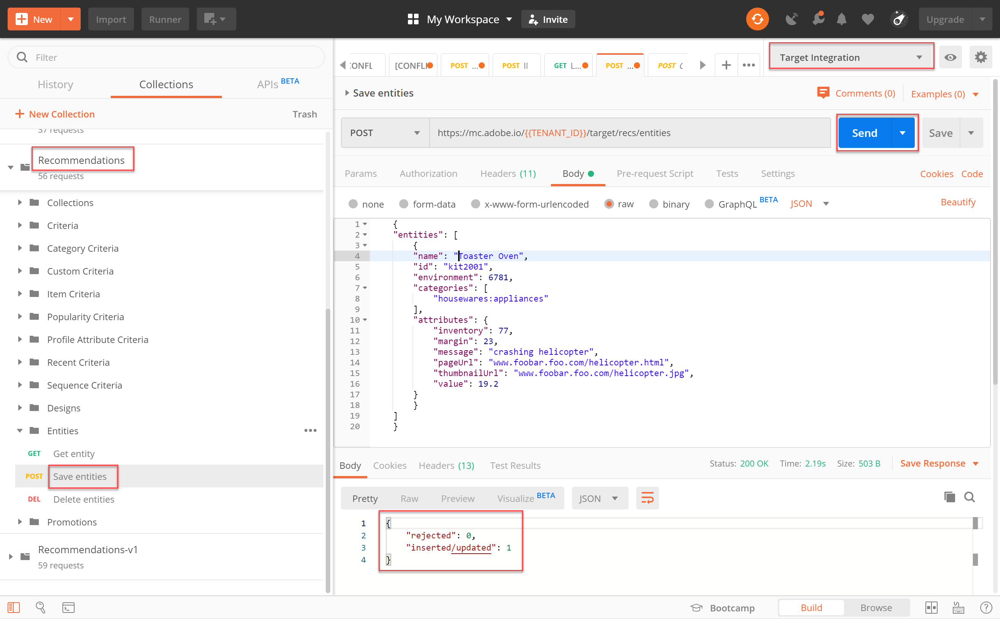

# Verwalten des Katalogs mit APIs[!DNL Recommendations]

An dieser Stelle haben Sie gelernt, wie Sie mithilfe des JWT-Authentifizierungsflusses ein Zugriffstoken zur Verwendung der Adobe Target Admin-APIs mit Adobe I/O generieren können.

Mit den [Recommendations APIs](https://developers.adobetarget.com/api/recommendations/) können Sie Elemente in Ihrem Empfehlungskatalog hinzufügen, aktualisieren oder löschen. Wie bei den anderen Adobe Target Admin-APIs ist für die [!DNL Recommendations]-APIs eine Authentifizierung erforderlich.

>[!TIP]
>
>Senden Sie das IMS **[!UICONTROL an: JWT Generate + Auth über User Token]**-Anforderung, wenn Sie Ihr Zugriffstoken zur Authentifizierung aktualisieren müssen, da es nach 24 Stunden abläuft. Anweisungen hierzu finden Sie unter [Adobe-API-Authentifizierung konfigurieren](../apis/configure-io-target-integration.md).


>[!NOTE]
>
>Bevor Sie fortfahren, rufen Sie die [Recommendations Postman-Sammlung](https://developers.adobetarget.com/api/recommendations/#section/Postman) ab.

## Erstellen und Aktualisieren von Elementen mit der API zum Speichern von Entitäten

Um Ihre [!DNL Recommendations]-Produktdatenbank mit der API anstatt mit einem CSV-Produkt-Feed oder [!DNL Target]-Anforderungen zu füllen, die auf Produktseiten ausgelöst werden, verwenden Sie die [Entitäten-API speichern](https://developers.adobetarget.com/api/recommendations/#operation/saveEntities). Mit dieser Anforderung wird ein Element in einer einzelnen [!DNL Target]-Umgebung hinzugefügt oder aktualisiert. Die Syntax lautet:

```
POST https://mc.adobe.io/{{TENANT_ID}}/target/recs/entities
```

Beispielsweise können &quot;Save Entities&quot;verwendet werden, um Artikel zu aktualisieren, wenn bestimmte Schwellenwerte (z. B. Werte für Bestand oder Preis) erreicht werden, um diese Elemente zu kennzeichnen und zu verhindern, dass sie empfohlen werden.

1. Navigieren Sie zu **[!DNL Target]> [!UICONTROL Setup] > [!UICONTROL Hosts] > [!UICONTROL Umgebung]**, um die [!DNL Target]-Umgebung-ID abzurufen, der Sie ein Element hinzufügen oder aktualisieren möchten.

   

2. Überprüfen Sie die Variablen `TENANT_ID` und `API_KEY` auf die zuvor eingerichteten Postman-Umgebung. Verwenden Sie das unten stehende Bild zum Vergleich. Ändern Sie bei Bedarf die Kopfzeilen und den Pfad in Ihrer API-Anforderung so, dass sie mit denen in unten stehender Abbildung übereinstimmen.

   

3. Geben Sie Ihren JSON-Code als **raw**-Code in **Body** ein. Vergessen Sie nicht, Ihre Umgebung-ID mit der Variablen `environment` anzugeben. (Im folgenden Beispiel ist die Umgebung-ID 6781.)

   

   >!![NOTE]
   Nachfolgend finden Sie ein Beispiel für JSON, das entity.id kit2001 mit den zugehörigen Entitätswerten für ein Toaster Oven-Produkt in Umgebung 6781 hinzufügt.

   ```
      {
      "entities": [{
              "name": "Toaster Oven",
              "id": "kit2001",
              "environment": 6781,
              "categories": [
                  "housewares:appliances"
              ],
              "attributes": {
                  "inventory": 77,
                  "margin": 23,
                  "message": "crashing helicopter",
                  "pageUrl": "www.foobar.foo.com/helicopter.html",
                  "thumbnailUrl": "www.foobar.foo.com/helicopter.jpg",
                  "value": 19.2
              }
          }]
      }
   ```

4. Klicken Sie auf **Senden**. Sie sollten die folgende Antwort erhalten.

   

Das JSON-Objekt kann skaliert werden, um mehrere Produkte zu senden. Beispielsweise gibt dieses JSON zwei Entitäten an.

```
    {
        "entities": [{
                "name": "Toaster Oven",
                "id": "kit2001",
                "environment": 6781,
                "categories": [
                    "housewares:appliances"
                ],
                "attributes": {
                    "inventory": 89,
                    "margin": 11,
                    "message": "Toaster Oven",
                    "pageUrl": "www.foobar.foo.com/helicopter.html",
                    "thumbnailUrl": "www.foobar.foo.com/helicopter.jpg",
                    "value": 102.5
                }
            },
            {
                "name": "Blender",
                "id": "kit2002",
                "environment": 6781,
                "categories": [
                    "housewares:appliances"
                ],
                "attributes": {
                    "inventory": 36,
                    "margin": 5,
                    "message": "Blender",
                    "pageUrl": "www.foobar.foo.com/helicopter.html",
                    "thumbnailUrl": "www.foobar.foo.com/helicopter.jpg",
                    "value": 54.5
                }
            }
        ]
    }
```

1. Jetzt bist du dran! Verwenden Sie die API **Entitäten speichern**, um dem Katalog die folgenden Elemente hinzuzufügen. Verwenden Sie das obige Beispiel-JSON als Ausgangspunkt. (Sie müssen das JSON um weitere Entitäten erweitern.)

   

Hoppla, sieht so aus, als ob diese letzten beiden Artikel nicht gehören. Überprüfen wir sie mithilfe der API **Get Entity** und löschen Sie sie gegebenenfalls mithilfe der API **Delete Entities**.

## Abrufen von Elementdetails mit der Get Entity API

Um die Details eines vorhandenen Elements abzurufen, verwenden Sie die [Get Entity API](https://developers.adobetarget.com/api/recommendations/#operation/getEntity). Die Syntax lautet:

```
GET https://mc.adobe.io/{{TENANT_ID}}/target/recs/entities/[entity.id]
```

Entitätsdetails können jeweils nur für eine einzelne Entität abgerufen werden. Sie können &quot;Get Entity&quot;verwenden, um zu bestätigen, dass im Katalog wie erwartet Aktualisierungen vorgenommen wurden, oder um den Inhalt des Katalogs anderweitig zu prüfen.

1. Geben Sie in der API-Anforderung die Entitäts-ID mit der Variablen `entityId` an. Im folgenden Beispiel werden Details zur Entität zurückgegeben, deren entityId=kit2004.

   

2. Überprüfen Sie die Variablen `TENANT_ID` und `API_KEY` auf die zuvor eingerichteten Postman-Umgebung. Verwenden Sie das unten stehende Bild zum Vergleich. Ändern Sie bei Bedarf die Kopfzeilen und den Pfad in Ihrer API-Anforderung so, dass sie mit denen in unten stehender Abbildung übereinstimmen.

   

3. Senden Sie die Anforderung.

   
Wenn eine Fehlermeldung angezeigt wird, dass die Entität nicht gefunden wurde (wie im Beispiel oben gezeigt), überprüfen Sie, ob Sie die Anforderung an die richtige  [!DNL Target] Umgebung senden.

   >[!NOTE]
   Wenn keine Umgebung explizit angegeben ist, versucht Get Entity, die Entität nur von Ihrer [Standardeinstellung ](https://docs.adobe.com/content/help/en/target/using/administer/hosts.html#section_4F8539B07C0C45E886E8525C344D5FB0) abzurufen. Wenn Sie von einer anderen Umgebung als der standardmäßigen Umgebung abrufen möchten, müssen Sie die Umgebung-ID angeben.

4. Fügen Sie bei Bedarf den Parameter `environmentId` hinzu und senden Sie die Anforderung erneut.

   

5. Senden Sie eine weitere **Get Entity**-Anforderung, diesmal zur Überprüfung der Entität, deren entityId=kit2005.

   

Angenommen, Sie entscheiden, dass diese Entitäten aus Ihrem Katalog entfernt werden müssen. Verwenden wir die API **Entitäten** löschen.

## Löschen von Elementen mit der API zum Löschen von Entitäten

Um Elemente aus Ihrem Katalog zu entfernen, verwenden Sie die API [Entitäten löschen](https://developers.adobetarget.com/api/recommendations/#operation/deleteEntities). Die Syntax lautet:

```
DELETE https://mc.adobe.io/{{TENANT_ID}}/target/recs/entities?ids=[comma-delimited-entity-ids]&environment=[environmentId]
```

>[!WARNING]
Diese API löscht Entitäten, auf die von Ihnen angegebene IDs verweisen.
Wenn keine Entitäts-IDs angegeben sind, werden alle Entitäten in der jeweiligen Umgebung gelöscht. Wenn keine Umgebung-ID angegeben wird, werden Entitäten aus allen Umgebung gelöscht. Benutze das mit Vorsicht!

1. Navigieren Sie zu **[!DNL Target]> [!UICONTROL Setup] > [!UICONTROL Hosts] > [!UICONTROL Umgebung]**, um die [!DNL Target]-Umgebung-ID abzurufen, aus der Sie Elemente löschen möchten.

   

2. Geben Sie in der API-Anforderung die Entitäts-IDs der Entitäten an, die Sie löschen möchten, und verwenden Sie dazu die Syntax `&ids=[comma-delimited-entity-ids]` (Abfrage-Parameter). Trennen Sie beim Löschen von mehr als einer Entität die IDs durch Kommas.

   

3. Geben Sie die Umgebung-ID mit der Syntax `&environment=[environmentId]` an, andernfalls werden Entitäten aus allen Umgebung gelöscht.

   

4. Überprüfen Sie die Variablen `TENANT_ID` und `API_KEY` auf die zuvor eingerichteten Postman-Umgebung. Verwenden Sie das unten stehende Bild zum Vergleich. Ändern Sie bei Bedarf die Kopfzeilen und den Pfad in Ihrer API-Anforderung so, dass sie mit denen in unten stehender Abbildung übereinstimmen.

   

5. Senden Sie die Anforderung.

   

6. Überprüfen Sie Ihre Ergebnisse mit **Get Entity**, was nun darauf hinweisen sollte, dass die gelöschten Entitäten nicht gefunden werden können.

   

   

Herzlichen Glückwunsch! Sie können jetzt die APIs [!DNL Recommendations] verwenden, um Details zu den Entitäten in Ihrem Katalog zu erstellen, zu aktualisieren, zu löschen und abzurufen. Im nächsten Abschnitt erfahren Sie, wie Sie benutzerdefinierte Kriterien verwalten.

[Nächste &quot;Benutzerspezifische Kriterien verwalten&quot;>](manage-custom-criteria.md)
