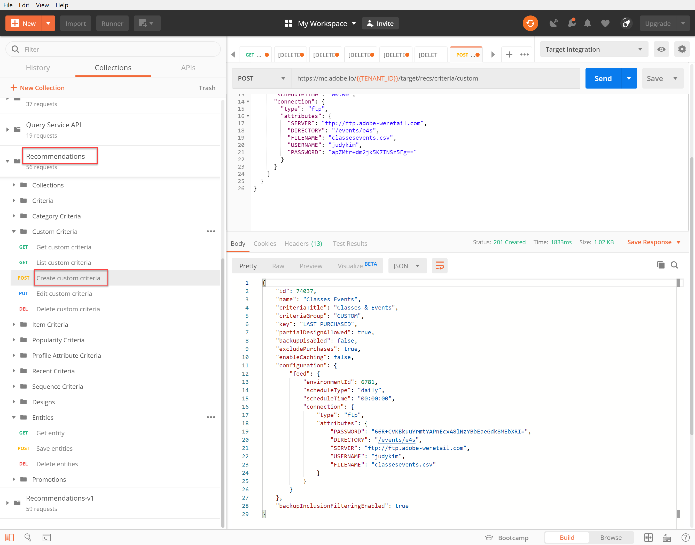

# Benutzerdefinierte Kriterien verwalten

Manchmal werden die von [!DNL Recommendations] können bestimmte Artikel, die Sie bewerben möchten, nicht aufdecken. In einem solchen Fall bieten benutzerdefinierte Kriterien eine Möglichkeit, einen bestimmten Satz empfohlener Artikel für ein bestimmtes Schlüsselelement oder eine bestimmte Kategorie bereitzustellen. Sie definieren die Zuordnung zwischen dem Schlüsselelement oder der Schlüsselkategorie und den empfohlenen Elementen und importieren diese Zuordnung als benutzerdefinierte Kriterien. Dieser Vorgang wird im Abschnitt [Dokumentation benutzerdefinierter Kriterien](https://experienceleague.adobe.com/docs/target/using/recommendations/criteria/recommendations-csv.html?lang=en). Wie in dieser Dokumentation erwähnt, können Sie benutzerdefinierte Kriterien über die [!DNL Target] Benutzeroberfläche. Allerdings [!DNL Target] bietet außerdem eine Reihe benutzerdefinierter Kriterien-APIs, die eine detailliertere Verwaltung Ihrer benutzerspezifischen Kriterien ermöglichen.

>[!IMPORTANT]
>
>Befolgen Sie diese Nutzungsrichtlinien für benutzerdefinierte Kriterien:
>
> Führen Sie entweder alle Aktionen (Erstellen, Bearbeiten, Löschen) für ein bestimmtes benutzerdefiniertes Kriterium mithilfe der APIs aus oder führen Sie über die Benutzeroberfläche alle anderen Aktionen durch (Erstellen, Bearbeiten, Löschen). Die Verwaltung benutzerdefinierter Kriterien durch eine Kombination aus Benutzeroberfläche und API kann zu widersprüchlichen Informationen oder unerwarteten Ergebnissen führen. Beispielsweise spiegelt das Erstellen eines benutzerdefinierten Kriteriums in der Benutzeroberfläche und dessen anschließende Bearbeitung über die API Ihre Aktualisierungen in der Benutzeroberfläche nicht wider, obwohl sie im Backend aktualisiert werden, wie über die API sichtbar.

## Erstellen benutzerdefinierter Kriterien

So erstellen Sie benutzerdefinierte Kriterien mit dem [Benutzerdefinierte Kriterien-API erstellen](https://developers.adobetarget.com/api/recommendations/#operation/createCriteriaCustom)lautet die Syntax:

`POST https://mc.adobe.io/{{TENANT_ID}}/target/recs/criteria/custom`

>[!WARNING]
>
>Benutzerdefinierte Kriterien, die mit der API Benutzerdefinierte Kriterien erstellen erstellt wurden, wie in dieser Übung beschrieben, werden in der Benutzeroberfläche angezeigt, wo sie beibehalten werden. Sie können sie nicht in der Benutzeroberfläche bearbeiten oder löschen. Sie können sie bearbeiten oder löschen **via API**, aber auf beide Arten werden sie weiterhin im [!DNL Target] Benutzeroberfläche. Um die Option zum Bearbeiten oder Löschen über die Benutzeroberfläche beizubehalten, erstellen Sie die benutzerdefinierten Kriterien mithilfe der Benutzeroberfläche pro [die Dokumentation](https://experienceleague.adobe.com/docs/target/using/recommendations/criteria/recommendations-csv.html?lang=en)im Gegensatz zur API Benutzerdefinierte Kriterien erstellen .

Fahren Sie mit diesem Tutorial erst fort, nachdem Sie die oben stehende Warnung gelesen haben und mit dem Erstellen neuer benutzerdefinierter Kriterien vertraut sind, die später nicht aus der Benutzeroberfläche gelöscht werden können.

1. Überprüfen `TENANT_ID` und `API_KEY` für **Erstellen benutzerdefinierter Kriterien** referenzieren Sie die zuvor erstellten Postman-Umgebungsvariablen. Verwenden Sie das folgende Bild zum Vergleich.

   

2. Fügen Sie Ihre **body** as **raw** JSON, das den Speicherort Ihrer CSV-Datei für benutzerdefinierte Kriterien definiert. Verwenden Sie das Beispiel im Abschnitt [Benutzerdefinierte Kriterien-API erstellen](https://developers.adobetarget.com/api/recommendations/#operation/getAllCriteriaCustom) Dokumentation als Vorlage, `environmentId` und anderen Werten nach Bedarf. Für dieses Beispiel verwenden wir LAST_PURCHASED als Schlüssel.

   

3. Senden Sie die Anfrage und beobachten Sie die Antwort, die die Details der soeben erstellten benutzerdefinierten Kriterien enthält.

   

4. Um zu überprüfen, ob Ihre benutzerdefinierten Kriterien erstellt wurden, navigieren Sie in Adobe Target zu **[!UICONTROL Recommendations] > [!UICONTROL Kriterien]** und suchen Sie nach Ihren Kriterien nach Namen oder verwenden Sie die **Benutzerdefinierte Kriterien-API auflisten** im nächsten Schritt.

   

In diesem Fall haben wir einen Fehler. Untersuchen wir den Fehler, indem wir die benutzerdefinierten Kriterien genauer untersuchen und die **Benutzerdefinierte Kriterien-API auflisten**.

## Benutzerdefinierte Kriterien auflisten

Um eine Liste aller benutzerdefinierten Kriterien zusammen mit Details zu jedem abzurufen, verwenden Sie die [Benutzerdefinierte Kriterien-API auflisten](https://developers.adobetarget.com/api/recommendations/#operation/getAllCriteriaCustom). Die Syntax lautet:

`GET https://mc.adobe.io/{{TENANT_ID}}/target/recs/criteria/custom`

1. Überprüfen `TENANT_ID` und `API_KEY` und senden Sie die Anfrage. Beachten Sie in der Antwort die benutzerdefinierte Kriterien-ID sowie Details zur zuvor genannten Fehlermeldung.
   

In diesem Fall ist der Fehler aufgetreten, weil die Serverinformationen falsch sind, d. h. [!DNL Target] kann nicht auf die CSV-Datei zugreifen, die die benutzerdefinierte Kriteriendefinition enthält. Bearbeiten wir die benutzerdefinierten Kriterien, um dies zu korrigieren.

## Benutzerdefinierte Kriterien bearbeiten

Um die Details einer benutzerdefinierten Kriteriendefinition zu ändern, verwenden Sie die [Benutzerdefinierte Kriterien-API bearbeiten](https://developers.adobetarget.com/api/recommendations/#operation/updateCriteriaCustom). Die Syntax lautet:

`POST https://mc.adobe.io/{{TENANT_ID}}/target/recs/criteria/custom/:criteriaId`

1. Überprüfen `TENANT_ID` und `API_KEY`, wie zuvor.
   

1. Geben Sie die Kriterien-ID der (einzelnen) benutzerdefinierten Kriterien an, die Sie bearbeiten möchten.
   

1. Geben Sie im Hauptteil aktualisierte JSON-Dateien mit den richtigen Serverinformationen ein. (Geben Sie für diesen Schritt den FTP-Zugriff auf einen Server an, auf den Sie zugreifen können.)
   

1. Senden Sie die Anfrage und notieren Sie die Antwort.
   

Überprüfen wir anhand des Erfolgs der aktualisierten benutzerdefinierten Kriterien. **Abrufen der API für benutzerdefinierte Kriterien**.

## Abrufen benutzerdefinierter Kriterien

Um benutzerdefinierte Kriteriendetails für ein bestimmtes benutzerdefiniertes Kriterium anzuzeigen, verwenden Sie die [Abrufen der API für benutzerdefinierte Kriterien](https://developers.adobetarget.com/api/recommendations/#operation/getCriteriaCustom). Die Syntax lautet:

`GET https://mc.adobe.io/{{TENANT_ID}}/target/recs/criteria/custom/:criteriaId`

1. Geben Sie die Kriterien-ID der benutzerdefinierten Kriterien an, deren Details Sie erhalten möchten. Senden Sie die Anfrage und überprüfen Sie die Antwort.
   
1. Überprüfen Sie den Erfolg. (Überprüfen Sie in diesem Fall, ob keine weiteren FTP-Fehler mehr vorliegen.)
   
1. (Optional) Überprüfen Sie, ob die Aktualisierung in der Benutzeroberfläche korrekt angezeigt wird.
   

## Benutzerdefinierte Kriterien löschen

Löschen Sie mithilfe der zuvor angegebenen Kriterien-ID Ihre benutzerdefinierten Kriterien mithilfe der [Benutzerdefinierte Kriterien-API löschen](https://developers.adobetarget.com/api/recommendations/#operation/deleteCriteriaCustom). Die Syntax lautet:

`DELETE https://mc.adobe.io/{{TENANT_ID}}/target/recs/criteria/custom/:criteriaId`

1. Geben Sie die Kriterien-ID des (einzelnen) benutzerdefinierten Kriteriums an, das Sie löschen möchten. Klicken Sie auf **Senden**.
   

1. Vergewissern Sie sich, dass die Kriterien mit &quot;Benutzerdefinierte Kriterien abrufen&quot;gelöscht wurden.
   
In diesem Fall zeigt der erwartete 404-Fehler an, dass die gelöschten Kriterien nicht gefunden werden können.

>[!NOTE]
>Zur Erinnerung: Die Kriterien werden nicht aus dem [!DNL Target] Benutzeroberfläche, obwohl sie gelöscht wurde, da sie mit der API Benutzerdefinierte Kriterien erstellen erstellt wurde.

Herzlichen Glückwunsch! Sie können jetzt mithilfe des [!DNL Recommendations] API. Im nächsten Abschnitt verwenden Sie die [!DNL Target] Bereitstellungs-API zum Abrufen von Empfehlungen.

[Weiter mit &quot;Abrufen von Recommendations mit der serverseitigen Bereitstellungs-API&quot;>](https://developer.adobe.com/target/before-administer/recs-api/fetch-recs-server-side-delivery-api/){target=&quot;_blank&quot;}
