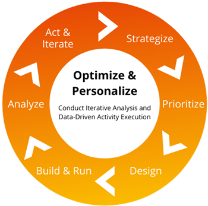

# Best Practices für die Optimierung mit Adobe Target

Lernen Sie die sechs Grundlagen der Optimierung von Adobe kennen und wie Sie sie anwenden können.

Wenn es darum geht, eine starke digitale Präsenz aufzubauen, gibt es eine Reihe von Herausforderungen, vor denen Ihr Team stehen wird. Sie haben nicht nur die Aufgabe, Hunderte oder sogar Tausende von Kunden zu ansprechen. Darüber hinaus zeigen Ihre Kunden eine Vielzahl einzigartiger Verhaltensweisen und Vorlieben, die sich im Laufe der Zeit ändern werden, und es liegt an Ihnen, nicht nur mit diesen Änderungen Schritt zu halten, sondern sie zu antizipieren und Ihre Strategien effizient und genau auszuführen. Es ist ein Rennen gegen die Konkurrenten in einem permanenten Inhalts-Marathon, der ständige Iteration und erstklassige Technologie erfordert.

Eine Lösung für diese vielseitige Herausforderung ist die Optimierung mit Adobe Target, die sicherstellt, dass Sie über eine sich entwickelnde digitale Präsenz verfügen, die relevant, wertvoll und reibungsfrei ist. Die technische Architektur und die Kanäle, in denen Sie [!DNL Target] bereitstellen, sind von Kunde zu Kunde sehr unterschiedlich. Wir haben jedoch eine Liste mit Best Practices und Optimierungsstrategien zusammengestellt, die jedes Team verwenden kann, um die Möglichkeiten dieses leistungsstarken Tools optimal zu nutzen.

## Grundlegendes zur Optimierung

Optimierung ist definiert als „die Aktion, eine Situation oder Ressource optimal oder am effektivsten zu nutzen.“ Dies ist der effizienteste Weg, um sicherzustellen, dass Sie über qualitative Daten verfügen, die beweisen, dass die von Ihnen vorgenommenen Änderungen nützlich sind. Um wirklich zu optimieren, müssen Sie in der Lage sein, die Wirkung und den Wert Ihrer Bemühungen zu messen. Andernfalls führen die von Ihnen vorgenommenen Änderungen zu höheren Kosten bei minimalem Gewinn. Um dies effektiv und effizient zu erreichen, müssen Sie mit der strategischen Planung beginnen. Ohne einen strategischen Plan in Ihre Optimierung einzubeziehen, würden Sie einfach raten.

### Sechs Grundlagen der Optimierung

1. **Strategie**: Identifizieren Sie Möglichkeiten für Aktivitäten, die mit Geschäftszielen abgestimmt sind und auf Daten basieren.
1. **Priorisieren**: Bewerten und planen Sie die Aktivitäten nach ihrer Ausrichtung am Unternehmen, dem Aufwand und der potenziellen Wirkung.
1. **Design**: Erstellen Sie fertige Visualisierungen der Aktivitätserlebnisse und entwickeln Sie Aktivitätspläne mit detaillierten Kriterien.
1. **Erstellen und Ausführen**: Entwickeln Sie Aktivitäten einschließlich [!DNL Target] Einrichtung, Code-Entwicklung und QA-Tests.
1. **Analysieren**: Starten [!DNL Target] Aktivität für die Produktion und Überwachen der Leistung für die Dauer der Aktivität.
1. **Handeln und iterieren**: Entwickeln Sie Empfehlungen auf der Grundlage der Leistung von Test- oder Personalisierungsaktivitäten.

Da der Wandel eine Konstante ist, sollte unsere Optimierungsstrategie ein iterativer Ausführungszyklus sein, um den sich ständig ändernden Anforderungen Ihrer Kunden gerecht zu werden (siehe Abbildung 1 unten).

_Abbildung 1: Iterativer Optimierungszyklus_

## Erstellen einer Optimierungsstrategie

Der Prozess der Entwicklung einer Optimierungsstrategie kann wie folgt aufgeschlüsselt werden: (1) Erstellen eines Aktivitätsplans für Tests und (2) Grundlagen der Optimierung.

1: Der Aktivitätsplan für den Test sollte dokumentiert werden. Dadurch wird sichergestellt, dass Sie bei Ihrer Testaktivitätsanwendung über einen minimalen Qualitätsstandard verfügen. Ihr Testaktivitätsplan sollte Folgendes enthalten:

* **Name und Beschreibung:** Name der intuitiven Aktivität und Beschreibung dessen, worauf sich das Experiment konzentriert. „Wie? Was? Wann? Wo? Warum?“

* **Ziel** Zweck der Aktivität und abgestimmtes Geschäftsziel, auf deren Wirkung sie ausgelegt ist.

* **Hypothese:** Eine Hypothese ist eine Prognose, die Sie vor der Durchführung eines Experiments erstellen. Hier wird klar gesagt, was getestet wird, was man für das Ergebnis hält und warum man das glaubt. Die Durchführung des Experiments bestätigt oder widerlegt Ihre Hypothese.

Eine vollständige Hypothese besteht aus drei Teilen:

* If _variable_
* Then _result_
* Denn _rational_

* **Speicherort** URL, Seitenbereich und Gerätetyp.
* **Zielmetrik:** wird der Erfolg gemessen?
* **Sekundäre Metriken:** Weitere wichtige Leistungsindikatoren (KPIs), die ausgewertet werden können, um Auswirkungen besser zu verstehen und Iterationen zu planen.
* **Aktivitätszielgruppe:** Beschreibung der erforderlichen Filterung der Testbelichtung.
* **Reporting-Zielgruppen:** Liste der Beschreibungen von Besucheruntergruppen, die für die Analyse verwendet werden sollen.
* **Erlebniskonzepte:** Mockups, Beispiele für Wireframes und Beschreibungen.

**Allgemeiner Hinweis:** Jedes Element einer Web-Seite, das den Geschäftswert steigern oder wertvolle Einblicke in das Besucherverhalten geben kann, kann getestet werden. Zu den gebräuchlichen Arten von Testaktivitäten gehören:

* Überschrifttext
* Inhaltstext
* Schaltflächentext
* Seitenlayout
* Fotografie
* Schaltflächenfarbe
* Element-Layout
* Entfernen und Hinzufügen von Elementen
* Navigationsreihenfolge
* Navigationstaxonomie
* Suchhervorhebung

2: Die zweite Phase der Strategie besteht darin, die Grundlagen der Optimierung zu verstehen, was das Verständnis der Testelemente selbst umfasst. Zu den Testelementen der Optimierung gehören:

    a. Elementwert
    
    Dies wird erreicht, indem Sie einen Schritt zurück gehen und fragen, warum ein bestimmtes Element auf Ihrer Site vorhanden ist und ob der Inhalt einem bestimmten Zweck dient? Diese Fragen sind ein guter Ausgangspunkt, wenn Ihre Site gerade ein Redesign abgeschlossen hat oder wenn eine neue Funktion kürzlich eingeführt wurde. Die Taktik, mit der der Elementwert bestimmt wird, wird als Ein-/Ausschlusstest bezeichnet. Ein-/Ausschlusstests bieten eine gute Wertschätzung der Seite, auf der das Element angezeigt wird.
    
    b. Elementdarstellung
    
     Hier würden Sie über das Gesamtbild des Elements und dessen Auswirkungen auf die gesamte Seitendarstellung nachdenken. Die Taktik, die für die Präsentation verwendet wird, besteht darin, sich auf wirkungsvolle Änderungen an Inhalten und Seitenelementen zu konzentrieren.
    
    C. Elementfunktion
    
    Hier fragen wir, ob das Element auf der Seite das tut, was es tun soll? Funktioniert die Interaktion erfolgreich und wie beabsichtigt? Ist die Interaktion natürlich oder ein Reibungspunkt? Die für Funktionen verwendete Taktik besteht darin, Erlebnisse zu erstellen, die sich auf benutzerfreundliche Funktionen ohne zusätzliche Kostenauswirkungen konzentrieren.

## Optimierung vs. Personalisierung

Nachdem wir nun die Komponenten der Strategie analysiert und aufgelistet haben, ist es wichtig, zwischen Optimierungsbemühungen und Personalization-Maßnahmen zu unterscheiden. Optimierung ist die Maßnahme, eine Situation oder Ressource am besten oder effektivsten zu nutzen, während Personalization die Maßnahme ist, etwas zu entwerfen oder zu produzieren, das den individuellen Anforderungen einer Person entspricht.

Auf allgemeiner Ebene:

* Die Optimierung konzentriert sich auf Tests, um herauszufinden, was für ALLE am effizientesten und leistungsfähigsten ist, die mit Ihrer digitalen Präsenz interagieren.
* Personalization testet, was für einige von denen, die mit Ihrer digitalen Präsenz interagieren, am effizientesten und leistungsfähigsten ist.

Wenn wir uns auf die Optimierung konzentrieren, sind die häufigsten Testaktivitäten:

* **A/B-Tests** Echtzeit-Tests von zwei oder mehr Seiten oder Seitenelementen gegeneinander, um quantitative Einblicke in die Kundenpräferenzen zu erhalten.
* **Multivariate Tests** Vergleichen von Angebotskombinationen zwischen Elementen auf einer Seite, um festzustellen, welche Kombination die besten Ergebnisse erzielt. Darüber hinaus ermittelt der Multivarianz-Test, welches Element der Seite die Konversionen am besten verbessert.

Wenn Sie sich auf Personalization konzentrieren, sehen Sie wahrscheinlich dieselben Testaktivitäten wie in Optimierung, sie sind jedoch auf spezifischere Zielgruppen ausgerichtet. Bei A/B-Tests werden Sie beispielsweise wahrscheinlich Seiten und Zielgruppen innerhalb der Erlebnisse hinzufügen, um Ihre Personalization weiter zu unterstützen.

Personalization umfasst auch den Testaktivitätstyp Experience Targeting , der basierend auf einem Satz definierter Regeln und Kriterien Inhalte für bestimmte Zielgruppen bereitstellt. Wenn Sie mit dem Wachstum und der Vertiefung in Personalization beginnen, werden Sie auch einige der Premium-Funktionen von Target nutzen, wie:

* Automated Personalization-Aktivitätstyp
* Recommendations-Aktivitätstyp

## Optimierung vor Personalisierung

Adobe empfiehlt daher, vor der Personalisierung zu optimieren und Personalization von einer umfassenden zu einer granularen Lösung zu entwickeln. Um Personalization-Aktivitäten von umfangreich bis detailliert zu entwickeln, verwenden Sie zunächst einen universellen Personalisierungsstil (breiter Stil) (mithilfe von A/B-Tests) und wechseln dann zum granularen Einzelpersonalisierungsstil (mithilfe von Automated Personalization-Aktivitäten).

Weitere Informationen finden Sie im [Webinar zum Verständnis und Optimieren Ihrer Adobe Target-Implementierung](https://adobecustomersuccess.adobeconnect.com/pkfafpzd9yarmp4/) mit Business Consultant Katie Cozby.

Erfahren Sie mehr über Strategie und Meinungsführerschaft auf dem [Customer Success](https://experienceleague.adobe.com/docs/customer-success/customer-success/overview.html?lang=de)-Hub.
